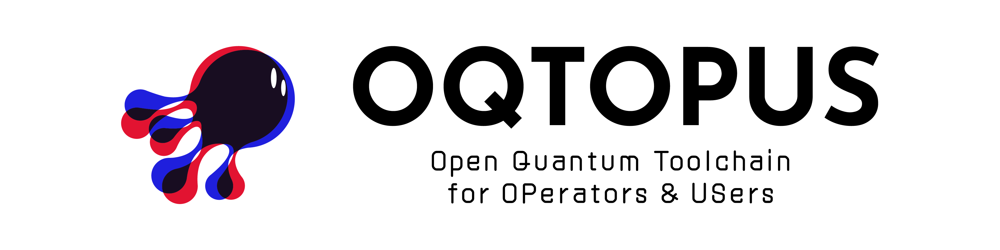

# QDash

QDash is a web application that provides a user-friendly interface to manage and monitor the execution of qubit calibration workflows.

> [!WARNING]
> QDash is currently under development. Please check back later for updates.

## Key Features

- **⚡ Workflows**: Centrally manage and track the progress of calibration workflows, from creation to completion.

- **📊 Observations**: Access and analyze the observational data utilized in calibration processes, ensuring transparency and insight.

- **⚙️ Settings**: Configure calibration parameters and adjust workflow settings to meet specific requirements seamlessly.

## Documentation

- [Documentation Home](https://qdash.readthedocs.io/en/stable/)

## CITATION

You can use the DOI to cite QDash in your research.

Citation information is also available in the [CITATION](https://github.com/oqtopus-team/qdash/blob/main/CITATION.cff) file.

## Contact

You can contact us by creating an issue in this repository,
or you can contact us by email:

- [oqtopus-team[at]googlegroups.com](mailto:oqtopus-team[at]googlegroups.com)

## LICENSE

OQTOPUS Cloud is released under the [Apache License 2.0](https://github.com/oqtopus-team/qdash/blob/main/LICENSE).
