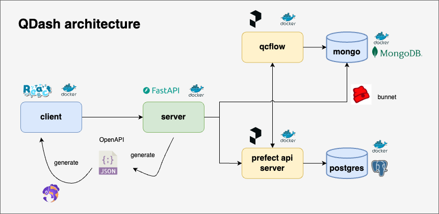
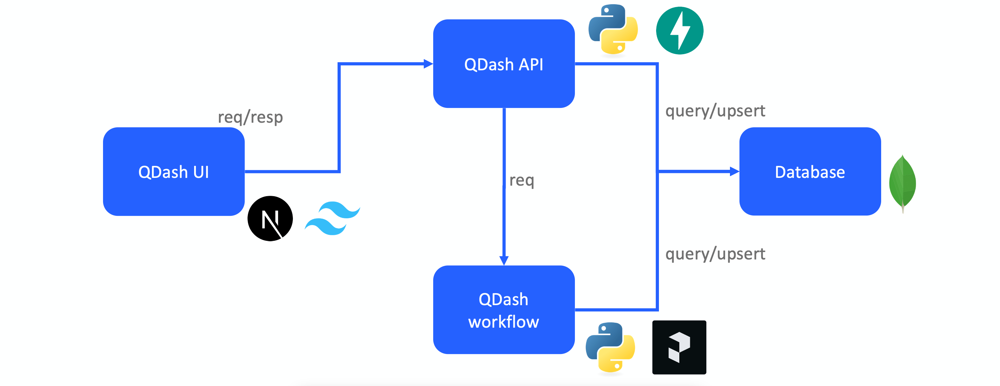
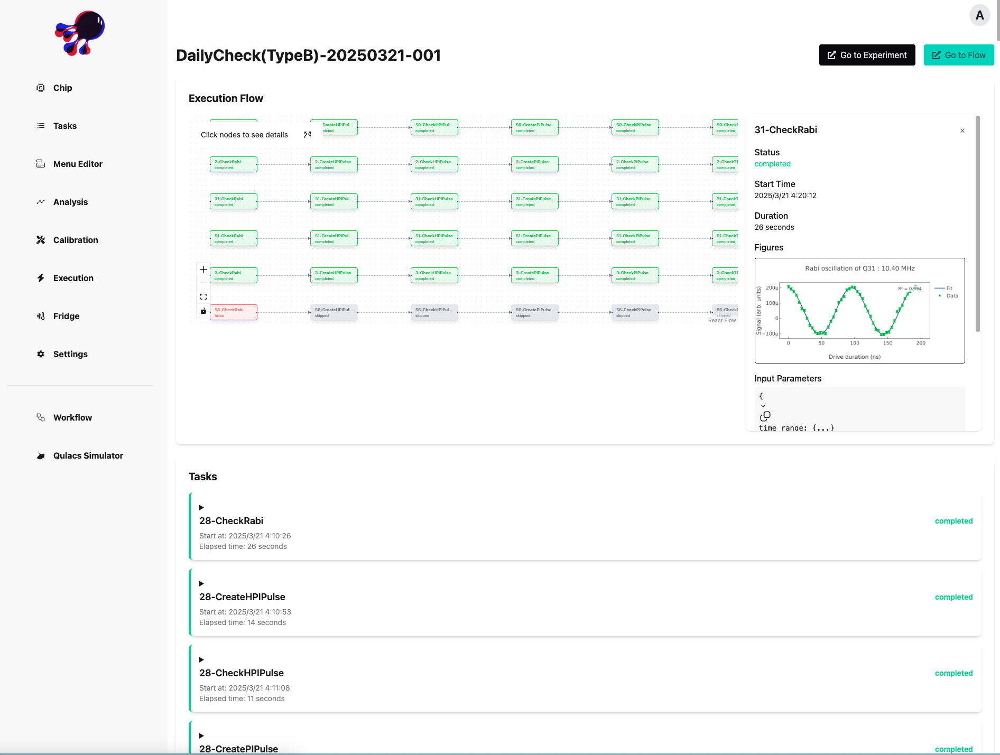
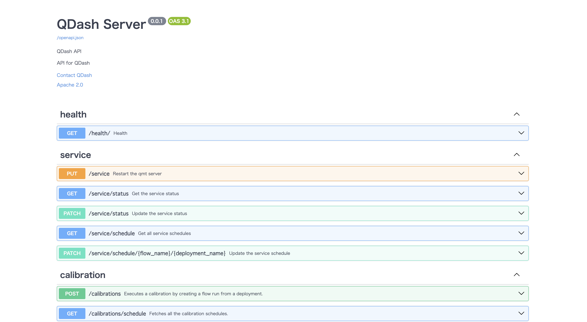
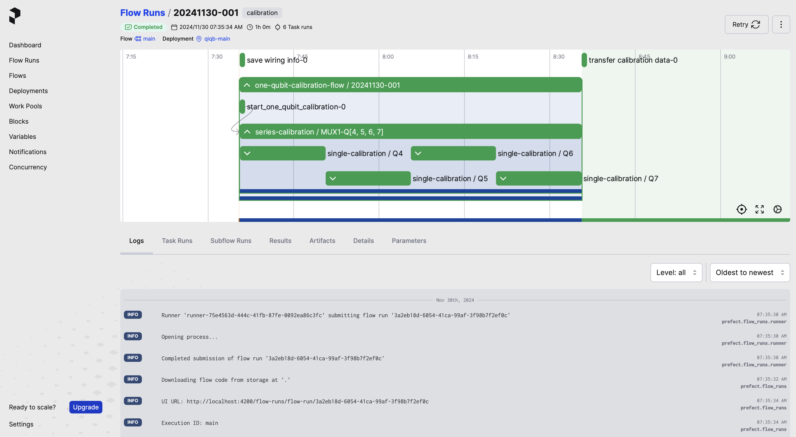
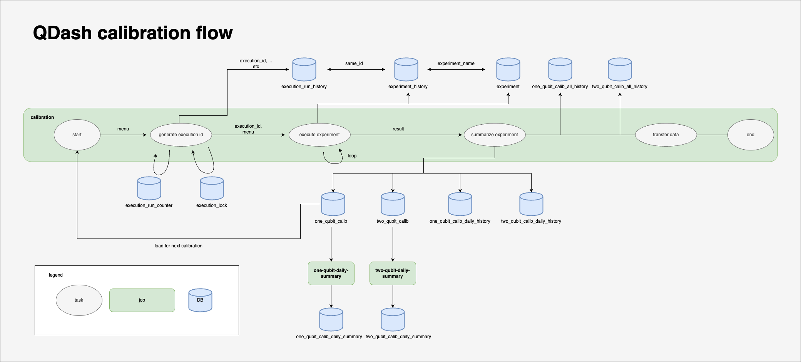

# Architecture

## Overview

QDash consists of three major components.

- client
  - Front end for user use
- server
  - backend that receives user requests and communicates with the database
- qcflow
  - Component that manages Qubit calibration workflow

<!--  -->

## Components

### QDash UI

The client is the front-end for the user, developed using React, and provides an interface for the user to manage the calibration workflow.

The client code is generated using orval based on the OpenAPI schema generated by the server. This ensures that when the server API specification changes, the client code is automatically updated.

### QDash API

The server is the backend that receives user requests and communicates with the database, and is developed using FastAPI.

### QDash Workflow

workflow is a component that manages Qubit's calibration workflow.
Prefect is an OSS workflow engine, and its strength is its ability to create DAGs in a Python code base.

The experimental libraries that have been used in the laboratory can be used as they are, so there is no need to change the experimental libraries.

The scheduling and log management functions of general workflow engines are supported, making workflow management easy.

### Calibration Flow

Calibration is performed in the following flow.

1. The user requests calibration from the client via the server. At this time, the user specifies in the menu which qubits to experiment with and what kind of experiment to perform.
2. The server requests qcflow to create a calibration workflow.
3. qcflow creates a workflow based on the given menu. In this case, any experimental library is used to perform the measurement.
4. qcflow's handler has exclusive control and uses the execution_lock table to prevent multiple workflows from running at the same time.
5. execution_id is generated from the execution_run_counter based on the execution date/time and execution count, and the workflow is executed. The execution_id is used to link the data for each execution.
6. When the workflow execution is completed, the results are saved in various DB.
7. The latest experimental results saved in each DB are used as initial parameters for the next calibration.

