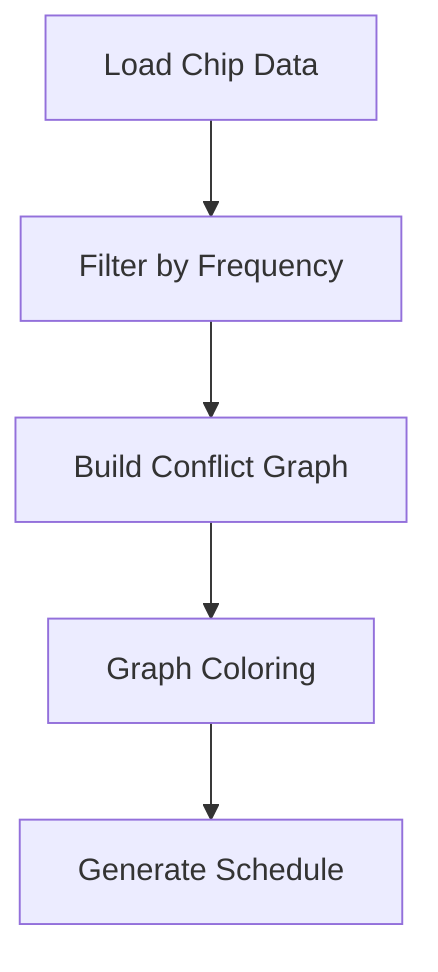

# Architecture Documentation

Technical architecture documentation for QDash components.

## Contents

### Quantum Hardware

- **[Square Lattice Topology](./square-lattice-topology.md)** - Qubit layout, MUX organization, and coordinate systems for 64Q and 144Q chips
  - MUX-based qubit organization
  - Coordinate conversion algorithms
  - Coupling topology and edge classification
  - MUX resource conflict detection

### Calibration Workflow

- **[1-Qubit Scheduler](./one-qubit-scheduler.md)** - Single-qubit calibration scheduling
  - Box type detection (Box A/B) from wiring configuration
  - MUX-based qubit grouping by box constraints
  - Stage generation for parallel/sequential execution

- **[CR Gate Scheduler](./cr-scheduler.md)** - Cross-resonance gate scheduling algorithm
  - Conflict detection and graph coloring
  - Fast/slow pair separation
  - Greedy coloring strategies
  - Integration with workflow engine

## Quick Links

### Related Documentation

- [Main Documentation](../../README.md)
- [Development Flow](../development-flow.md)
- [Tools Documentation](../../src/tools/README.md)

### Implementation

- 1-Qubit Scheduler: `src/qdash/workflow/engine/calibration/scheduler/one_qubit_scheduler.py`
- CR Scheduler: `src/qdash/workflow/engine/calibration/scheduler/cr_scheduler.py`
- Visualization: `src/tools/cr_scheduler_visualizer.py`
- Tests: `tests/qdash/workflow/engine/calibration/scheduler/`

### Configuration

- Wiring configs: `/workspace/qdash/config/qubex/{chip_id}/config/wiring.yaml`
- Device topology: Generated via `src/tools/device_topology_generator.py`

## Visualization Tools

### CR Schedule Visualizer

Generate visual representations of CR gate schedules:

```bash
python src/tools/cr_scheduler_visualizer.py
```

**Output:**

- Console: Schedule statistics and group breakdown
- Files: `.tmp/schedule_output/*.png` with lattice visualizations

## Contributing

When adding new architecture documentation:

1. Create a new `.md` file in this directory
2. Add entry to this README with brief description
3. Include diagrams using Mermaid or ASCII art
4. Link to relevant implementation files
5. Provide usage examples where applicable

## Document Standards

### Structure

Each architecture document should include:

- **Overview**: Purpose and scope
- **Architecture**: Key components and data structures
- **Algorithm**: Step-by-step explanation
- **Examples**: Code snippets and usage patterns
- **References**: Links to implementation and related docs

### Code Examples

Use Python syntax highlighting:

```python
from qdash.workflow.engine.cr_scheduler import CRScheduler

scheduler = CRScheduler(username="alice", chip_id="64Qv3")
result = scheduler.generate()
```

### Diagrams

Use ASCII art for simple diagrams:

```
MUX Structure (2×2):
┌─────┬─────┐
│  0  │  1  │
├─────┼─────┤
│  2  │  3  │
└─────┴─────┘
```

Or Mermaid for complex flows:


