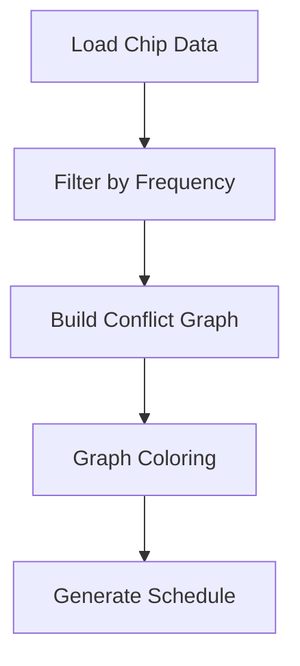

# Architecture Documentation

Technical architecture documentation for QDash components.

## Quantum Hardware

- **[Square Lattice Topology](./square-lattice-topology.md)** — Qubit layout, MUX organization, and coordinate systems for 64Q and 144Q chips
  - MUX-based qubit organization
  - Coordinate conversion algorithms
  - Coupling topology and edge classification
  - MUX resource conflict detection

## Data Lineage

- **[Provenance](./provenance.md)** — Calibration data lineage tracking
  - W3C PROV-DM based design
  - Parameter version history and comparison
  - Lineage/impact graph traversal
  - MongoDB schema and indexing

- **[Notes](./notes.md)** — Scoped summaries, task-result notes, legacy metric notes, and audit events
  - Inline notes on Qubit / Coupling / TaskResult documents
  - `note_event` write-through audit log
  - Performance indexes (partial sparse + text search)
  - Endpoints for the dashboard, knowledge feed, full-text search

## Calibration Workflow

- **[1-Qubit Scheduler](./one-qubit-scheduler.md)** — Single-qubit calibration scheduling
  - Box type detection (Box A/B) from wiring configuration
  - MUX-based qubit grouping by box constraints
  - Stage generation for parallel/sequential execution

- **[CR Gate Scheduler](./cr-scheduler.md)** — Cross-resonance gate scheduling algorithm
  - Conflict detection and graph coloring
  - Fast/slow pair separation
  - Greedy coloring strategies
  - Integration with workflow engine

## Implementation Files

- 1-Qubit Scheduler: `src/qdash/workflow/engine/scheduler/one_qubit_scheduler.py`
- CR Scheduler: `src/qdash/workflow/engine/scheduler/cr_scheduler.py`
- Tests: `tests/qdash/workflow/engine/scheduler/`

Configuration inputs include wiring files under `config/qubex-config/{chip_id}/config/wiring.yaml`.
Device topology fixtures can be created with `scripts/generate_topology.py`. Follow the
[development flow](../development/development-flow.md) when changing these implementations.

Add new architecture pages to the VitePress sidebar and link their implementation files. Follow
the repository [documentation guidelines](../development/docs-guidelines.md) for structure and
style.

## Code Examples

Use Python syntax highlighting:

```python
from qdash.workflow.engine.scheduler.cr_scheduler import CRScheduler

scheduler = CRScheduler(username="alice", chip_id="64Qv3")
result = scheduler.generate()
```

## Diagrams

Use ASCII art for simple diagrams:

```
MUX Structure (2×2):
┌─────┬─────┐
│  0  │  1  │
├─────┼─────┤
│  2  │  3  │
└─────┴─────┘
```

Or Mermaid for complex flows:


```mermaid
graph TD
    A[Load Chip Data] --> B[Filter by Frequency]
    B --> C[Build Conflict Graph]
    C --> D[Graph Coloring]
    D --> E[Generate Schedule]
```
