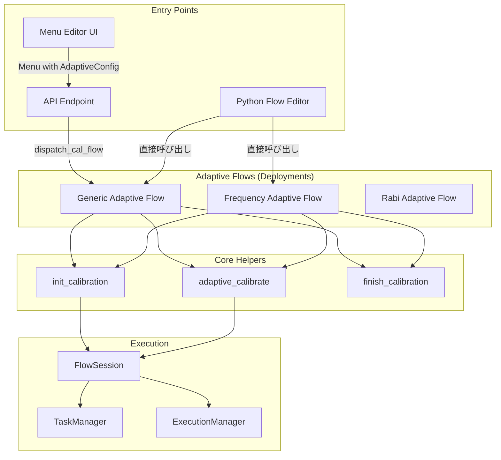

# Dispatch先でのClosed Loop実装設計

## 概要

既存のMenu/dispatch systemとPython Flow Editorを拡張し、deployment経由でclosed loop calibrationを実行できるようにする設計。

**作成日**: 2025-01-23
**ステータス**: 設計フェーズ

---

## 背景

### 現状の課題

1. **Python Flow EditorのadaptiveカONLYヘルパーは直接実行のみ**
   - `adaptive_calibrate()` は flow 内で直接呼び出す前提
   - deploymentとして登録して他のflowから呼び出せない

2. **Menu systemはclosed loopに対応していない**
   - 静的なタスクリストのみサポート
   - 収束条件を設定できない

3. **dispatch経由でのclosed loop実行が未サポート**
   - `dispatch_cal_flow` はループをサポートしていない
   - deploymentアーキテクチャでの反復実行が実装されていない

### 求められる機能

- ✅ deploymentとして登録可能なadaptive calibration flow
- ✅ 既存のMenu systemからの呼び出し対応（オプション）
- ✅ 汎用性の高いループロジック（どのタスクでも使える）
- ✅ UIからのパラメータ設定と実行

---

## 採用する設計: ハイブリッドアプローチ

### アプローチ1: Generic Adaptive Calibration Flow (優先度高)

汎用的なadaptive flowをdeploymentとして提供。

#### 実装

````python
# src/qdash/workflow/deployment/flows/adaptive_flow.py
"""Generic adaptive calibration flow for deployment."""

from typing import Any
from prefect import flow, get_run_logger
from qdash.workflow.helpers import (
    init_calibration,
    adaptive_calibrate,
    finish_calibration,
    get_session,
)


@flow(
    name="adaptive-calibration",
    log_prints=True,
    flow_run_name="{task_name}-adaptive-{qids}",
)
def adaptive_calibration_flow(
    username: str,
    chip_id: str,
    qids: list[str],
    task_name: str,
    convergence_parameter: str,
    threshold: float = 0.01,
    max_iterations: int = 10,
    execution_id: str | None = None,
    backend: str = "qubex",
    task_details: dict[str, Any] | None = None,
) -> dict[str, dict[str, Any]]:
    """Generic adaptive calibration flow for any task.

    This flow executes a calibration task repeatedly until convergence
    is achieved, based on a user-defined parameter and threshold.

    Args:
        username: Username for calibration session
        chip_id: Target chip ID
        qids: List of qubit IDs to calibrate
        task_name: Name of task to execute (e.g., "CheckFreq", "CheckRabi")
        convergence_parameter: Parameter to monitor for convergence (e.g., "qubit_frequency")
        threshold: Convergence threshold (absolute difference)
        max_iterations: Maximum number of iterations
        execution_id: Execution ID (auto-generated if None)
        backend: Backend type ("qubex" or "fake")
        task_details: Optional task-specific configuration

    Returns:
        Dictionary mapping qubit IDs to their convergence results:
        {
            "0": {
                "converged": True,
                "iterations": 5,
                "final_result": {...},
                "history": [...]
            },
            ...
        }

    Example:
        Deploy and run via UI or programmatically:

        ```python
        # Via deployment
        from prefect.deployments import run_deployment
        result = await run_deployment(
            "adaptive-calibration/prod-adaptive-calibration",
            parameters={
                "username": "alice",
                "chip_id": "64Qv3",
                "qids": ["0", "1"],
                "task_name": "CheckFreq",
                "convergence_parameter": "qubit_frequency",
                "threshold": 0.01,
                "max_iterations": 10,
            }
        )
        ```
    """
    logger = get_run_logger()
    logger.info(
        f"Starting adaptive calibration: task={task_name}, "
        f"parameter={convergence_parameter}, threshold={threshold}"
    )

    # Initialize calibration session
    session = init_calibration(
        username=username,
        chip_id=chip_id,
        qids=qids,
        execution_id=execution_id,
        backend=backend,
        name=f"Adaptive {task_name} Calibration",
        tags=["adaptive", "closed-loop", task_name],
    )

    if task_details is None:
        task_details = {}

    def measure(qid: str, iteration: int) -> dict[str, Any]:
        """Measurement function: executes the specified task."""
        logger.info(f"[Iteration {iteration}] Measuring {task_name} for qubit {qid}")
        result = session.execute_task(task_name, qid, task_details)
        logger.info(f"[Iteration {iteration}] Result: {result.get(convergence_parameter)}")
        return result

    def update(qid: str, result: dict[str, Any]) -> None:
        """Update function: updates parameters based on result."""
        if convergence_parameter in result:
            new_value = result[convergence_parameter]
            session.set_parameter(qid, convergence_parameter, new_value)
            logger.info(f"Updated {convergence_parameter} for qubit {qid}: {new_value}")

    def converged(history: list[dict[str, Any]]) -> bool:
        """Convergence function: checks if calibration has converged."""
        if len(history) < 2:
            return False

        last_value = history[-1].get(convergence_parameter, 0)
        prev_value = history[-2].get(convergence_parameter, 0)
        diff = abs(last_value - prev_value)

        is_converged = diff < threshold
        logger.info(
            f"Convergence check: diff={diff:.6f}, "
            f"threshold={threshold}, converged={is_converged}"
        )
        return is_converged

    # Execute adaptive calibration for each qubit
    results = {}
    for qid in qids:
        logger.info(f"Starting adaptive calibration for qubit {qid}")
        results[qid] = adaptive_calibrate(
            qid=qid,
            measure_func=measure,
            update_func=update,
            converge_func=converged,
            max_iterations=max_iterations,
        )

        convergence_result = results[qid]
        logger.info(
            f"Qubit {qid} completed: converged={convergence_result['converged']}, "
            f"iterations={convergence_result['iterations']}"
        )

    # Finish calibration session
    finish_calibration()

    logger.info("Adaptive calibration flow completed successfully")
    return results
````

#### Deployment登録

```python
# src/qdash/workflow/deployment/oqtopus/main.py
from qdash.workflow.deployment.flows.adaptive_flow import adaptive_calibration_flow

# ...

if __name__ == "__main__":
    adaptive_cal_deploy = adaptive_calibration_flow.to_deployment(
        name=f"{deployment_name}-adaptive-calibration",
        description="Generic adaptive calibration with convergence detection",
        tags=["calibration", "adaptive", "closed-loop"],
        parameters={
            "username": "orangekame3",
            "chip_id": "64Qv3",
            "qids": ["32", "38"],
            "task_name": "CheckFreq",
            "convergence_parameter": "qubit_frequency",
            "threshold": 0.01,
            "max_iterations": 10,
        },
    )

    _ = serve(
        # ... existing deployments ...
        adaptive_cal_deploy,  # 追加
        webserver=True,
        limit=50,
    )
```

### アプローチ2: Task-Specific Adaptive Flows (オプション)

よく使うタスクに特化したadaptive flowを提供。

```python
# src/qdash/workflow/deployment/flows/adaptive_freq.py
"""Adaptive frequency calibration flow."""

from prefect import flow
from qdash.workflow.helpers import init_calibration, adaptive_calibrate, finish_calibration


@flow(name="adaptive-frequency-calibration")
def adaptive_frequency_calibration_flow(
    username: str,
    chip_id: str,
    qids: list[str],
    threshold: float = 0.01,
    max_iterations: int = 10,
    execution_id: str | None = None,
):
    """Adaptive frequency calibration with predefined logic.

    Specialized flow for CheckFreq with optimal convergence detection.
    """
    session = init_calibration(username, chip_id, qids, execution_id)

    def measure(qid, iteration):
        return session.execute_task("CheckFreq", qid)

    def update(qid, result):
        if "qubit_frequency" in result:
            session.set_parameter(qid, "qubit_frequency", result["qubit_frequency"])

    def converged(history):
        if len(history) < 2:
            return False
        diff = abs(
            history[-1].get("qubit_frequency", 0) -
            history[-2].get("qubit_frequency", 0)
        )
        return diff < threshold

    results = {}
    for qid in qids:
        results[qid] = adaptive_calibrate(qid, measure, update, converged, max_iterations)

    finish_calibration()
    return results


@flow(name="adaptive-rabi-calibration")
def adaptive_rabi_calibration_flow(
    username: str,
    chip_id: str,
    qids: list[str],
    threshold: float = 0.1,  # Rabi amplitude threshold
    max_iterations: int = 10,
    execution_id: str | None = None,
):
    """Adaptive Rabi calibration with predefined logic."""
    # Similar implementation for CheckRabi...
    pass
```

### アプローチ3: Menu-based Adaptive Support (将来拡張)

MenuModelを拡張してUI経由でのclosed loop設定を可能に。

```python
# qdash/datamodel/menu.py
from pydantic import BaseModel, Field


class AdaptiveConfig(BaseModel):
    """Configuration for adaptive/closed-loop calibration."""

    enabled: bool = Field(
        default=False,
        description="Enable adaptive calibration with convergence detection"
    )
    convergence_parameter: str = Field(
        default="",
        description="Parameter name to monitor for convergence (e.g., 'qubit_frequency')"
    )
    threshold: float = Field(
        default=0.01,
        description="Convergence threshold (absolute difference)"
    )
    max_iterations: int = Field(
        default=10,
        ge=1,
        le=100,
        description="Maximum number of iterations"
    )


class MenuModel(BaseModel):
    # ... existing fields ...
    adaptive_config: AdaptiveConfig | None = Field(
        default=None,
        description="Adaptive calibration configuration (optional)"
    )
```

Menu UIでの設定:

```typescript
// ui/src/app/menu/editor/page.tsx
interface AdaptiveConfig {
  enabled: boolean;
  convergenceParameter: string;
  threshold: number;
  maxIterations: number;
}

// UI components
<AdaptiveConfigSection
  config={adaptiveConfig}
  onChange={setAdaptiveConfig}
/>
```

---

## 実装ロードマップ

### Phase 1: Generic Adaptive Flow (Week 1-2)

**目標**: deploymentとして使える汎用adaptive flowの実装

**タスク**:

1. `adaptive_flow.py` の実装
2. deployment登録の追加
3. ドキュメント作成
4. テストコード作成

**成果物**:

```bash
src/qdash/workflow/deployment/flows/adaptive_flow.py
tests/qdash/workflow/deployment/flows/test_adaptive_flow.py
docs/guides/adaptive-calibration-deployment.md
```

### Phase 2: Task-Specific Flows (Week 3)

**目標**: よく使うタスクの専用adaptive flow

**タスク**:

1. `adaptive_freq.py` の実装
2. `adaptive_rabi.py` の実装
3. deployment登録

**成果物**:

```bash
src/qdash/workflow/deployment/flows/adaptive_freq.py
src/qdash/workflow/deployment/flows/adaptive_rabi.py
```

### Phase 3: Menu-based Support (Week 4-5)

**目標**: Menu EditorからのUI設定対応

**タスク**:

1. `AdaptiveConfig` データモデル追加
2. Menu Editor UIコンポーネント追加
3. `dispatch_cal_flow` の拡張
4. E2Eテスト

**成果物**:

```bash
src/qdash/datamodel/menu.py (extended)
ui/src/app/menu/editor/components/AdaptiveConfigSection.tsx
src/qdash/workflow/core/calibration/flow.py (extended)
```

---

## 使用例

### 例1: Deployment経由での実行

```python
# API or CLI経由でdeploymentを実行
from prefect.deployments import run_deployment

result = await run_deployment(
    "adaptive-calibration/prod-adaptive-calibration",
    parameters={
        "username": "alice",
        "chip_id": "64Qv3",
        "qids": ["0", "1", "2"],
        "task_name": "CheckFreq",
        "convergence_parameter": "qubit_frequency",
        "threshold": 0.01,
        "max_iterations": 10,
    }
)
```

### 例2: Python Flow Editor内での使用

```python
from prefect import flow
from qdash.workflow.deployment.flows.adaptive_flow import adaptive_calibration_flow

@flow
def complex_calibration_with_adaptive(username, chip_id, qids):
    """複雑なcalibration flowの一部としてadaptive flowを呼び出し."""

    # Step 1: 通常のcalibration
    init_calibration(username, chip_id, qids)
    calibrate_qubits_parallel(qids, ["CheckRabi", "CheckT1"])
    finish_calibration()

    # Step 2: Adaptive frequency calibration (subflowとして実行)
    freq_results = adaptive_calibration_flow(
        username=username,
        chip_id=chip_id,
        qids=qids,
        task_name="CheckFreq",
        convergence_parameter="qubit_frequency",
        threshold=0.01,
        max_iterations=10,
    )

    # Step 3: 結果に基づいて次のcalibration
    init_calibration(username, chip_id, qids)
    calibrate_qubits_parallel(qids, ["CheckT2Echo"])
    finish_calibration()

    return freq_results
```

### 例3: Menu経由での実行 (Phase 3以降)

```python
# Menu definition with adaptive config
menu = MenuModel(
    name="Adaptive Frequency Calibration",
    username="alice",
    chip_id="64Qv3",
    tasks=["CheckFreq"],
    schedule=SerialNode(serial=["0", "1", "2"]),
    adaptive_config=AdaptiveConfig(
        enabled=True,
        convergence_parameter="qubit_frequency",
        threshold=0.01,
        max_iterations=10,
    )
)

# Execute via main_flow
main_flow(menu=menu)
```

---

## アーキテクチャ図



---

## メリット・デメリット

### メリット

✅ **汎用性**: Generic flowはどのタスクでも使える
✅ **再利用性**: 既存のPython Flow Editorヘルパーを活用
✅ **柔軟性**: deployment、Python Flow、Menu経由すべてでサポート
✅ **段階的導入**: Phase 1だけでも十分に機能する
✅ **メンテナンス性**: 既存のアーキテクチャと統合

### デメリット（と対策）

❌ **複雑性の増加**
→ 対策: Phase 1のGeneric flowのみで開始し、必要に応じて拡張

❌ **UI実装コスト** (Phase 3)
→ 対策: Phase 1-2はUI不要、deploymentとして十分機能

❌ **収束条件の設計が難しい**
→ 対策: デフォルトのthresholdを提供、ドキュメント充実

---

## 次のアクション

### 即座に開始可能 (Phase 1)

1. **Generic adaptive flow実装**

   ```bash
   mkdir -p src/qdash/workflow/deployment/flows
   touch src/qdash/workflow/deployment/flows/__init__.py
   touch src/qdash/workflow/deployment/flows/adaptive_flow.py
   ```

2. **Deployment登録**
   - `main.py` に追加

3. **テストコード作成**

   ```bash
   mkdir -p tests/qdash/workflow/deployment/flows
   touch tests/qdash/workflow/deployment/flows/test_adaptive_flow.py
   ```

4. **ドキュメント作成**
   ```bash
   mkdir -p docs/guides
   touch docs/guides/adaptive-calibration-deployment.md
   ```

---

## 参考資料

- [Python Flow Implementation Plan](./python-flow-implementation-plan.md)
- [Post-Refactor Guide](./post-refactor.md)
- [Prefect Deployments](https://docs.prefect.io/concepts/deployments/)
- [QDash Workflow Architecture](../workflow-architecture.md)

---

## 変更履歴

| 日付       | 変更内容 | 著者 |
| ---------- | -------- | ---- |
| 2025-01-23 | 初版作成 | -    |
