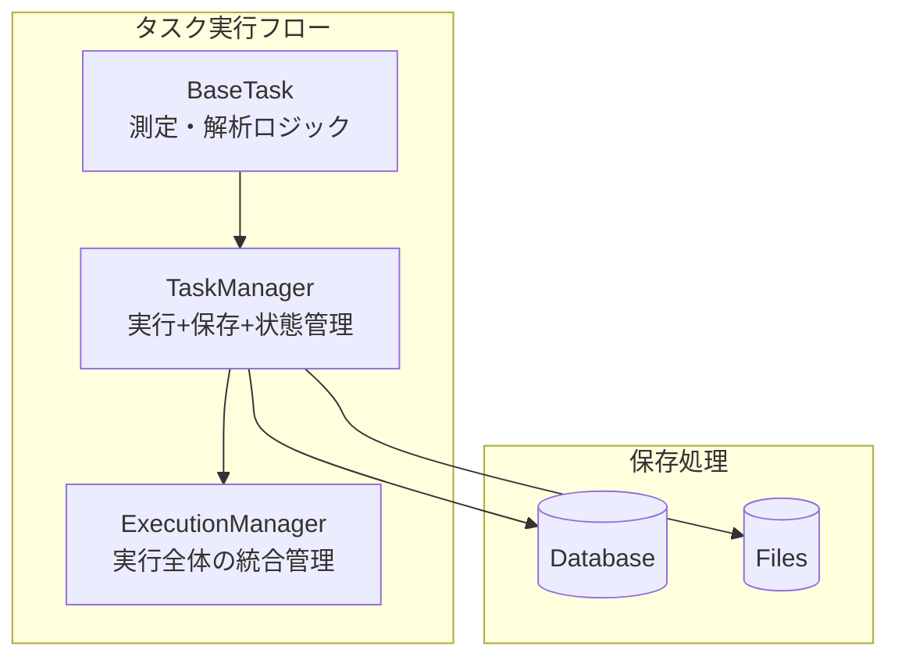

# リファクタリング完了後ガイド

## 概要

TaskManager での保存処理統合リファクタリングが完了しました。このドキュメントでは、新しいアーキテクチャの使用方法と、Python Flow Editor の実装方法について説明します。

## 新しいアーキテクチャ

### 責任分担



### 主要な変更点

1. **TaskManager の拡張**

   - `execute_task()` メソッドで実行と保存を統合
   - バックエンド特有の保存処理を内包
   - エラーハンドリングの統一

2. **BaseTask の維持**

   - 既存の `run()`, `preprocess()`, `postprocess()` を維持
   - タスクロジックに集中
   - 保存処理から分離

3. **実行フローの簡素化**
   - `execute_dynamic_task_*` の大幅な簡素化
   - 重複する保存処理の削除

## 使用方法

### 1. 基本的なタスク実行

```python
# リファクタリング後の統合された実行方法
from qdash.workflow.core.calibration.task_manager import TaskManager
from qdash.workflow.core.calibration.execution_manager import ExecutionManager
from qdash.workflow.tasks.active_protocols import generate_task_instances

# 1. 初期化
execution_manager = ExecutionManager(
    username="user",
    execution_id="20240101-001",
    calib_data_path="/app/calib_data/user/20240101-001",
    chip_id="chip_1"
).save().start_execution()

task_manager = TaskManager(
    username="user",
    execution_id="20240101-001",
    qids=["0"],
    calib_dir="/app/calib_data/user/20240101-001"
)

# 2. タスクインスタンス取得
task_instances = generate_task_instances(
    task_names=["CheckFreq"],
    task_details={},
    backend="qubex"
)

# 3. 統合された実行（保存処理は自動）
execution_manager, task_manager = task_manager.execute_task(
    task_instances["CheckFreq"],
    session,
    execution_manager,
    qid="0"
)

# 結果は自動的に保存される：
# - 出力パラメータ → TaskManager
# - 図表・生データ → ファイルシステム
# - タスク履歴 → TaskResultHistoryDocument
# - 実行履歴 → ExecutionHistoryDocument
# - キャリブレーションデータ → QubitDocument/CouplingDocument
```

### 2. カスタムタスクの作成

```python
# カスタムタスクは既存のインターフェースを維持
from qdash.workflow.tasks.qubex.base import QubexTask

class CustomCalibrationTask(QubexTask):
    name = "CustomCalibration"
    task_type = "qubit"

    def preprocess(self, session, qid):
        # 前処理ロジック
        return PreProcessResult(input_parameters=self.input_parameters)

    def run(self, session, qid):
        # 測定・解析ロジック
        # 保存処理は TaskManager が自動処理
        return RunResult(raw_result=measurement_data)

    def postprocess(self, session, execution_id, run_result, qid):
        # 後処理ロジック
        return PostProcessResult(
            output_parameters={"frequency": 5.0},
            figures=[plot_figure],
            raw_data=[raw_measurement_data]
        )

# 使用方法は同じ
execution_manager, task_manager = task_manager.execute_task(
    CustomCalibrationTask(),
    session,
    execution_manager,
    qid="0"
)
```

### 3. バッチ実行

```python
# 複数キューブットの実行
qids = ["0", "1", "2"]
for qid in qids:
    execution_manager, task_manager = task_manager.execute_task(
        task_instance,
        session,
        execution_manager,
        qid
    )
    # 各キューブットの結果が自動保存される
```

## Python Flow Editor の実装

### 1. FlowSession クラス

```python
# src/qdash/workflow/helpers/flow_helpers.py
from qdash.workflow.core.calibration.execution_manager import ExecutionManager
from qdash.workflow.core.calibration.task_manager import TaskManager
from qdash.workflow.core.session.factory import create_session
from qdash.workflow.tasks.active_protocols import generate_task_instances

class FlowSession:
    """Python Flow 用のセッション管理クラス"""

    def __init__(self, username: str, execution_id: str, chip_id: str, backend: str = "qubex"):
        self.username = username
        self.execution_id = execution_id
        self.chip_id = chip_id
        self.backend = backend

        # 統合された ExecutionManager を使用
        self.execution_manager = ExecutionManager(
            username=username,
            execution_id=execution_id,
            calib_data_path=f"/app/calib_data/{username}/{execution_id}",
            chip_id=chip_id,
            name="Python Flow Execution",
            tags=["python_flow"]
        ).save().start_execution()

        # 既存の Session を使用
        self.session = create_session(
            backend=backend,
            config={
                "task_type": "qubit",
                "username": username,
                "qids": [],
                "note_path": f"/app/calib_data/{username}/{execution_id}/calib_note/flow.json",
                "chip_id": chip_id,
            }
        )
        self.session.connect()

    def execute_task(self, task_name: str, qid: str, task_details: dict = None) -> dict:
        """統合された保存処理を活用したタスク実行"""

        # TaskManager 作成
        task_manager = TaskManager(
            username=self.username,
            execution_id=self.execution_id,
            qids=[qid],
            calib_dir=self.execution_manager.calib_data_path
        )

        # タスクインスタンス取得
        task_instances = generate_task_instances(
            task_names=[task_name],
            task_details=task_details or {},
            backend=self.backend
        )

        task_instance = task_instances[task_name]

        # 統合された実行（保存処理は自動）
        self.execution_manager, task_manager = task_manager.execute_task(
            task_instance, self.session, self.execution_manager, qid
        )

        # 結果返却
        return task_manager.get_output_parameter_by_task_name(
            task_name, task_type=task_instance.get_task_type(), qid=qid
        )

    def get_parameter(self, qid: str, param_name: str):
        """パラメータ取得"""
        return self.execution_manager.calib_data.qubit.get(qid, {}).get(param_name)

    def set_parameter(self, qid: str, param_name: str, value):
        """パラメータ設定"""
        if qid not in self.execution_manager.calib_data.qubit:
            self.execution_manager.calib_data.qubit[qid] = {}
        self.execution_manager.calib_data.qubit[qid][param_name] = value

    def finish_calibration(self):
        """キャリブレーション完了処理"""
        self.execution_manager = self.execution_manager.complete_execution()

# ヘルパー関数
def init_calibration(username: str, execution_id: str, chip_id: str, backend: str = "qubex") -> FlowSession:
    """キャリブレーションセッション初期化"""
    return FlowSession(username, execution_id, chip_id, backend)

def get_session() -> FlowSession:
    """Prefect context からセッション取得"""
    from prefect import get_run_context
    context = get_run_context()
    return context.parameters.get("session")

def finish_calibration():
    """キャリブレーション完了"""
    session = get_session()
    session.finish_calibration()
```

### 2. 高レベルヘルパー関数

```python
# 既存タスクを活用した並列実行
def calibrate_qubits_parallel(qids: list[str], tasks: list[str], task_details: dict = None) -> dict:
    """統合された保存処理を活用した並列キャリブレーション"""
    session = get_session()
    results = {}

    for task_name in tasks:
        # 各タスクを全キューブットで実行
        for qid in qids:
            if qid not in results:
                results[qid] = {}

            task_result = session.execute_task(task_name, qid, task_details)
            results[qid].update(task_result)

    return results

def calibrate_qubits_serial(qids: list[str], tasks: list[str], task_details: dict = None) -> dict:
    """統合された保存処理を活用したシリアルキャリブレーション"""
    session = get_session()
    results = {}

    for qid in qids:
        results[qid] = {}
        for task_name in tasks:
            task_result = session.execute_task(task_name, qid, task_details)
            results[qid].update(task_result)

    return results

def adaptive_calibrate(
    qid: str,
    measure_func: callable,
    update_func: callable,
    converge_func: callable,
    max_iterations: int = 10
) -> dict:
    """適応的キャリブレーション"""
    session = get_session()
    history = []

    for iteration in range(max_iterations):
        # ユーザー定義の測定関数
        result = measure_func(qid, iteration)
        history.append(result)

        # パラメータ更新
        if "parameters" in result:
            for param_name, value in result["parameters"].items():
                session.set_parameter(qid, param_name, value)

        # ユーザー定義の更新関数
        update_func(qid, result)

        # 収束判定
        if converge_func(history):
            break

    return {
        "converged": converge_func(history),
        "iterations": len(history),
        "final_result": history[-1] if history else {},
        "history": history
    }
```

### 3. Python Flow の使用例

#### 例 1: シンプルなキャリブレーション

```python
from prefect import flow
from qdash.workflow.helpers.flow_helpers import (
    init_calibration, calibrate_qubits_parallel, finish_calibration
)

@flow
def simple_calibration(username, execution_id, chip_id, qids):
    session = init_calibration(username, execution_id, chip_id)

    # 統合された保存処理を活用
    results = calibrate_qubits_parallel(
        qids=qids,
        tasks=["CheckFreq", "CheckRabi", "CheckT1"]
    )

    finish_calibration()
    return results
```

#### 例 2: 適応的キャリブレーション

```python
@flow
def adaptive_frequency_calibration(username, execution_id, chip_id, qids, threshold=0.01):
    session = init_calibration(username, execution_id, chip_id)

    def measure(qid, iteration):
        # 統合された保存処理を活用
        return session.execute_task("CheckFreq", qid)

    def update(qid, result):
        if "qubit_frequency" in result:
            session.set_parameter(qid, "qubit_frequency", result["qubit_frequency"])

    def converged(history):
        if len(history) < 2:
            return False
        diff = abs(history[-1].get("qubit_frequency", 0) - history[-2].get("qubit_frequency", 0))
        return diff < threshold

    results = {}
    for qid in qids:
        results[qid] = adaptive_calibrate(qid, measure, update, converged)

    finish_calibration()
    return results
```

#### 例 3: 条件分岐を含むキャリブレーション

```python
@flow
def smart_calibration(username, execution_id, chip_id, qids):
    session = init_calibration(username, execution_id, chip_id)
    results = {}

    for qid in qids:
        # 初期チェック
        freq_result = session.execute_task("CheckFreq", qid)

        if freq_result.get("frequency", 0) < 5.0:
            # 低周波数の場合
            results[qid] = session.execute_task("LowFreqCalibration", qid)
        else:
            # 通常の場合
            rabi_result = session.execute_task("CheckRabi", qid)
            t1_result = session.execute_task("CheckT1", qid)
            results[qid] = {**freq_result, **rabi_result, **t1_result}

    finish_calibration()
    return results
```

## 移行ガイド

### 既存コードからの変更点

#### Before（リファクタリング前）

```python
# 複雑な保存処理が分散
task_manager.start_task(task_name, task_type, qid)
preprocess_result = task_instance.preprocess(session, qid)
task_manager.put_input_parameters(...)
run_result = task_instance.run(session, qid)
postprocess_result = task_instance.postprocess(...)
task_manager.put_output_parameters(...)
task_manager.save_figures(...)
task_manager.save_raw_data(...)
task_manager.save()
TaskResultHistoryDocument.upsert_document(...)
execution_manager.update_with_task_manager(task_manager)
task_manager.update_task_status_to_completed(...)
```

#### After（リファクタリング後）

```python
# 統合された実行
execution_manager, task_manager = task_manager.execute_task(
    task_instance, session, execution_manager, qid
)
# 保存処理は自動的に実行される
```

### カスタムタスクの移行

既存のカスタムタスクは**変更不要**です：

- `preprocess()`, `run()`, `postprocess()` メソッドはそのまま
- 保存処理は TaskManager が自動処理
- 既存のテストコードも動作

## パフォーマンス改善

### 1. コード削減

- 重複する保存処理の削除により、約 30%のコード削減
- エラーハンドリングの統一により、保守性向上

### 2. 実行効率

- 保存処理の最適化により、実行時間の短縮
- データベースアクセスの統合により、I/O 効率向上

### 3. メモリ使用量

- 重複するオブジェクト生成の削減
- ガベージコレクションの効率化

## トラブルシューティング

### よくある問題

1. **既存タスクが動作しない**

   - 原因: TaskManager の初期化不足
   - 解決: 適切な qids を指定して TaskManager を初期化

2. **保存処理が実行されない**

   - 原因: `execute_task()` ではなく直接 `run()` を呼び出している
   - 解決: `task_manager.execute_task()` を使用

3. **バックエンド特有の処理が動作しない**
   - 原因: task_instance.backend の設定不足
   - 解決: タスクインスタンスの backend 属性を確認

### デバッグ方法

```python
# ログレベルを設定してデバッグ
import logging
logging.getLogger("qdash.workflow").setLevel(logging.DEBUG)

# 実行状況の確認
print(f"Task status: {task_manager.get_task(task_name, qid=qid).status}")
print(f"Execution status: {execution_manager.status}")
```

## 今後の拡張

### 1. 新しいバックエンドの追加

```python
# TaskManager._save_backend_specific に追加
elif task_instance.backend == "new_backend":
    self._save_new_backend_specific(task_instance, execution_manager, qid)
```

### 2. カスタム保存処理

```python
# TaskManager を継承してカスタマイズ
class CustomTaskManager(TaskManager):
    def _save_all_results(self, task_instance, execution_manager, postprocess_result, qid):
        super()._save_all_results(task_instance, execution_manager, postprocess_result, qid)
        # カスタム保存処理を追加
        self._save_custom_data(postprocess_result, qid)
```

このリファクタリングにより、QDash のタスク実行システムがより保守性が高く、拡張しやすい設計になりました。Python Flow Editor の実装も、この統合された保存処理を活用することで、シンプルで強力な機能を提供できます。
