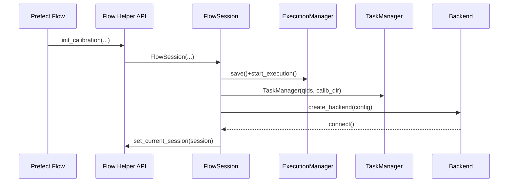
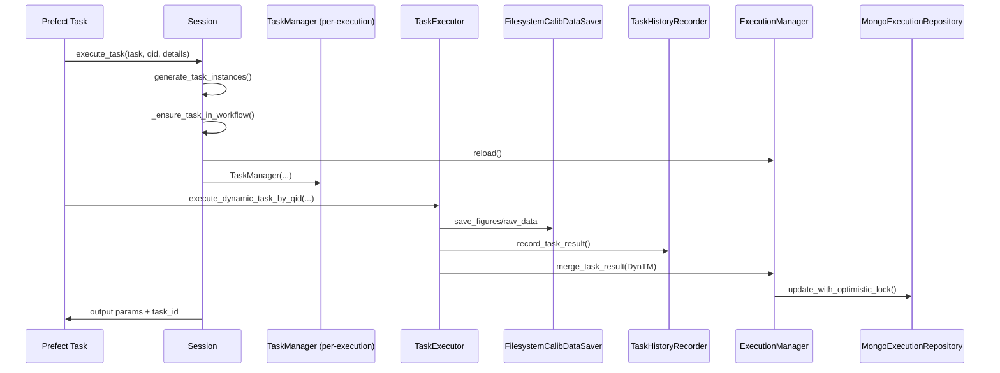
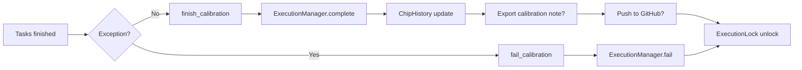

# Workflow Processing Flow

## Overview

This document maps the calibration workflow execution path triggered from the Python Flow Editor, focusing on how `FlowSession`, `TaskManager`, `ExecutionManager`, and the supporting repositories cooperate. It mirrors the level of detail in the existing [Workflow Testing Guidelines](./workflow-testing-guidelines.md) so that developers, SREs, and QA engineers share the same mental model.

- **Code scope**: `src/qdash/workflow/flow/session.py` as the entry point, the `engine/calibration/*` layer, `dbmodel/*`, and `workflow/caltasks/*` implementations
- **Primary use case**: running a Python Flow from the UI, invoking the helper APIs inside Prefect, and persisting results to MongoDB plus the filesystem
- **Nearby references**: [Python Flow Editor Guide](./python-flow-editor-guide.md), [Workflow Testing Guidelines](./workflow-testing-guidelines.md)

---

## 1. Runtime Components

| Layer | Main modules | Responsibility |
| --- | --- | --- |
| Flow API | `init_calibration`, `finish_calibration`, `get_session` (`workflow/flow/__init__.py`) | Prefect-facing façade; stores the active session in `SessionContext`. |
| Session | `FlowSession` (`workflow/flow/session.py`) | Owns session locking, execution ID generation, backend init, task execution, stage/result logging, GitHub integration. |
| Backend | `create_backend()` (`engine/backend/factory.py`) | Injects `qubex` or `fake` backend used by `session.execute_task` to talk to devices. |
| Execution | `ExecutionManager` + `MongoExecutionRepository` | Persists execution metadata to MongoDB (`ExecutionHistoryDocument`) and handles state transitions (RUNNING→COMPLETED/FAILED). |
| Task | `TaskManager` + `TaskExecutor` | Coordinates the per-task lifecycle, wiring `TaskStateManager`, `TaskResultProcessor`, `TaskHistoryRecorder`, and merges results back to the execution record. |
| Storage | `FilesystemCalibDataSaver`, `TaskHistoryRecorder` | Writes files under `/app/calib_data` and updates `TaskResultHistoryDocument`/`ChipDocument`/`ChipHistoryDocument`. |
| Optional | `GitHubIntegration`, `get_params_updater` | Pull/push configuration files and sync YAML parameters before exporting to GitHub. |

### Relevant guidelines

- **Testing**: [Workflow Testing Guidelines](./workflow-testing-guidelines.md)
- **User experience**: [Python Flow Editor Guide](./python-flow-editor-guide.md)

---

## 2. Session Initialization Sequence

`init_calibration()` is invoked from a Prefect flow and constructs `FlowSession`. The major steps are:

1. **Execution ID generation**: `generate_execution_id()` uses `ExecutionCounterDocument` to emit `YYYYMMDD-NNN` identifiers.
2. **Lock acquisition**: when `use_lock=True`, `ExecutionLockDocument` ensures exclusivity; failures release the lock in `finally`.
3. **Directory bootstrap**: `/app/calib_data/<username>/<date>/<index>` gets `task/`, `fig/`, `calib/`, and `calib_note/` folders plus `classifier_dir` under `~/.classifier`.
4. **GitHub sync (optional)**: if `enable_github_pull=True` and credentials exist, `GitHubIntegration.pull_config()` fetches configs and stores the commit ID in `note`.
5. **ExecutionManager startup**: `.save().start_execution().update_execution_status_to_running()` writes the initial Mongo record and registers tags via `TagDocument`.
6. **TaskManager creation**: the session-wide `TaskManager` prepares empty `task_result` and `calib_data` containers per qid.
7. **Backend connection**: `create_backend()` builds the backend and `backend.connect()` activates it; `qubex` calls `save_note()` to load parameter overrides.
8. **SessionContext registration**: `set_current_session()` makes the instance accessible to downstream Prefect tasks through `get_session()`.

> **Note:** By default the first tag equals the flow display name so the UI can filter executions easily. `note` captures stage logs, GitHub commit IDs, and other metadata surfaced later in the UI.

---

## 3. Task Execution Pipeline (`session.execute_task`)

`session.execute_task(task_name, qid, task_details)` may be called from any Prefect task. The pipeline is:

1. **Task definition resolution**: `generate_task_instances()` interprets `task_details`, deciding `task_type`, timeouts, and input parameters.
2. **Workflow shape update**: `_ensure_task_in_workflow()` appends metadata into `TaskManager.task_result` (qubit/coupling/global/system buckets).
3. **ExecutionManager reload**: a fresh `ExecutionManager(...).reload()` pulls the latest Mongo state to avoid race conditions.
4. **Per-execution TaskManager**: a new `TaskManager` instance copies only the relevant `CalibDataModel` sections for the qid(s); `_upstream_task_id` follows the explicit argument or the last task per qid.
5. **Prefect task invocation**: `execute_dynamic_task_by_qid.with_options(...)()` calls `TaskExecutor`, which runs `preprocess → run → postprocess → result_processor`.
6. **Persistence**:
   - `TaskHistoryRecorder` writes to `TaskResultHistoryDocument`, updates `ChipDocument`, and optionally snapshots `ChipHistoryDocument`.
   - `FilesystemCalibDataSaver` stores figures (`fig/`), raw data (`raw_data/`), and notes (`calib_note/`), auto-resolving name collisions.
   - `TaskResultProcessor` enforces R²/fidelity thresholds and aborts persistence if validation fails.
7. **Merge back**: the on-demand TaskManager pushes `calib_data` and `controller_info` into the session TaskManager; `ExecutionManager.update_with_task_manager()` merges into Mongo with optimistic locking.
8. **Return value**: the task’s output parameters plus `task_id`, also cached in `_last_executed_task_id_by_qid` for implicit upstream chaining.

### Parameter & stage logging

- `session.get_parameter()` / `session.set_parameter()` access `ExecutionManager.calib_data` directly, matching what the UI queries for realtime values.
- `record_stage_result()` appends JSON blobs to `execution_manager.note["stage_results"]` with a `pendulum` timestamp; `get_stage_result()` retrieves them for branching logic.

---

## 4. Persistence & Data Sync

| Data | Write path | Destination |
| --- | --- | --- |
| Execution metadata (`ExecutionModel`) | `ExecutionManager.save()/start_execution()/update_*()` | MongoDB `ExecutionHistoryDocument` via `MongoExecutionRepository` |
| Task results | `TaskHistoryRecorder.record_task_result()` | MongoDB `TaskResultHistoryDocument` |
| Chip state | `TaskHistoryRecorder.update_chip_with_calib_data()` | MongoDB `ChipDocument` |
| Chip history | `ChipHistoryDocument.create_history()` (also retriggered in `FlowSession.finish_calibration()`) | MongoDB `ChipHistoryDocument` |
| Calibration files | `FilesystemCalibDataSaver.save_*()` | `/app/calib_data/<user>/<date>/<index>/{fig,raw_data,calib,calib_note}` |
| GitHub sync | `_sync_backend_params_before_push()` → `GitHubIntegration.push_files()` | Remote repository (props/calib_note/YAML) |

### Optimistic locking

`MongoExecutionRepository.update_with_optimistic_lock()` compares `_version` to guard concurrent updates. When a conflict occurs the update retries with the latest document to keep multi-worker Prefect executions consistent.

### Backend parameter sync

Inside `finish_calibration()` the helper `_sync_backend_params_before_push()` uses `get_params_updater()` to push recent calibration values into backend YAML/props before GitHub export, keeping UI data and GitHub sources aligned.

---

## 5. Session Completion & Failure Handling

| Phase | Invocation | Actions |
| --- | --- | --- |
| Normal completion | `finish_calibration(update_chip_history=True, push_to_github=None, export_note_to_file=False)` | `ExecutionManager.complete_execution()` → optional `ChipHistoryDocument.create_history()` → optional `CalibrationNoteDocument` export → optional GitHub push → unlock execution. |
| Failure | `fail_calibration(error_message="...")` | `ExecutionManager.fail_execution()` marks Mongo status as FAILED and releases the lock. |
| GitHub push override | `github_push_config.enabled=True` or `push_to_github=True` | `GitHubIntegration.push_files()` results stored in `execution_manager.note["github_push_results"]`. |

> **Tip:** `finish_calibration()` always resets the `SessionContext` via `clear_current_session()`. Ensure Prefect flows call it in `finally`, and invoke `fail_calibration()` inside exception handlers to prevent leaked locks.

---

## 6. Related Documents & Guidelines

- [Workflow Testing Guidelines](./workflow-testing-guidelines.md): how to verify the flows described here.
- [Python Flow Editor Guide](./python-flow-editor-guide.md): user-facing flow creation and helper usage examples.
- [Workflow Architecture Refactoring Proposal](../refactoring/workflow-architecture-proposal.md): future plans for FlowSession/Factory/Config.
- [Architecture Overview](../architecture.md): how workflow fits into the broader QDash stack.

Use this document as the hub when cross-referencing test plans, UI flows, or refactoring proposals within the workflow domain.
