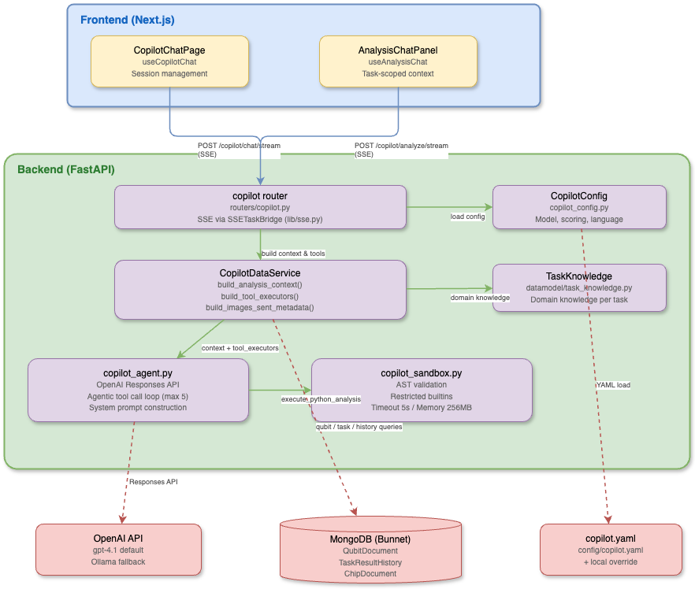

# Copilot Architecture

## Overview

QDash Copilot is an AI-powered assistant that helps experimentalists interpret qubit calibration results. It provides two interaction modes:

1. **Analysis Sidebar** -- Task-scoped analysis within the metrics modal, providing contextual interpretation of individual calibration results (e.g., CheckT1, CheckRabi).
2. **Chat Page** -- A dedicated chat interface for chip-wide questions, cross-qubit comparisons, and exploratory data analysis.

Both modes use the same underlying LLM agent with tool-calling capabilities, sandboxed Python execution, and SSE streaming for real-time progress feedback.

## Component Diagram



## Key Files

| File | Responsibility |
|------|---------------|
| `src/qdash/api/routers/copilot.py` | FastAPI router with `/config`, `/analyze`, `/analyze/stream`, `/chat/stream` endpoints; SSE event generation via `SSETaskBridge` |
| `src/qdash/api/services/copilot_data_service.py` | Data loading service: `build_analysis_context()`, `build_images_sent_metadata()`, qubit/task/history queries, tool executor wiring |
| `src/qdash/api/lib/copilot_agent.py` | LLM agent: system prompt construction, OpenAI Responses API calls, tool call loop, response parsing |
| `src/qdash/copilot/` | Shared Copilot runtime used outside the API process, including workflow-side automatic review |
| `src/qdash/workflow/engine/task/ai_review.py` | Asynchronous task-result review hook that writes AI review notes to task history |
| `src/qdash/api/lib/copilot_sandbox.py` | Sandboxed Python execution: AST validation, restricted builtins, resource limits |
| `src/qdash/api/lib/copilot_analysis.py` | Pydantic models: `TaskAnalysisContext`, `AnalysisResponse`, `AnalysisContextResult`; request schemas |
| `src/qdash/api/lib/sse.py` | SSE utilities: `sse_event()` formatter, `SSETaskBridge` for queue-poll-heartbeat-drain pattern |
| `src/qdash/api/lib/copilot_config.py` | Configuration loader: `CopilotConfig`, `ModelConfig`, `ScoringThreshold` models; YAML loading with local override |
| `src/qdash/datamodel/task_knowledge.py` | `TaskKnowledge` model with domain-specific knowledge per calibration task |
| `config/copilot.yaml` | Main configuration file for model settings, scoring thresholds, system prompts |
| `ui/src/hooks/useCopilotChat.ts` | React hook for the chat page: session management, SSE consumption, localStorage persistence |
| `ui/src/hooks/useAnalysisChat.ts` | React hook for the analysis sidebar: task-scoped SSE streaming, message management |
| `ui/src/components/features/chat/CopilotChatPage.tsx` | Chat page UI: session list, message rendering, blocks/chart display |
| `ui/src/components/features/metrics/AnalysisChatPanel.tsx` | Analysis sidebar UI within the metrics modal |

## Configuration

### `config/copilot.yaml`

```yaml
enabled: true

# Language settings
thinking_language: en      # Internal reasoning language
response_language: en      # User-facing response language

# Model settings
model:
  provider: openai         # openai | ollama
  name: gpt-4.1
  temperature: 0.7
  max_output_tokens: 2048

analysis_models:
  - provider: ollama
    name: gemma4:26b
    base_url: env:OLLAMA_BASE_URL
    api_key_env: OLLAMA_API_KEY
    keep_alive: 30m
    temperature: 1.0
    top_p: 0.95
    top_k: 64
    reasoning_effort: none
    disable_thinking_instruction: true
    max_output_tokens: 4096
  - provider: ollama
    name: gemma4:31b
    base_url: env:OLLAMA_BASE_URL
    api_key_env: OLLAMA_API_KEY
    keep_alive: 30m
    temperature: 1.0
    top_p: 0.95
    top_k: 64
    reasoning_effort: none
    disable_thinking_instruction: true
    max_output_tokens: 4096

# Metrics for chip health evaluation
evaluation_metrics:
  qubit: [qubit_frequency, anharmonicity, t1, t2_echo, ...]
  coupling: [zx90_gate_fidelity, bell_state_fidelity]

# Scoring thresholds per metric
scoring:
  t1:
    good: 50
    excellent: 100
    bad: 20
    unit: "μs"
    higher_is_better: true
  # ... (see config/copilot.yaml for full list)

# Task analysis settings
analysis:
  enabled: true
  multimodal: true
  max_expected_images: 2
  ai_review_max_expected_images: null
  ai_review_max_output_tokens: null
  ai_review_tasks: [CheckQubitSpectroscopy, CheckResonatorSpectroscopy]
  ai_review_message: >-
    Review this calibration result and attach a concise operational review note.
  max_conversation_turns: 10
```

Configuration is loaded via `ConfigLoader` with local override support (`copilot.local.yaml`).

### Environment Variables

| Variable | Purpose |
|----------|---------|
| `OPENAI_API_KEY` | OpenAI API authentication |
| `OLLAMA_BASE_URL` | Ollama / OpenAI-compatible server URL (default: `http://localhost:11434`) |
| `OLLAMA_API_KEY` | Optional API key for the Ollama / OpenAI-compatible server |
| `DS4_BASE_URL` | DeepSeek v4 OpenAI-compatible gateway base URL |
| `DS4_API_KEY` | DeepSeek v4 API key |
| `NEXT_PUBLIC_API_URL` | API base URL for frontend (default: `/api`) |

## Two Modes

### Analysis Sidebar

Activated from the metrics modal when viewing a specific task result (e.g., CheckT1 for qubit Q03).

- **Endpoint**: `POST /copilot/analyze/stream`
- **Hook**: `useAnalysisChat`
- **Context**: Full `TaskAnalysisContext` including task knowledge, qubit parameters, experiment results, historical data, neighbor qubit data, and coupling parameters
- **Use case**: "Is this T1 result normal?", "Why does the fit R² look low?"

### Chat Page

A standalone page (`/copilot`) for general questions about the calibration system.

- **Endpoint**: `POST /copilot/chat/stream`
- **Hook**: `useCopilotChat`
- **Context**: Chip ID, optional qubit ID, scoring thresholds
- **Use case**: "Compare T1 across all qubits", "Show me the frequency trend for Q16"
- **Sessions**: Persisted to localStorage with multi-session support

### Automatic AI Review

Automatic AI review attaches an LLM-generated operational review note to selected terminal task results after they are persisted. It is designed for tasks where visual or contextual review is valuable, but sending every calibration result to an LLM would be too slow or expensive.

For prompt and task-knowledge tuning, use the [AI review evaluation loop](./ai-review-evals.md) to capture a real task result once and replay it in either frozen-context or rebuilt-context mode.

- **Entry point**: `enqueue_ai_review_note()` in `src/qdash/workflow/engine/task/ai_review.py`
- **Trigger**: task-result history save paths in the workflow recorder and repository
- **Configuration**: `analysis.ai_review_tasks` and `analysis.ai_review_message` in `config/copilot.yaml`
- **Execution model**: asynchronous background thread pool, de-duplicated by `task_id`
- **Model selection**: `analysis_model`, then the first `analysis_models` entry, then the general `model`
- **AI review quality path**: automatic review inherits
  `analysis.max_expected_images` and the selected model's `max_output_tokens`
  by default. Set `analysis.ai_review_max_expected_images` or
  `analysis.ai_review_max_output_tokens` only for an explicit low-latency mode.
- **Storage**: task-result `user_note.content`, under a `## AI review` Markdown section
- **UI**: task detail modals render the note as Markdown; chip page badges are shown only when the review decision requires review

The hook is best effort. It must not block calibration progress and must not change the task outcome when the LLM request fails. Both successful and failed task results are eligible when the task name is listed in `ai_review_tasks`; running, pending, scheduled, and skipped results are ignored. Automatic review uses the current task result, current qubit parameters, task knowledge, figures, and reference images, but drops historical result runs from the prompt so the dashboard note is not framed as a past-history comparison.

For `CheckResonatorSpectroscopy`, QDash records one AI review note per MUX group. The representative result is the qid where `int(qid) % 4 == 0`; copied sibling resonator results are skipped to avoid duplicate LLM calls and duplicate notes.

For `CheckQubitSpectroscopy`, QDash applies a deterministic safety guard before
calling the VLM: if no f01-like output parameter is present, the note is marked
as `FAIL` / `NO_SIGNAL`. This avoids accepting an empty parameter update when a
compact local model returns an overly optimistic free-form response.

The expected review note begins with a compact review block:

```markdown
## AI review

**AI review**
- Decision: `PASS` | `PASS_WITH_NOTE` | `REVIEW` | `FAIL`
- Accepted parameter(s): ...
- Needs review: ...
- Primary reason: ...
- Recommended action: ...
```

The chip page badge logic intentionally does not mark every AI note. It marks only notes whose `Decision` is `REVIEW` or `FAIL`, or whose `Needs review` field is not `none`.
