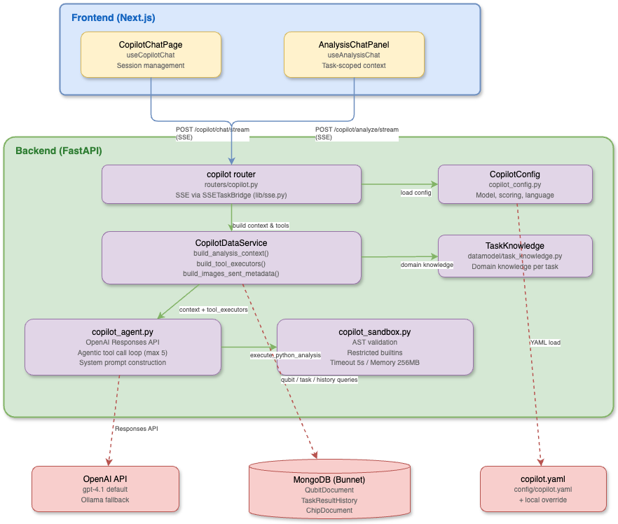

# Copilot Architecture

## Overview

QDash Copilot is an AI-powered assistant that helps experimentalists interpret qubit calibration results. It provides two interaction modes:

1. **Analysis Sidebar** -- Task-scoped analysis within the metrics modal, providing contextual interpretation of individual calibration results (e.g., CheckT1, CheckRabi).
2. **Chat Page** -- A dedicated chat interface for chip-wide questions, cross-qubit comparisons, and exploratory data analysis.

Both modes use the same underlying LLM agent with tool-calling capabilities, sandboxed Python execution, and SSE streaming for real-time progress feedback.

## Component Diagram



## Key Files

| File | Responsibility |
|------|---------------|
| `src/qdash/api/routers/copilot.py` | FastAPI router with `/config`, `/analyze`, `/analyze/stream`, `/chat/stream` endpoints; SSE event generation via `SSETaskBridge` |
| `src/qdash/api/services/copilot_data_service.py` | Data loading service: `build_analysis_context()`, `build_images_sent_metadata()`, qubit/task/history queries, tool executor wiring |
| `src/qdash/api/lib/copilot_agent.py` | LLM agent: system prompt construction, OpenAI Responses API calls, tool call loop, response parsing |
| `src/qdash/copilot/` | Shared Copilot runtime used outside the API process |
| `src/qdash/api/lib/copilot_sandbox.py` | Sandboxed Python execution: AST validation, restricted builtins, resource limits |
| `src/qdash/api/lib/copilot_analysis.py` | Pydantic models: `TaskAnalysisContext`, `AnalysisResponse`, `AnalysisContextResult`; request schemas |
| `src/qdash/api/lib/sse.py` | SSE utilities: `sse_event()` formatter, `SSETaskBridge` for queue-poll-heartbeat-drain pattern |
| `src/qdash/api/lib/copilot_config.py` | Configuration loader: `CopilotConfig`, `ModelConfig`, `ScoringThreshold` models; YAML loading with local override |
| `src/qdash/datamodel/task_knowledge.py` | `TaskKnowledge` model with domain-specific knowledge per calibration task |
| `config/copilot/config.yaml` | Shared enablement, language, and default model settings |
| `config/copilot/chat.yaml` | General chat models, prompt, initial message, and suggestions |
| `config/copilot/review.yaml` | Task result analysis models and scoring thresholds |
| `ui/src/hooks/useCopilotChat.ts` | React hook for the chat page: session management, SSE consumption, localStorage persistence |
| `ui/src/hooks/useAnalysisChat.ts` | React hook for the analysis sidebar: task-scoped SSE streaming, message management |
| `ui/src/components/features/chat/CopilotChatPage.tsx` | Chat page UI: session list, message rendering, blocks/chart display |
| `ui/src/components/features/metrics/AnalysisChatPanel.tsx` | Analysis sidebar UI within the metrics modal |

## Pi runtime authentication

The API forwards the authenticated user's access token and selected `X-Project-Id` to the Pi runtime on each chat or analysis turn, including approval responses. When no project header is supplied, it uses the user's default project. The internal `AGENT_RUNTIME_TOKEN` still authenticates API-to-runtime requests; user credentials travel in separate internal headers and are never added to model input or durable conversation state.

Each open conversation gets its own tool registry and a private temporary pi-qdash profile. Read tools, approved writes, and the Python sandbox use that user's credentials. The runtime overrides connection arguments supplied by a model or an older stored tool call and never falls back to `QDASH_API_TOKEN` or an administrator login. QDash API endpoints enforce the user's permissions.

The pinned pi-qdash version accepts a configuration file rather than an injected client. The runtime creates the profile in a private directory with a mode-0600 file and removes it when the conversation closes, including failures. Docker Compose mounts `/tmp` as tmpfs so these credentials do not enter the container's persistent filesystem. Deployments outside Compose should provide an equivalent memory-backed temporary directory.

## Configuration

### `config/copilot/`

```yaml
# config.yaml
enabled: true
copilot_backend: pi       # Also requires COMPOSE_PROFILES=agent-runtime for Docker Compose

# Language settings
thinking_language: en      # Internal reasoning language
response_language: auto    # Follow the latest user message; use ja/en to pin it

# Model settings
model:
  provider: openai         # openai | ollama
  name: gpt-4.1
  temperature: 0.7
  max_output_tokens: 2048

# chat.yaml
chat_models:
  - provider: ollama
    name: gemma4:26b
    base_url: env:OLLAMA_BASE_URL
    api_key_env: OLLAMA_API_KEY
system_prompt: |
  You are QDash Copilot...

# review.yaml
# Metrics for chip health evaluation
evaluation_metrics:
  qubit: [qubit_frequency, anharmonicity, t1, t2_echo, ...]
  coupling: [zx90_gate_fidelity, bell_state_fidelity]

# Scoring thresholds per metric
scoring:
  t1:
    good: 50
    excellent: 100
    bad: 20
    unit: "μs"
    higher_is_better: true
  # ... (see config/copilot/review.yaml for full list)

# Task analysis settings
analysis:
  enabled: true
  multimodal: true
  max_expected_images: 2
  max_conversation_turns: 10
```

Configuration is loaded via `ConfigLoader` by deep-merging `config.yaml`, `chat.yaml`, and
`review.yaml`. YAML string values support shell-style environment variable references such
as `${OPENAI_API_KEY}`, so environment-specific or sensitive values should be supplied
through environment variables instead of committed template files.

### Environment Variables

| Variable | Purpose |
|----------|---------|
| `OPENAI_API_KEY` | OpenAI API authentication |
| `OLLAMA_BASE_URL` | Ollama / OpenAI-compatible server URL (default: `http://localhost:11434`) |
| `OLLAMA_API_KEY` | Optional API key for the Ollama / OpenAI-compatible server |
| `DS4_BASE_URL` | DeepSeek v4 OpenAI-compatible gateway base URL |
| `DS4_API_KEY` | DeepSeek v4 API key |
| `NEXT_PUBLIC_API_URL` | API base URL for frontend (default: `/api`) |

### Developing a pi extension against the runtime

The Agent Runtime image installs `@oqtopus-team/pi-qdash` at a pinned version
(`agent-runtime/Dockerfile`), so a published release is the only way an
extension normally reaches it. While developing another extension (for example
`pi-qcaleval`), clone it under `agent-runtime/extensions/` (gitignored) and start
the runtime with the override:

```bash
git clone https://github.com/orangekame3/pi-qcaleval.git agent-runtime/extensions/pi-qcaleval
docker compose up -d agent-runtime
```

`compose.yaml` always mounts `agent-runtime/extensions/` at `/app/extensions`
(read-only); the directory is tracked through a `.gitkeep`, so the mount exists in
every clone and is empty in production. At startup the runtime takes every
subdirectory whose `package.json` carries a `pi` manifest as a checkout and
passes it to pi's resource loader as an additional extension path. No override
file or environment variable is involved, so `task deploy` and a plain
`docker compose up -d` behave the same. A checkout of a package the image also
installs (pi-qcaleval once pinned, or pi-qdash) replaces the installed copy; pi
rejects the installed one as a tool-name conflict, which the runtime logs as
"local checkout ... replaces installed ...". A pi-qdash checkout keeps the
per-name allowlist (`ALLOWLISTED_PACKAGES`), so developing it in place never
exposes a tool that production would filter; run `bun install` inside the
checkout first, since pi-qdash has dependencies of its own. The checkout must use the pi package layout
(`package.json` with a `pi.extensions` manifest, like pi-qdash) and may depend only
on the packages the runtime already ships (`@earendil-works/pi-coding-agent`,
`typebox`), because its imports resolve from the runtime's `node_modules`.

A checkout is trusted by its path, not by tool name: every tool it defines is
offered to the model without the pi-qdash allowlist review
(`agent-runtime/src/allowed-tools.ts`), with three limits. The same trust applies
in production to the packages listed in `TRUSTED_EXTENSION_PACKAGES` (for example
`@orangekame3/pi-qcaleval`), which the image installs at a pinned version next to
pi-qdash in `agent-runtime/Dockerfile`; a package is added to that list only after
review, and the version pin is the release gate.

- An experimental write name (`EXPERIMENTAL_WRITE_TOOL_NAMES`) still needs
  `AGENT_RUNTIME_ENABLE_WRITE_TOOLS=true`, and then goes through the same
  approval card as the pinned tool.
- A checkout tool is rerun after an interrupted turn only when its pi
  `annotations.readOnlyHint` is `true`; other local tools are reported to the
  model as interrupted instead, so a side-effecting tool never runs twice.
- A checkout tool that reuses a pinned tool's name replaces the pinned
  implementation; the runtime logs the replacement at startup.

Checkout tools receive the same extension context as pi-qdash tools, including
`modelRegistry` for calling a model other than the conversation's. Their pi
`promptSnippet` and `promptGuidelines` are inlined into the system prompt under
"Additional tools", since the pi-qdash tool guide does not know them. A checkout
tool that declares an `images` parameter (for example `qcal_evaluate`) gets it
filled by the runtime when the model omits it: the newest figure in the
conversation, whether a user attachment or a figure a pi-qdash tool returned, is
taken from the durable transcript, so the model never has to copy image bytes
into a call.

A checkout tool that declares `task_name` and `knowledge` parameters (again
`qcal_evaluate`) gets `knowledge` filled the same way: when the model names the
task and passes no reference of its own, the runtime fetches the task's review
guide from the QDash API as the user (`GET /tasks/{task_name}/knowledge`,
`review_prompt_text`, or the full `prompt_text` for a task without a review
guide, cut at 6000 characters) and passes it. Every evaluation of a task is thus
read against the same host-maintained reference, kept in the task knowledge
repository, rather than against a summary the planner improvised. The exact
text the evaluation model received is stored in the tool result's
`details.prompt`.

The runtime's `/chat` body carries two image lists: `initial_images` (the
analysis sidebar's opening figures, attached only when the conversation is new)
and `images` (attachments of the current turn, attached every time). Restart the
runtime after editing the extension; the startup log lists the local paths and
the tools they contributed. Anything placed under `agent-runtime/extensions/` on
the host is trusted the same way, so keep that directory empty on production hosts.

## Two Modes

### Analysis Sidebar

Activated from the metrics modal when viewing a specific task result (e.g., CheckT1 for qubit Q03).

- **Endpoint**: `POST /copilot/analyze/stream`
- **Hook**: `useAnalysisChat`
- **Context**: Full `TaskAnalysisContext` including task knowledge, qubit parameters, experiment results, historical data, neighbor qubit data, and coupling parameters
- **Use case**: "Is this T1 result normal?", "Why does the fit R² look low?"

### Chat Page

A standalone page (`/copilot`) for general questions about the calibration system.

- **Endpoint**: `POST /copilot/chat/stream`
- **Hook**: `useCopilotChat`
- **Context**: Chip ID, optional qubit ID, scoring thresholds
- **Use case**: "Compare T1 across all qubits", "Show me the frequency trend for Q16"
- **Sessions**: Persisted to localStorage with multi-session support
