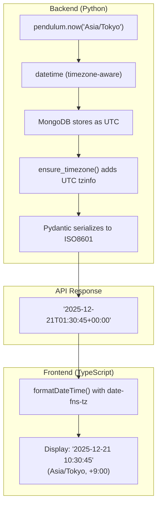
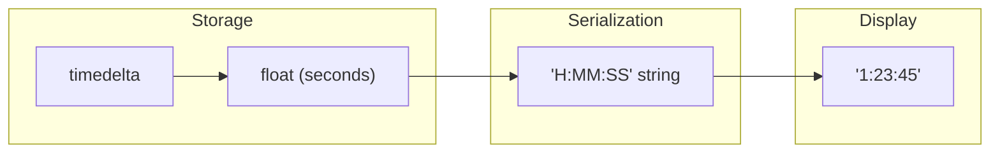

# Datetime Handling

This document describes how datetime values are handled across the QDash application.

## Overview

QDash uses a hybrid approach for datetime handling:

- **Storage**: Native `datetime` objects in MongoDB for efficient querying
- **API Response**: ISO8601 UTC strings for interoperability
- **Display**: Converted to Asia/Tokyo timezone in the frontend

## Data Flow



## Elapsed Time Handling

MongoDB's BSON format does not support `timedelta` natively:



## Backend (Python)

### Timezone Configuration

The default timezone is configured in `src/qdash/config.py`:

```python
timezone: str = "Asia/Tokyo"
```

### Utility Module

All datetime operations should use `src/qdash/common/datetime_utils.py`:

| Function | Description |
|----------|-------------|
| `now()` | Get current datetime in configured timezone |
| `now_iso()` | Get current datetime as ISO8601 string |
| `ensure_timezone(value)` | Ensure datetime is timezone-aware (handles naive MongoDB datetimes) |
| `to_datetime(value)` | Convert string/datetime/pendulum to standard datetime |
| `format_iso(dt)` | Format datetime as ISO8601 string |
| `parse_elapsed_time(elapsed_str)` | Parse elapsed time string to timedelta |
| `format_elapsed_time(elapsed)` | Format timedelta as "H:MM:SS" string |

### Pydantic Serialization

```python
# In API schema models
@field_validator("elapsed_time", mode="before")
def _parse_elapsed_time(cls, v: Any) -> timedelta | None:
    return parse_elapsed_time(v)

@field_serializer("elapsed_time")
def _serialize_elapsed_time(cls, v: timedelta | None) -> str | None:
    return format_elapsed_time(v) if v else None
```

### MongoDB Considerations

MongoDB returns naive datetimes (without timezone info), assumed to be UTC. Use `ensure_timezone()` to convert them:

```python
# In dbmodel validators
@field_validator("start_at", "end_at", mode="before")
@classmethod
def _ensure_timezone(cls, v: Any) -> datetime | None:
    if v is None:
        return None
    if isinstance(v, datetime):
        return ensure_timezone(v)
    return v
```

## Frontend (TypeScript)

### Utility Module

All datetime formatting should use `ui/src/utils/datetime.ts`:

| Function | Format | Example Output |
|----------|--------|----------------|
| `formatDateTime(utcString)` | `yyyy-MM-dd HH:mm:ss` | `2025-12-21 10:30:45` |
| `formatDate(utcString)` | `yyyy-MM-dd` | `2025-12-21` |
| `formatTime(utcString)` | `HH:mm:ss` | `10:30:45` |
| `formatDateTimeCompact(utcString)` | `MM/dd HH:mm` | `12/21 10:30` |

### Usage Example

```typescript
import { formatDateTime, formatDateTimeCompact } from "@/utils/datetime";

// Full datetime
<span>{formatDateTime(execution.start_at)}</span>
// Output: "2025-12-21 10:30:45"

// Compact format for lists
<span>{formatDateTimeCompact(task.end_at)}</span>
// Output: "12/21 10:30"

// Null handling (returns "-" for null/undefined)
<span>{formatDateTime(task.start_at)}</span>
// Output: "-" if null/undefined
```

### Dependencies

- `date-fns`: Date manipulation utilities
- `date-fns-tz`: Timezone conversion with `formatInTimeZone()`

## Best Practices

1. **Always use utility functions** - Never use `new Date().toLocaleString()` directly
2. **Handle null/undefined** - API responses may have null datetime fields
3. **Use appropriate format** - `formatDateTimeCompact()` for space-constrained UIs
4. **Store elapsed_time as seconds** - Convert to float before MongoDB storage

## Related Files

| Layer | File |
|-------|------|
| Backend utilities | `src/qdash/common/datetime_utils.py` |
| Frontend utilities | `ui/src/utils/datetime.ts` |
| API schemas | `src/qdash/api/schemas/*.py` |
| DB models | `src/qdash/dbmodel/*.py` |
