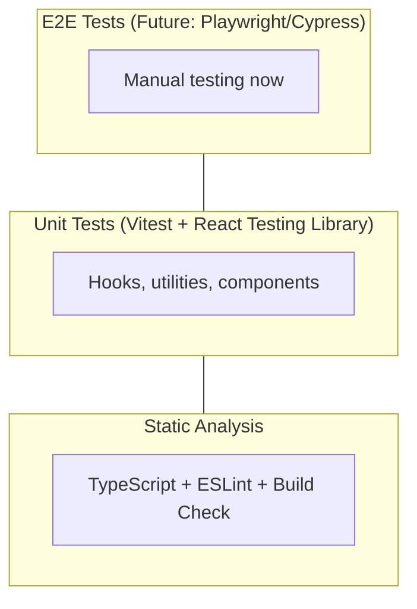

# UI Testing Guidelines

## Testing Strategy

### Current Testing Approach

QDash UI uses a layered testing approach:

1. **Unit Tests** - Vitest + React Testing Library for hooks and utilities
2. **Static Analysis** - TypeScript type checking and ESLint
3. **Build Verification** - Production build validation
4. **Manual Testing** - Feature testing in development environment

### Testing Pyramid for QDash UI



---

## Unit Testing

### Test Runner: Vitest

QDash uses [Vitest](https://vitest.dev/) with React Testing Library for unit testing.

**Configuration files:**

| File | Purpose |
| --- | --- |
| `vitest.config.mts` | Vitest config (jsdom, react plugin, tsconfig paths) |
| `vitest.setup.ts` | Setup file (`@testing-library/jest-dom` matchers) |

### Running Tests

```bash
# From project root
task test-ui

# From ui/ directory
bun run test:run    # Single run (CI-friendly)
bun run test        # Watch mode (development)
```

### Test File Location

Tests live alongside the code they test in `__tests__/` directories:

```
src/hooks/
├── __tests__/
│   ├── useTimeRange.test.ts
│   └── useCSVExport.test.ts
├── url-state/
│   ├── __tests__/
│   │   ├── types.test.ts
│   │   ├── useAnalysisUrlState.test.ts
│   │   ├── useChipUrlState.test.ts
│   │   ├── useMetricsUrlState.test.ts
│   │   ├── useCDFUrlState.test.ts
│   │   └── useExecutionUrlState.test.ts
│   ├── types.ts
│   └── use*UrlState.ts
└── use*.ts
```

### Writing Tests

#### Hook Tests

Use `renderHook` from React Testing Library:

```tsx
import { describe, it, expect } from "vitest";
import { renderHook, act } from "@testing-library/react";

import { useTimeRange } from "../useTimeRange";

describe("useTimeRange", () => {
  it("returns default time range", () => {
    const { result } = renderHook(() => useTimeRange());

    expect(result.current.timeRange.startAt).toBeDefined();
    expect(result.current.timeRange.endAt).toBeDefined();
  });

  it("updates start time and locks it", () => {
    const { result } = renderHook(() => useTimeRange());

    act(() => {
      result.current.updateStartAt("2024-01-01T00:00:00.000+09:00");
    });

    expect(result.current.timeRange.startAt).toBe("2024-01-01T00:00:00.000+09:00");
    expect(result.current.timeRange.isStartAtLocked).toBe(true);
  });
});
```

#### URL State Hook Tests

Use `withNuqsTestingAdapter` from `nuqs/adapters/testing`:

```tsx
import { describe, it, expect } from "vitest";
import { renderHook, act } from "@testing-library/react";
import { withNuqsTestingAdapter } from "nuqs/adapters/testing";

import { useChipUrlState } from "../useChipUrlState";

describe("useChipUrlState", () => {
  it("returns defaults when no URL params are set", () => {
    const { result } = renderHook(() => useChipUrlState(), {
      wrapper: withNuqsTestingAdapter({ searchParams: "" }),
    });

    expect(result.current.selectedChip).toBe("");
    expect(result.current.selectedDate).toBe("latest");
  });

  it("reads initial values from URL params", () => {
    const { result } = renderHook(() => useChipUrlState(), {
      wrapper: withNuqsTestingAdapter({
        searchParams: "chip=CHIP01&date=2024-01-01",
      }),
    });

    expect(result.current.selectedChip).toBe("CHIP01");
    expect(result.current.selectedDate).toBe("2024-01-01");
  });
});
```

> **Note:** For array parameters using `parseAsArrayOf`, nuqs uses comma-separated values (e.g., `params=t1,t2_echo`), not repeated keys.

#### Mocking

Use Vitest's built-in mocking:

```tsx
import { vi } from "vitest";

// Mock a module
vi.mock("@/client/chip/chip", () => ({
  getChipList: vi.fn().mockResolvedValue({
    chips: [{ chip_id: "chip-001" }],
  }),
}));

// Fake timers
vi.useFakeTimers();
vi.setSystemTime(new Date("2024-06-15T12:00:00.000Z"));
// ... run tests ...
vi.useRealTimers();

// Spies
vi.spyOn(document, "createElement");
```

#### Testing with React Query (Future)

```tsx
import { describe, it, expect } from "vitest";
import { render, screen, waitFor } from "@testing-library/react";
import { QueryClient, QueryClientProvider } from "@tanstack/react-query";

describe("ChipList", () => {
  const queryClient = new QueryClient({
    defaultOptions: {
      queries: { retry: false },
    },
  });

  const wrapper = ({ children }: { children: React.ReactNode }) => (
    <QueryClientProvider client={queryClient}>{children}</QueryClientProvider>
  );

  it("renders chips from API", async () => {
    render(<ChipList />, { wrapper });

    await waitFor(() => {
      expect(screen.getByText("chip-001")).toBeInTheDocument();
    });
  });
});
```

---

## Manual Testing

### Development Server

```bash
# Start development server
cd ui
bun run dev

# Access at http://localhost:3000
```

### Testing Workflow

1. **Start the full stack**

   ```bash
   # From project root
   docker compose up -d

   # Or start UI separately for faster iteration
   cd ui && bun run dev
   ```

2. **Test each page manually**
   - Navigate to each route
   - Verify data loads correctly
   - Test user interactions
   - Check error states
   - Verify responsive design

### Key Test Scenarios

Verify the following per page during manual testing:

- **Authentication** — login, redirect to `/inbox`, protected routes redirect to `/login`, logout clears session
- **Metrics** (`/metrics`) — page loads, chip selector, visualizations, time range
- **Chip** (`/chip`) — list loads, details page, qubit grid, task results
- **Execution** (`/execution`) — list loads, details, real-time updates
- **Analysis** (`/analysis`) — charts render, filters, export

---

## Type Checking

### Running TypeScript Checks

```bash
cd ui

# Full type check
bunx tsc --noEmit

# Watch mode during development
bunx tsc --noEmit --watch
```

### Common Type Errors and Fixes

#### Implicit `any` in Callbacks

```tsx
// ❌ Error: Parameter 'chip' implicitly has an 'any' type
chips.map((chip) => chip.name);

// ✅ Fix: Add explicit type
import type { ChipSummary } from "@/schemas";
chips.map((chip: ChipSummary) => chip.name);
```

#### Mutation Callback Types

```tsx
// ❌ Error: Parameter 'response' implicitly has an 'any' type
onSuccess: (response) => {
  console.log(response.data);
};

// ✅ Fix: Add explicit type
import type { AxiosResponse } from "axios";
import type { ExecuteFlowResponse } from "@/schemas";

onSuccess: (response: AxiosResponse<ExecuteFlowResponse>) => {
  console.log(response.data);
};
```

#### Array Method Types

```tsx
// ❌ Error in .reduce(), .filter(), .some(), .find()
tasks.reduce((acc, task) => { ... }, {})

// ✅ Fix: Type both accumulator and item
tasks.reduce((acc: Record<string, TaskInfo[]>, task: TaskInfo) => { ... }, {})
```

### Type Check in CI/CD

The Docker build runs type checking in strict mode. To reproduce locally:

```bash
# Clean build (like Docker)
rm -rf .next
bun run build
```

---

## Linting

### Running ESLint

```bash
cd ui

# Check for issues
bun run lint

# Auto-fix issues
bun run fmt
```

### ESLint Configuration

```javascript
// eslint.config.mjs
export default [
  {
    ignores: [
      "node_modules/**",
      ".next/**",
      "src/schemas/**", // Auto-generated types
      "src/client/**", // Auto-generated client
    ],
  },
  {
    files: ["**/*.{ts,tsx}"],
    rules: {
      "react-hooks/rules-of-hooks": "error",
      "react-hooks/exhaustive-deps": "warn",
      "@typescript-eslint/no-unused-vars": [
        "warn",
        { argsIgnorePattern: "^_", varsIgnorePattern: "^_" },
      ],
      "@typescript-eslint/no-explicit-any": "warn",
    },
  },
];
```

### Common Lint Issues

#### React Hooks Rules

```tsx
// ❌ Error: Hook called conditionally
function Component({ condition }) {
  if (condition) {
    const [state, setState] = useState(null); // Error!
  }
}

// ✅ Fix: Always call hooks at top level
function Component({ condition }) {
  const [state, setState] = useState(null);

  if (!condition) return null;
  // Use state...
}
```

#### Exhaustive Dependencies

```tsx
// ⚠️ Warning: Missing dependency
useEffect(() => {
  fetchData(userId);
}, []); // Missing 'userId'

// ✅ Fix: Add dependency
useEffect(() => {
  fetchData(userId);
}, [userId]);

// Or if intentional, disable with comment
useEffect(() => {
  // Run only on mount
  fetchData(userId);
  // eslint-disable-next-line react-hooks/exhaustive-deps
}, []);
```

---

## Build Verification

### Production Build

```bash
cd ui

# Build for production
bun run build

# Start production server
bun run start
```

### Build Checks

The build process includes:

1. **Compilation** - TypeScript to JavaScript
2. **Type Checking** - Full TypeScript validation
3. **Linting** - ESLint checks
4. **Optimization** - Tree shaking, minification
5. **Static Generation** - Pre-render static pages

### CI/CD Build

```bash
# Docker build (strict mode)
docker compose build ui

# This is equivalent to:
cd ui
rm -rf .next
bun install
bun run build
```

### Build Output Analysis

After building, check the output:

```
Route (app)                              Size     First Load JS
┌ ○ /                                    143 B          87.7 kB
├ ○ /admin                               7.71 kB         123 kB
├ ○ /analysis                            13.6 kB         171 kB
├ ○ /chip                                10.3 kB         172 kB
├ ƒ /chip/[chipId]/qubit/[qubitsId]      1.34 MB        1.52 MB  ← Large!
...
```

Monitor for:

- Large bundle sizes (> 500KB first load)
- Missing routes
- Build errors

---

## Debugging Tips

### React Query DevTools

Add DevTools during development:

```tsx
// src/app/providers.tsx
import { ReactQueryDevtools } from "@tanstack/react-query-devtools";

export function Providers({ children }) {
  return (
    <QueryClientProvider client={queryClient}>
      {children}
      <ReactQueryDevtools initialIsOpen={false} />
    </QueryClientProvider>
  );
}
```

### Network Tab Debugging

1. Open Chrome DevTools → Network tab
2. Filter by "Fetch/XHR"
3. Check request/response for API calls
4. Verify headers (X-Username)

### Console Debugging

```tsx
// Add temporary logging
const { data, isLoading, error } = useQuery({
  queryKey: ["chips"],
  queryFn: async () => {
    console.log("Fetching chips...");
    const result = await getChipList();
    console.log("Got chips:", result);
    return result;
  },
});
```

### React Developer Tools

Install React DevTools browser extension to:

- Inspect component tree
- View props and state
- Profile rendering performance
