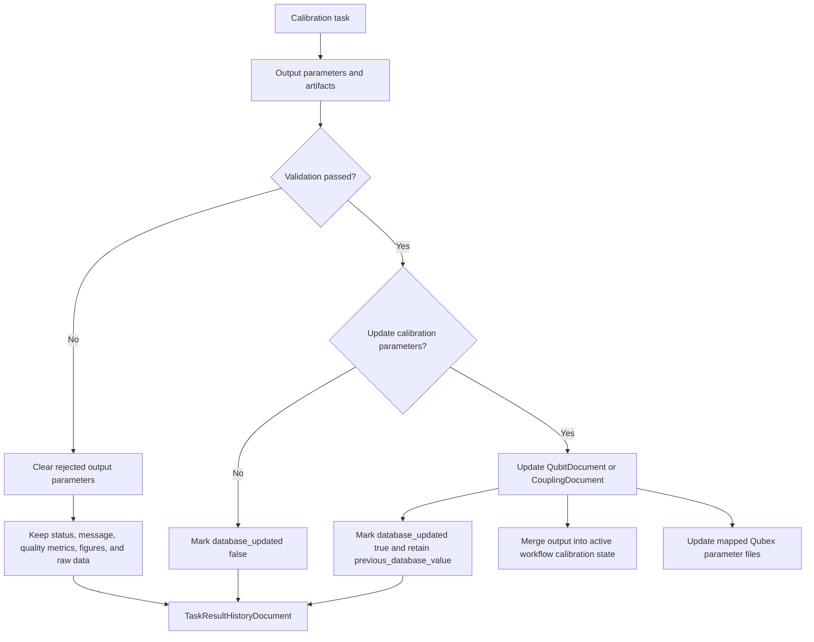
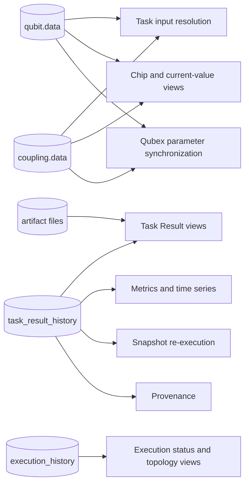

# Calibration Data Lifecycle

QDash separates measured task outputs from the accepted calibration state used by later
executions and hardware configuration.

## Data stores and responsibilities

"The database" is not one undifferentiated store. Each collection or runtime store has a distinct
responsibility.

| Store | Role | Primary consumers | Authoritative current calibration |
| --- | --- | --- | --- |
| Workflow `CalibDataModel` | In-memory calibration state for the active workflow | Downstream workflow tasks | No; execution-scoped |
| `task_result_history` | Durable measurement and task execution history | Task Result views, Metrics, snapshot re-execution, provenance | No |
| `qubit.data` / `coupling.data` | Latest accepted calibration parameters | Input resolution, chip views, later executions | Yes |
| `execution_history` | Execution lifecycle, ownership, status, tags, and timing | Execution views and operations | No |
| Calibration note | Qubex experiment note captured during execution | Workflow diagnostics and exported note data | No |
| Figure and raw-data files | Large task artifacts stored outside MongoDB documents | Task Result and analysis views | No |
| Qubex parameter files | Hardware-facing parameter representation synchronized from accepted outputs | Qubex experiments and external tooling | Derived from accepted state |

`task_result_history` answers "what did this task measure?" The qubit and coupling collections
answer "what calibration value is currently accepted?" A successful task result can exist without
replacing the accepted value.

## Write path

The task executor validates output before `BackendSaver` applies it. Task history is written after
the persistence decision, so its output metadata records whether the accepted calibration database
was updated.

The Qubex parameter update happens after the MongoDB calibration update. `database_updated` only
reports the `qubit.data` or `coupling.data` write; it does not prove that every mapped Qubex file was
updated. A Qubex synchronization failure is logged separately and does not revert the MongoDB
write.

## Read path

Consumers select a store based on whether they need the current accepted state or historical
evidence.

Normal task input resolution starts from the current accepted qubit or coupling data according to
the task's `InputParameterSpec`. Snapshot re-execution instead restores effective Input and Run
parameters from task history. Metrics also reads task history, so a measurement-only result remains
visible without becoming a current calibration value.

## Output outcomes

| Outcome | Task history | Metrics output | Current calibration DB | Active workflow state | Qubex parameter files |
| --- | --- | --- | --- | --- | --- |
| Validated and applied | Recorded with `database_updated: true` | Included | Updated | Updated | Update attempted |
| Validated measurement-only | Recorded with `database_updated: false` | Included | Retained | Retained | Retained |
| Validation rejected | Diagnostic record retained; rejected outputs cleared | Rejected output not included | Retained | Retained | Retained |

Task Result UI maps the output metadata to these labels:

- `database_updated: true`: **Calibration DB updated**
- `database_updated: false`: **Measurement only**
- Missing metadata on an older result: **Update status unknown**

The field name describes the current implementation. Its scope is specifically the authoritative
calibration value in MongoDB, not task-history persistence, Git commits, or Qubex file updates.

## Persistence controls

`persist_output_parameters` is the execution-level write-back control. Normal workflows default to
enabled, while Tasks quick runs default to disabled. A workflow task can override that behavior with
`update_calibration_parameters`; the resolved value is passed into its task context.

The control is independent of parameter resolution. It changes where validated outputs are
published, not which Input or Run parameters the experiment uses. See
[Parameter Resolution](./parameter-resolution.md) for precedence, snapshots, and overrides.

## Implementation files

- `src/qdash/workflow/engine/orchestrator.py`
- `src/qdash/workflow/engine/task/executor.py`
- `src/qdash/workflow/engine/task/backend_saver.py`
- `src/qdash/workflow/engine/task/history_recorder.py`
- `src/qdash/dbmodel/task_result_history.py`
- `src/qdash/dbmodel/qubit.py`
- `src/qdash/dbmodel/coupling.py`
- `src/qdash/workflow/engine/params_updater.py`
