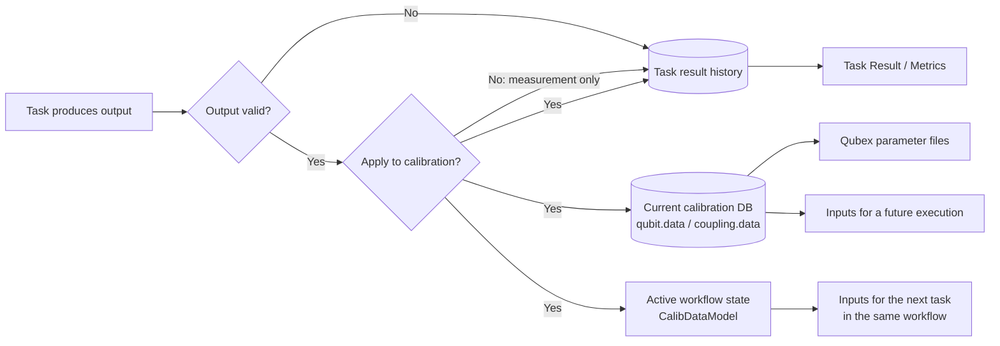
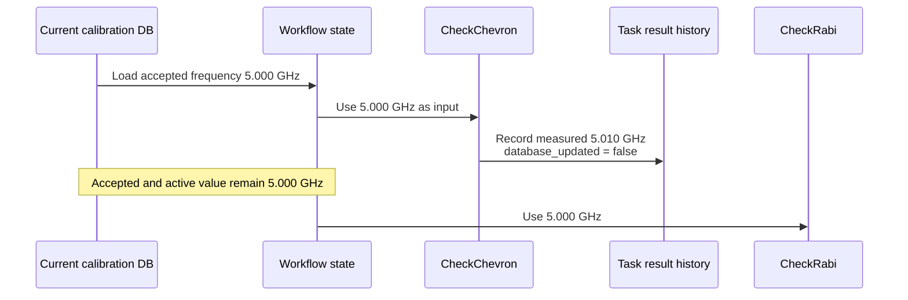

# Calibration Data Lifecycle

QDash separates measured task outputs from the accepted calibration state used by later
executions and hardware configuration.

## The four places called parameters

Start with the question being answered. Only one store is the authoritative current calibration.

| Question | Place | Lifetime |
| --- | --- | --- |
| What did this task measure? | `task_result_history.output_parameters` | Historical record |
| What value is accepted now? | `qubit.data` or `coupling.data` | Current calibration in MongoDB |
| What should the next task in this workflow use? | Workflow `CalibDataModel` | Current workflow only |
| What is exported for Qubex to use? | Qubex parameter files | Derived hardware configuration |

The first two are different MongoDB records. Workflow state is in memory, and Qubex parameter
files are outside MongoDB.

## Where one task output goes

Every task creates or updates its Task Result record. Applying an output additionally changes the
current calibration DB and the active workflow state. Measurement-only output stops at history, so
it remains visible without changing later inputs.

Rejected output parameters are cleared before history aggregation. The diagnostic Task Result still
retains status, message, quality metrics, figures, and raw-data paths.

## Coherence Check example

Assume the accepted `qubit_frequency` is 5.000 GHz and `CheckChevron` measures 5.010 GHz. In the
`coherence_check` template, Chevron is measurement-only.

The Task Result modal and Metrics can show the 5.010 GHz measurement. `CheckRabi` still receives
5.000 GHz, and a later workflow also starts from 5.000 GHz. If Chevron were applied, both the
current calibration DB and workflow state would become 5.010 GHz before Rabi runs.

## Output outcomes

| Outcome | Task history | Metrics output | Current calibration DB | Active workflow state | Qubex parameter files |
| --- | --- | --- | --- | --- | --- |
| Validated and applied | Recorded with `database_updated: true` | Included | Updated | Updated | Update attempted |
| Validated measurement-only | Recorded with `database_updated: false` | Included | Retained | Retained | Retained |
| Validation rejected | Diagnostic record retained; rejected outputs cleared | Rejected output not included | Retained | Retained | Retained |

Task Result UI maps the output metadata to these labels:

- `database_updated: true`: **Calibration DB updated**
- `database_updated: false`: **Measurement only**
- Missing metadata on an older result: **Update status unknown**

The field name describes the current implementation. Its scope is specifically the authoritative
calibration value in MongoDB, not task-history persistence, Git commits, or Qubex file updates.
The MongoDB write occurs before Qubex synchronization, and a file synchronization failure does not
roll the MongoDB value back.

## Persistence controls

`persist_output_parameters` is the execution-level write-back control. Normal workflows default to
enabled, while Tasks quick runs default to disabled. A workflow task can override that behavior with
`update_calibration_parameters`; the resolved value is passed into its task context.

The control is independent of parameter resolution. It changes where validated outputs are
published, not which Input or Run parameters the experiment uses. See
[Parameter Resolution](./parameter-resolution.md) for precedence, snapshots, and overrides.

## Implementation files

- `src/qdash/workflow/engine/orchestrator.py`
- `src/qdash/workflow/engine/task/executor.py`
- `src/qdash/workflow/engine/task/backend_saver.py`
- `src/qdash/workflow/engine/task/history_recorder.py`
- `src/qdash/dbmodel/task_result_history.py`
- `src/qdash/dbmodel/qubit.py`
- `src/qdash/dbmodel/coupling.py`
- `src/qdash/workflow/engine/params_updater.py`
