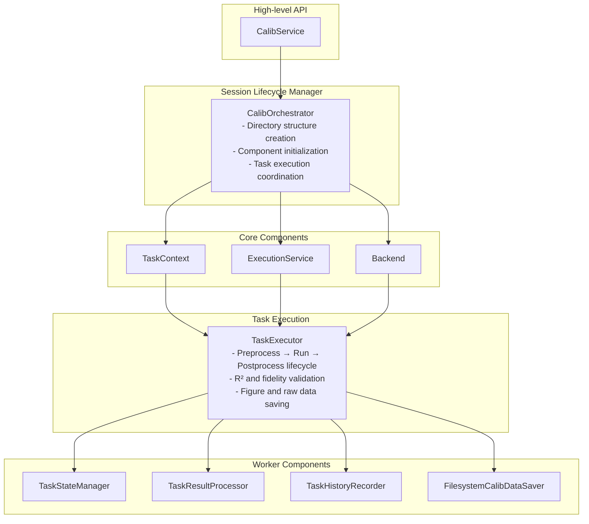
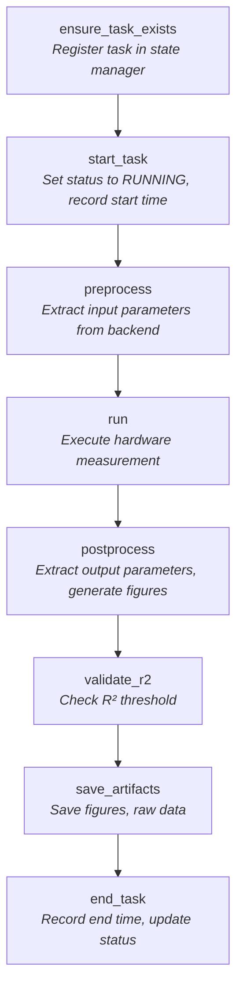
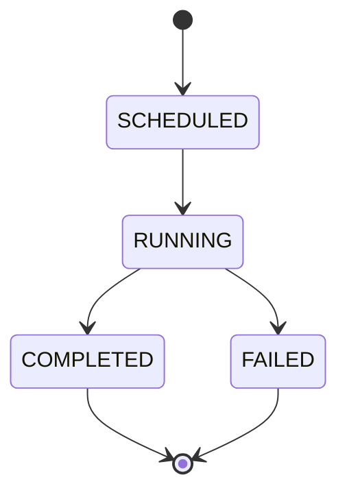
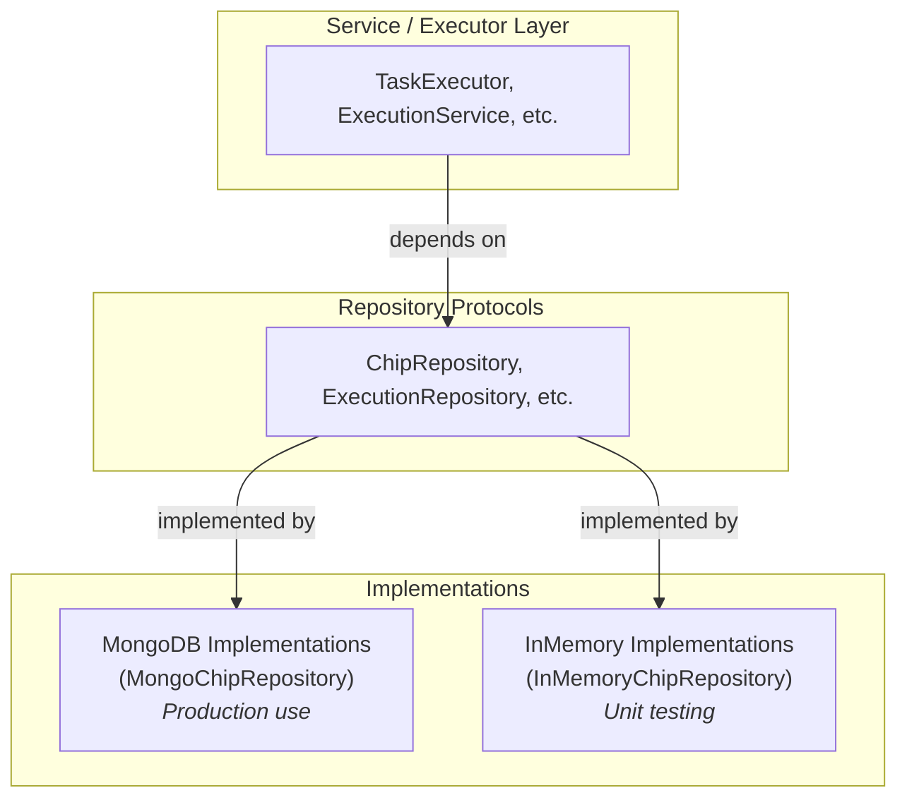
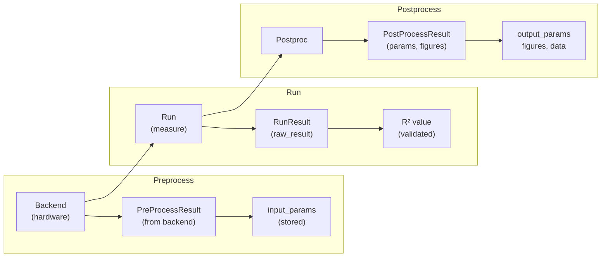
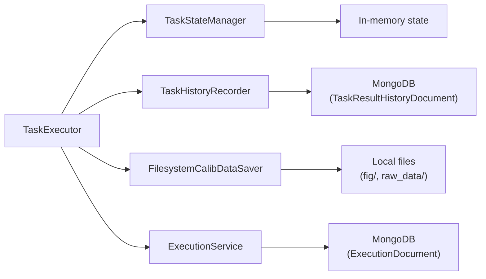

# Workflow Engine Architecture

This document explains the architecture of the `qdash.workflow.engine` module,
which provides the core infrastructure for calibration workflow execution.

## Overview

The engine module is responsible for:

- **Task Execution**: Running calibration tasks with proper lifecycle management
- **State Management**: Tracking task status, parameters, and results
- **Execution Tracking**: Managing workflow execution sessions
- **Scheduling**: Coordinating parallel task execution
- **Data Persistence**: Saving results to MongoDB and filesystem
- **Backend Abstraction**: Supporting multiple hardware backends (qubex, fake)

## Architecture Diagram



## Module Structure

```
engine/
├── __init__.py          # Public API exports
├── orchestrator.py      # CalibOrchestrator - session lifecycle
├── config.py            # CalibConfig - session configuration
├── task_runner.py       # Prefect task wrappers
├── params_updater.py    # Backend parameter updates
├── util.py              # Utility functions
│
├── task/                # Task execution layer
│   ├── context.py       # TaskContext - execution context
│   ├── executor.py      # TaskExecutor - task lifecycle
│   ├── state_manager.py # TaskStateManager - state tracking
│   ├── result_processor.py # Result validation
│   └── history_recorder.py # History recording
│
├── execution/           # Execution management layer
│   ├── service.py       # ExecutionService - session tracking
│   ├── state_manager.py # ExecutionStateManager
│   └── models.py        # Execution data models
│
├── scheduler/           # Scheduling layer
│   ├── cr_scheduler.py  # CRScheduler - 2-qubit scheduling
│   ├── one_qubit_scheduler.py  # 1-qubit scheduling
│   └── plugins.py       # Ordering strategies
│
├── repository/          # Data persistence layer
│   ├── protocols.py     # Repository interfaces
│   ├── mongo_impl.py    # MongoDB implementations
│   ├── mongo_execution.py  # Execution repository
│   └── filesystem_impl.py  # Filesystem implementations
│
└── backend/             # Hardware abstraction layer
    ├── base.py          # BaseBackend abstract class
    ├── factory.py       # Backend factory
    ├── qubex.py         # Qubex backend
    └── fake.py          # Fake backend for testing
```

## Core Components

### 1. CalibOrchestrator

**Location**: `engine/orchestrator.py`

**Purpose**: Manages the complete lifecycle of a calibration session.

**Responsibilities**:
- Creates directory structure for calibration data
- Initializes ExecutionService, TaskContext, and Backend
- Coordinates task execution via `run_task()`
- Handles session completion and failure

**Usage**:
```python
from qdash.workflow.engine import CalibOrchestrator, CalibConfig

config = CalibConfig(
    username="alice",
    chip_id="64Qv3",
    qids=["0", "1"],
    execution_id="20240101-001",
)
orchestrator = CalibOrchestrator(config)
orchestrator.initialize()

# Run tasks
result = orchestrator.run_task("CheckRabi", qid="0")

# Complete session
orchestrator.complete()
```

### 2. TaskContext

**Location**: `engine/task/context.py`

**Purpose**: Container for task execution state and results.

**Key Attributes**:
- `execution_id`: Current execution identifier
- `task_result`: Container for qubit/coupling/global task results
- `calib_data`: Calibration data (parameters extracted from tasks)

### 3. TaskExecutor

**Location**: `engine/task/executor.py`

**Purpose**: Executes individual calibration tasks with proper lifecycle management.

**Execution Flow**:



### 4. TaskStateManager

**Location**: `engine/task/state_manager.py`

**Purpose**: Manages task state transitions and parameter storage.

**State Transitions**:



**Key Methods**:
- `ensure_task_exists()`: Create task entry if not exists
- `start_task()`: Mark task as running
- `put_input_parameters()`: Store input parameters
- `put_output_parameters()`: Store output parameters
- `update_task_status_to_completed()`: Mark success
- `update_task_status_to_failed()`: Mark failure
- `end_task()`: Record end timestamp

### 5. ExecutionService

**Location**: `engine/execution/service.py`

**Purpose**: Manages workflow execution sessions in MongoDB.

**Responsibilities**:
- Creates and tracks execution records
- Updates task results during execution
- Manages execution status (RUNNING, COMPLETED, FAILED)
- Handles tags and metadata

### 6. Schedulers

#### CRScheduler (2-Qubit)

**Location**: `engine/scheduler/cr_scheduler.py`

**Purpose**: Schedules 2-qubit (Cross-Resonance) calibration tasks.

**Features**:
- Graph coloring for conflict avoidance
- MUX-aware parallel grouping
- Multiple coloring strategies

#### OneQubitScheduler (1-Qubit)

**Location**: `engine/scheduler/one_qubit_scheduler.py`

**Purpose**: Schedules 1-qubit calibration tasks.

**Features**:
- Box-aware grouping (BOX_A, BOX_B, BOX_MIXED)
- Synchronized execution mode
- Pluggable ordering strategies

### 7. Repository Layer

**Location**: `engine/repository/`

**Purpose**: Data persistence abstraction using the Repository Pattern.

The Repository Pattern separates data access logic from business logic, enabling:
- **Testability**: Swap MongoDB for InMemory implementations in tests
- **Flexibility**: Easy to change persistence mechanisms
- **Clean Architecture**: Business logic doesn't depend on database details



**Protocols** (interfaces in `protocols.py`):

| Protocol | Purpose |
|----------|---------|
| `TaskResultHistoryRepository` | Task result history recording |
| `ChipRepository` | Chip configuration access |
| `ChipHistoryRepository` | Chip history snapshots |
| `CalibDataSaver` | Figure and raw data saving |
| `ExecutionRepository` | Execution session records |
| `CalibrationNoteRepository` | Calibration note storage |
| `QubitCalibrationRepository` | Qubit calibration data updates |
| `CouplingCalibrationRepository` | Coupling calibration data updates |
| `ExecutionCounterRepository` | Atomic execution ID counter |
| `ExecutionLockRepository` | Project execution locking |
| `UserRepository` | User preferences |
| `TaskRepository` | Task name lookup |

**MongoDB Implementations**:
- `MongoTaskResultHistoryRepository`
- `MongoChipRepository`
- `MongoChipHistoryRepository`
- `MongoExecutionRepository`
- `MongoCalibrationNoteRepository`
- `MongoQubitCalibrationRepository`
- `MongoCouplingCalibrationRepository`
- `MongoExecutionCounterRepository`
- `MongoExecutionLockRepository`
- `MongoUserRepository`
- `MongoTaskRepository`

**InMemory Implementations** (for testing):
- `InMemoryExecutionRepository`
- `InMemoryChipRepository`
- `InMemoryChipHistoryRepository`
- `InMemoryTaskResultHistoryRepository`
- `InMemoryCalibrationNoteRepository`
- `InMemoryQubitCalibrationRepository`
- `InMemoryCouplingCalibrationRepository`
- `InMemoryExecutionCounterRepository`
- `InMemoryExecutionLockRepository`
- `InMemoryUserRepository`
- `InMemoryTaskRepository`

**Filesystem Implementations**:
- `FilesystemCalibDataSaver`: Local filesystem for figures/data

**Usage with Dependency Injection**:

```python
# Production code (MongoDB)
from qdash.workflow.engine.repository import MongoChipRepository

chip_repo = MongoChipRepository()
chip = chip_repo.get_current_chip(username="alice")

# Test code (InMemory)
from qdash.workflow.engine.repository import InMemoryChipRepository

chip_repo = InMemoryChipRepository()
chip_repo.add_chip("alice", mock_chip)  # Test helper

# With DI in service
scheduler = CRScheduler(
    username="alice",
    chip_id="64Qv3",
    chip_repo=InMemoryChipRepository(),  # Inject for testing
)
```

### 8. Backend Layer

**Location**: `engine/backend/`

**Purpose**: Hardware abstraction.

**BaseBackend Interface**:
```python
class BaseBackend(ABC):
    name: str

    @abstractmethod
    def connect(self) -> None: ...

    @abstractmethod
    def get_instance(self) -> Any: ...

    @abstractmethod
    def save_note(...) -> None: ...

    @abstractmethod
    def update_note(...) -> None: ...
```

**Implementations**:
- `QubexBackend`: Real hardware via qubex library
- `FakeBackend`: Simulation for testing

## Data Flow

### Task Execution Data Flow



### Persistence Flow



## Extension Points

### Adding a New Backend

1. Create `engine/backend/your_backend.py`:
```python
from qdash.workflow.engine.backend.base import BaseBackend

class YourBackend(BaseBackend):
    name = "your_backend"

    def connect(self) -> None:
        # Initialize hardware connection
        pass

    def get_instance(self) -> Any:
        # Return experiment session
        pass
```

2. Register in `engine/backend/factory.py`

### Adding a New Scheduler Strategy

1. Implement the strategy in `engine/scheduler/plugins.py`
2. Register in the scheduler's strategy registry

### Adding a New Repository Implementation

1. Define or use existing protocol from `engine/repository/protocols.py`:
```python
@runtime_checkable
class YourRepository(Protocol):
    def find(self, id: str) -> YourModel | None: ...
    def save(self, model: YourModel) -> None: ...
```

2. Create MongoDB implementation:
```python
# engine/repository/mongo_your.py
class MongoYourRepository:
    def find(self, id: str) -> YourModel | None:
        doc = YourDocument.find_one({"id": id}).run()
        return self._to_model(doc) if doc else None

    def save(self, model: YourModel) -> None:
        YourDocument.from_model(model).save()
```

3. Create InMemory implementation for testing:
```python
# engine/repository/inmemory_impl.py
class InMemoryYourRepository:
    def __init__(self):
        self._store: dict[str, YourModel] = {}

    def find(self, id: str) -> YourModel | None:
        return self._store.get(id)

    def save(self, model: YourModel) -> None:
        self._store[model.id] = model

    def clear(self) -> None:  # Test helper
        self._store.clear()
```

4. Export from `engine/repository/__init__.py`

5. Use with dependency injection in services:
```python
class YourService:
    def __init__(self, *, repo: YourRepository | None = None):
        if repo is None:
            from ... import MongoYourRepository
            repo = MongoYourRepository()
        self._repo = repo
```

## Best Practices

### For Engine Developers

1. **Use Protocols**: Define interfaces before implementations
2. **Dependency Injection**: Pass repositories/services as constructor args
3. **State Isolation**: Don't share mutable state between tasks
4. **Error Handling**: Always update task status on failure
5. **Logging**: Use structured logging for debugging

### For Service Users

1. **Use CalibService**: Don't directly instantiate engine components
2. **Handle Exceptions**: Catch `TaskExecutionError`, `R2ValidationError`
3. **Check Results**: Verify task success before proceeding

## Related Documentation

- [Testing Guidelines](./testing.md): How to test workflow components
- [CalibService API](https://github.com/oqtopus-team/qdash/blob/develop/src/qdash/workflow/__init__.py): High-level API (source code)
