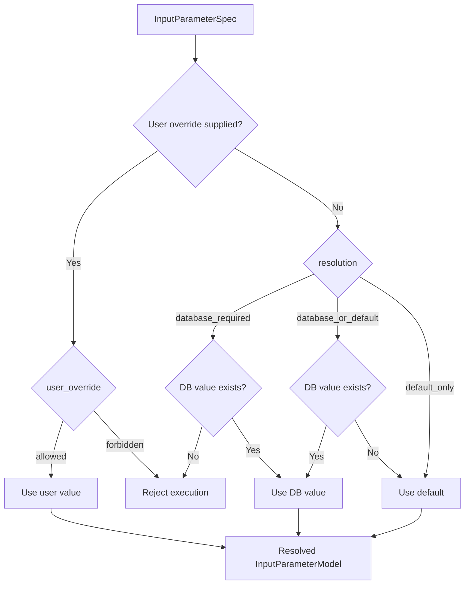
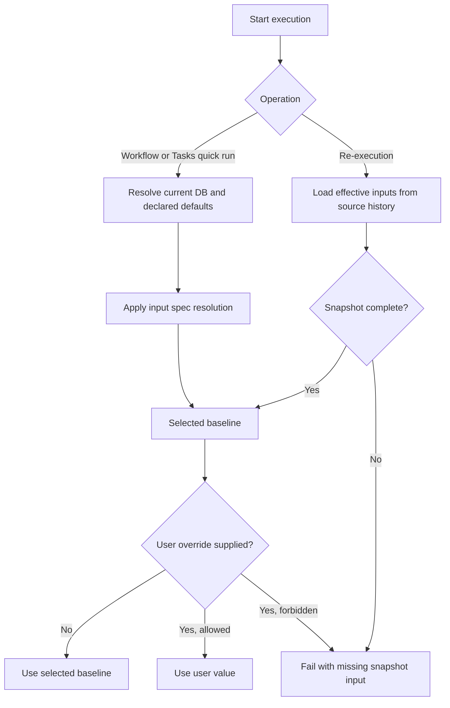
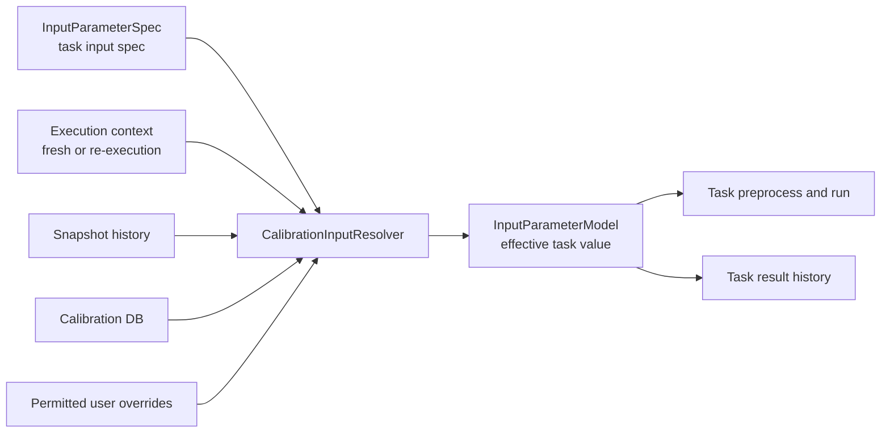
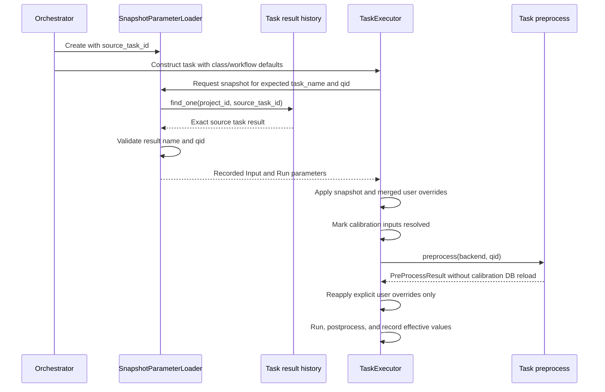

# Parameter Resolution

The workflow engine resolves task inputs, experiment configuration, snapshots, user overrides, and output persistence at different lifecycle stages.

## Parameter model contracts

`BaseTask` defines three symmetric declaration/runtime pairs:

| Collection | Model | Meaning |
| --- | --- | --- |
| `input_spec` | `InputParameterSpec` | Resolution and override policy declared by the task class |
| `input_parameters` | `InputParameterModel` | Values resolved for one task instance |
| `run_spec` | `RunParameterSpec` | Experiment configuration specified by the task class |
| `run_parameters` | `RunParameterModel` | Effective experiment configuration for one run |
| `output_spec` | `OutputParameterSpec` | Calibration outputs declared by the task class |
| `output_parameters` | `OutputParameterModel` | Calibration values produced by one task instance |

Every calibration input spec explicitly states its resolution and override policies through a named constructor:

```python
input_spec = {
    "qubit_frequency": InputParameterSpec.required_database(
        unit="GHz",
    ),
    "readout_amplitude": InputParameterSpec.database_or_default(
        default=DEFAULT_READOUT_AMPLITUDE,
        unit="a.u.",
    ),
}
```

`resolution` has three explicit values:

- `database_required`: use the database value and fail when it is absent.
- `database_or_default`: prefer the database value and otherwise use `default`.
- `default_only`: do not read this parameter from the database.

The constructors default to allowing user overrides; pass `user_override="forbidden"` when a task must prohibit them. A permitted user override has higher precedence than the selected baseline. The constructor's `default` is spec-time fallback data; the effective runtime value is stored separately in `input_parameters` as an `InputParameterModel`.

For coupling tasks, `InputParameterSpec.parameter_name` selects the database key and `InputParameterSpec.qid_role` selects `control`, `target`, or `coupling` data. Qubit tasks read from the selected qubit record.

## Normal workflow execution

Task construction resolves Run parameters in this order, from highest to lowest precedence:

1. Explicit `task_details[task_name].run_parameters`
2. Per-task entries in `CalibConfig.default_run_parameters`
3. Flat entries in `CalibConfig.default_run_parameters`
4. `run_spec` specified on the task class

`QubexTask.preprocess()` then resolves each declared Input parameter:

1. Follow the input spec's resolution policy.
2. Produce an effective `InputParameterModel` for the task instance.
3. Reapply an explicit user override when `user_override="allowed"`.
4. Reject an override when `user_override="forbidden"`.



The effective Input and Run parameter models are recorded in task result history for provenance and later snapshot re-execution.

## Execution-level parameter policy

The operation itself determines the baseline; no additional source selector is needed:

| Operation | Calibration input baseline | Run parameter baseline | Output persistence default |
| --- | --- | --- | --- |
| Normal workflow | Current DB, following task input specs | Task/workflow specs | Enabled |
| Tasks quick run | Current DB, following task input specs | Task specs and submitted overrides | Disabled |
| Task re-execution | Source task snapshot | Source task snapshot | Existing re-execution setting |
| Full execution re-execution | Source execution snapshot | Source execution snapshot | Existing workflow setting |

This gives `re-execution` one stable meaning: reproduce the recorded execution conditions, optionally with explicit parameter overrides. Running the same task against current calibration state is a new Tasks quick run, not a re-execution mode.

`user_override` and `persist_output_parameters` remain independent policies. A permitted override has the highest precedence; choosing to persist new outputs does not change how inputs were selected.



A re-execution must not silently fall back to current database values. Such fallback would make it non-reproducible. Missing required snapshot data should fail with an actionable error; the operator can then start a new Tasks quick run against current state.

### Model boundaries

Task classes declare immutable intent with `InputParameterSpec`, `RunParameterSpec`, and `OutputParameterSpec`. Each task instance receives the matching mutable runtime model: `InputParameterModel`, `RunParameterModel`, and `OutputParameterModel`. All three specs use `default` for their initial value and expose `create_model()` for the conversion.

The three runtime models may share persisted calibration metadata internally, but their distinct types keep input, run, and output roles visible at API boundaries and in type checking.



## Snapshot re-execution

### Re-execution behavior

For a single-task re-execution, `CalibService` passes `source_task_id` to `SnapshotParameterLoader`, which loads that exact task result. `task_name` and `qid` then validate that the selected history record matches the requested task. This avoids resolving an already identified task indirectly through its execution.

For a full workflow re-execution, no single task ID identifies every source task. In that case the loader uses `source_execution_id`, indexes task history by `(task_name, qid)`, and returns the last recorded entry for duplicate keys because records are read in ascending start time.

`TaskExecutor` applies parameters in this sequence:

1. Construct the task from class and workflow defaults.
2. Require a matching source snapshot and validate its declared Input coverage.
3. Replace Input and Run collections with the snapshot and merged user overrides.
4. Mark calibration Inputs as resolved, so `preprocess()` cannot refresh them from the database.
5. Reapply only explicit user overrides.
6. Run the experiment and record the resulting effective parameters.



The second override application preserves values computed during preprocessing while guaranteeing that explicit user input remains authoritative. The snapshot marker prevents preprocessing from replacing calibration inputs with current database values.

Calibration inputs are resolved before task preprocessing and passed as `InputParameterModel` values:

```text
Execution request
  -> CalibrationInputResolver(operation context)
  -> Apply permitted user overrides
  -> Task.preprocess(resolved inputs)
  -> Task.run()
```

Task preprocessing may compute derived runtime values, but it must not independently change the selected point-in-time source. Database access for declared calibration inputs belongs to `CalibrationInputResolver`.

### Effective-input validation

Numeric constraints such as `greater_than` and `less_than` belong to `InputParameterSpec`. The executor validates them after database or snapshot resolution and after user overrides, but before `run()`.

Concrete task `preprocess()` and `run()` methods must treat Input and Run parameters as read-only. They must not repair an invalid value, replace it with a default, or otherwise change the effective parameter collections. A missing database value may select the specified default only when the input spec uses `database_or_default()`; a present but invalid database, snapshot, or override value fails execution.

For a single-task re-execution, a missing `source_task_id`, a mismatch between the selected result and the requested task, or incomplete declared snapshot inputs causes execution to fail instead of silently changing its baseline. For full workflow re-execution, a missing `(task_name, qid)` entry has the same behavior. Execution-wide snapshot loading is bounded by `DEFAULT_SNAPSHOT_LIMIT`.

### Full execution re-execution

`POST /executions/{execution_id}/re-execute` starts the saved flow deployment with `source_execution_id`. Its `parameter_overrides` field overrides top-level Prefect flow parameters; it is not automatically interpreted as task-level `{input, run}` data. A flow that exposes task-level overrides must accept them and pass the structured value to `CalibService(parameter_overrides=...)`.

The re-execution UI should state that previous execution values are the baseline and allow explicit overrides. It should not offer current database values as another re-execution mode; that operation belongs on the Tasks page as a new run.

### Single-task result re-execution

`POST /task-results/{task_id}/re-execute` invokes the system `single-task-executor` with the source execution and source task IDs. It accepts task-level overrides in this shape:

```json
{
  "parameter_overrides": {
    "input": {"qubit_frequency": 5.1},
    "run": {"shots": 2000}
  }
}
```

The source task ID both selects the recorded parameter snapshot and links the child result to its parent. The source execution ID remains execution context; it is not used to re-identify the single source task.

The task-result re-execution modal should show the snapshot value as the baseline. Edited fields are user overrides and take precedence. The UI should distinguish the original snapshot value from the final submitted value rather than replacing the baseline in place.

## Tasks page quick run

`POST /tasks/{task_name}/execute` also uses `single-task-executor`, but sets `source_execution_id` to `None`.

- `input_parameter_overrides` becomes `parameter_overrides.input`.
- `run_parameter_overrides` becomes a per-task `default_run_parameters` entry.
- A `SnapshotParameterLoader` is still created when Input overrides exist so they can be reapplied after preprocessing.
- With no Input override, Qubex preprocessing loads current database values normally.

The Tasks page **Reload** action is client-side preparation only. It reads the selected qubit or coupling record and fills the form. The server treats every non-empty submitted field as an explicit override; it does not distinguish a typed value from a value inserted by Reload.

## Output persistence

`persist_output_parameters` controls authoritative write-back. When false, task history, execution state, figures, raw data, and in-memory output processing still occur, but `BackendSaver` skips calibration database and backend parameter writes.

When persistence is enabled:

- Qubit outputs update the qubit calibration repository.
- Coupling outputs update the coupling calibration repository.
- Successful qubit outputs are synchronized through the backend parameter updater.
- Failed validation skips backend parameter updates unless `force_update_params` is true.

The API field `update_params` is passed to `single-task-executor` as `force_update_params` and also controls GitHub integration for that run. It does not replace `persist_output_parameters`; persistence must be enabled before output values can be written.

## Implementation files

- `src/qdash/workflow/calibtasks/base.py`
- `src/qdash/workflow/calibtasks/qubex/base.py`
- `src/qdash/workflow/engine/orchestrator.py`
- `src/qdash/workflow/engine/task/snapshot_loader.py`
- `src/qdash/workflow/engine/task/executor.py`
- `src/qdash/workflow/engine/task/backend_saver.py`
- `src/qdash/workflow/service/calib_service.py`
- `src/qdash/workflow/service/single_task_flow.py`
