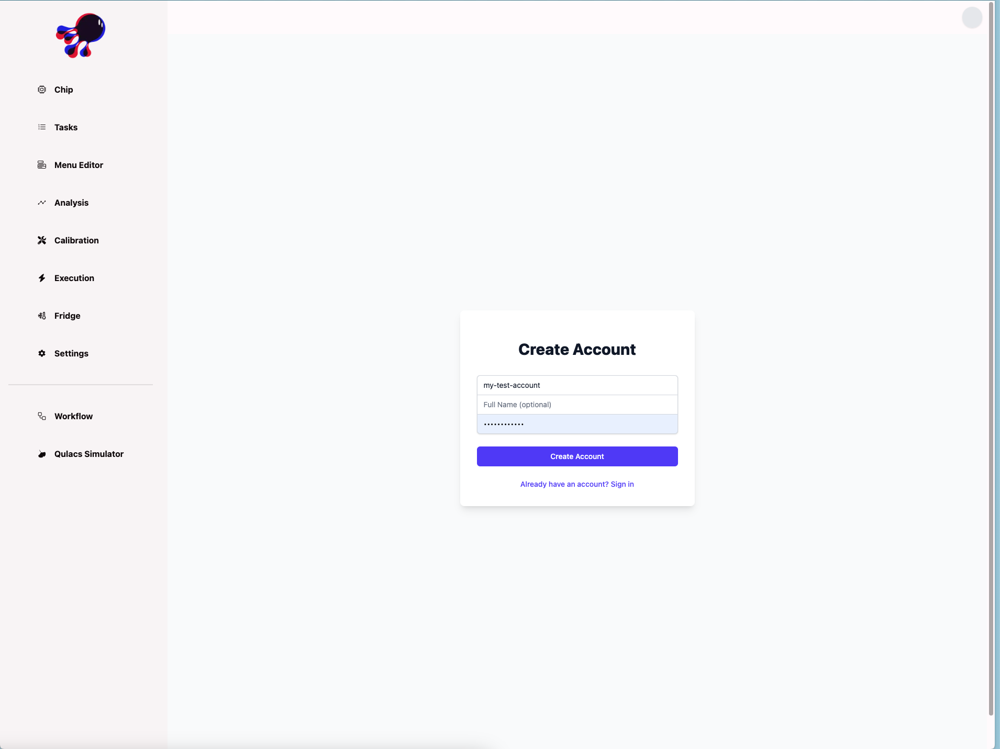

# Quick Start

## Install

```bash
git clone https://github.com/oqtopus-team/qdash.git
```

## Initial Setup

Run the following commands to create the necessary directories and environment files.

```bash
chmod +x scripts/create_directory.sh scripts/create_env.sh scripts/init.sh
scripts/init.sh
```

## Start the Application

```bash
docker compose up -d
```

You can now access the application at <a href="http://localhost:5714/signup"> localhost:5714 </a>.

## Create account



Now, your data is not setup yet. You need to initialize the database with your data.

## Setup devcontainer

```bash
 docker compose -f compose.dev.yaml up -d
```

## Install QDash CLI

```bash
docker compose -f compose.dev.yaml exec devcontainer sh -c "pip install -e ."
```

## Initialize the Database

```bash
docker exec -it qdash-devcontainer /bin/bash -c "qdash init-all-data --username <your-username> --chip-id <your-chip-id>"
```

You can now access the application at <a href="http://localhost:5714/execution"> localhost:5714 </a>.
