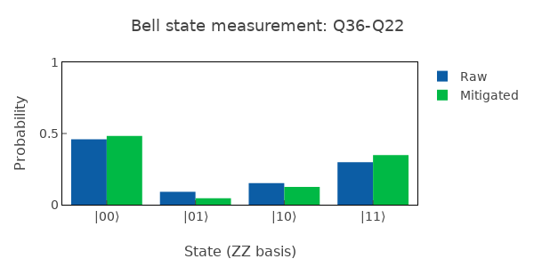

# CheckBellState

Prepares Bell state (|00⟩+|11⟩)/√2 and measures state fidelity.

## What it measures

Bell state fidelity – quality of entanglement between qubit pair.

## Physical principle

Apply H⊗I then CNOT; measure in Z basis and verify equal |00⟩/|11⟩ populations with coherent superposition.

## Expected result

Population histogram showing ~50/50 |00⟩/|11⟩ with minimal |01⟩/|10⟩.

- result_type: histogram
- x_axis: Computational basis states (|00⟩, |01⟩, |10⟩, |11⟩)
- y_axis: Population probability
- good_visual: two tall bars at |00⟩ and |11⟩ (~0.5 each), negligible |01⟩ and |10⟩ bars

## Evaluation criteria

Bell state fidelity should be high; |01⟩ and |10⟩ populations should be minimal. This is an end-to-end test of single and two-qubit gates.

- check_questions:
  - "Are the |00⟩ and |11⟩ populations approximately equal (~0.5)?"
  - "Are the |01⟩ and |10⟩ populations negligible (<5%)?"
  - "Is the Bell state fidelity meeting the target?"

## Output parameters

- bell_state_fidelity: Fidelity with ideal Bell state; target > 0.90
- p00: Population in |00⟩; expected ~0.5
- p11: Population in |11⟩; expected ~0.5
- p01: Population in |01⟩; expected ~0
- p10: Population in |10⟩; expected ~0

## Common failure patterns

- [critical] Low fidelity from single-qubit gate errors
  - cause: H gate or measurement basis errors
  - visual: unequal |00⟩/|11⟩ populations or significant |01⟩/|10⟩
  - next: debug single-qubit gates first (CheckHPIPulse, CheckPIPulse)
- [warning] Residual |01⟩/|10⟩ population
  - cause: ZX90 miscalibration, gate angle error
  - visual: non-negligible bars at |01⟩ and |10⟩
  - next: recalibrate ZX90 gate (CreateZX90)
- [warning] Decoherence during circuit
  - cause: T1/T2 too short for the circuit depth
  - visual: overall contrast reduction, all populations mixed
  - next: check coherence times, optimize circuit
- [warning] Readout crosstalk
  - cause: correlated measurement errors between qubits
  - visual: unexpected correlations in error pattern
  - next: check readout isolation between qubits

## Tips for improvement

- This is an end-to-end test combining single and two-qubit gates.
- Low fidelity here means debug gates individually first.
- Compare with Bell state tomography for full density matrix.

## Analysis guide

1. Check the population histogram for |00⟩/|11⟩ balance.
2. Quantify the |01⟩/|10⟩ leakage as fraction of total.
3. Compare Bell fidelity with individual gate fidelities.
4. If fidelity is low, determine if limited by single-qubit, two-qubit, or readout errors.
5. Recommend component-level debugging if needed.

## Prerequisites

- CheckZX90
- CheckHPIPulse
- CheckPIPulse

## Related context

- history(last_n=5)
- coupling(zx_rate, coupling_strength)
