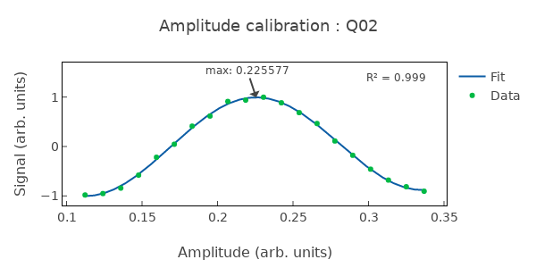

# CreatePIPulse

Calibrates π (X180) gate pulse amplitude via Rabi-based fitting.

## What it measures

Optimal pulse amplitude for a full π rotation (|0⟩ → |1⟩).

## Physical principle

Apply a shaped pulse of fixed duration and sweep amplitude; fit the Rabi oscillation to find the amplitude corresponding to exactly π rotation.

## Expected result

Cosine-like Rabi oscillation vs amplitude; π pulse at the first minimum (population inverted).

- result_type: oscillation
- x_axis: Drive amplitude (a.u.)
- y_axis: P(|1⟩)
- fit_model: A * cos(π · amp / amp_π) + B
- good_visual: clear cosine oscillation with well-defined minimum at π amplitude

## Evaluation criteria

Fit quality should be high; the amplitude should be in the linear drive regime. The extracted π amplitude should be consistent with previous calibrations.

- check_questions:
  - "Is the fit R² > 0.95?"
  - "Is the π amplitude in the linear drive regime?"
  - "Is the amplitude consistent with previous calibrations?"

## Output parameters

- pi_pulse_amplitude: Calibrated amplitude for π rotation
- fit_r_squared: Fit quality; expected > 0.95

## Common failure patterns

- [critical] Over/under-rotation
  - cause: amplitude calibration error accumulates in gate sequences
  - visual: minimum of Rabi oscillation shifted from expected position
  - next: refine amplitude scan, verify drive linearity
- [warning] Leakage to |2⟩
  - cause: pulse too fast relative to anharmonicity
  - visual: population minimum does not reach ~1.0
  - next: consider DRAG correction, slow down pulse
- [warning] Nonlinear drive response
  - cause: DAC/amplifier compression at high amplitudes
  - visual: asymmetric Rabi oscillation, compressed peaks at high amplitude
  - next: operate in linear regime, check DAC/amplifier

## Tips for improvement

- Duration is fixed; only amplitude is optimized. Check that duration is appropriate for anharmonicity.
- If R² is poor, the qubit frequency may have drifted – recalibrate frequency first.
- Compare π amplitude with previous runs to detect drift.

## Analysis guide

1. Verify the fit quality (R²) and symmetry of the Rabi oscillation.
2. Confirm the π amplitude is in the linear drive regime.
3. Compare with previous π amplitude for drift detection.
4. If fit is poor, recommend frequency recalibration first.

## Prerequisites

- CheckQubitFrequency
- CheckRabi

## Related context

- history(last_n=5)
