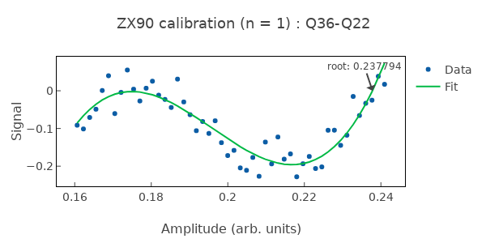
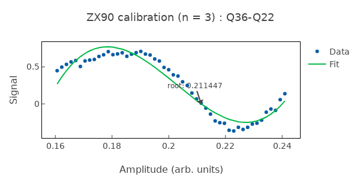
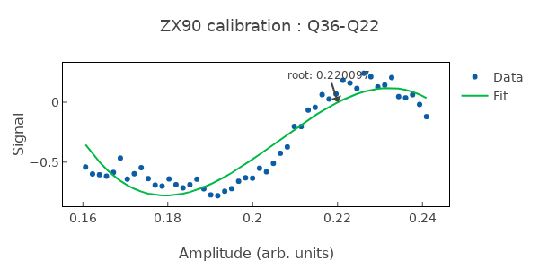

# CreateZX90

Calibrates ZX90 (CNOT-equivalent) two-qubit gate from cross-resonance interaction.

## What it measures

Optimal CR pulse amplitude and duration for π/2 ZX rotation.

## Physical principle

Tune CR drive parameters to achieve exactly 90° ZX rotation; combine with single-qubit corrections for CNOT.

## Expected result

ZX rotation angle vs CR pulse duration; target the 90° crossing point.

- result_type: oscillation
- x_axis: CR pulse duration (ns)
- y_axis: ZX rotation angle (degrees)
- good_visual: clear oscillation with well-defined 90° crossing point

## Evaluation criteria

ZX rotation should be precisely 90°; parasitic rotations should be compensated by echo or correction pulses.

- check_questions:
  - "Is the ZX rotation within 1° of 90°?"
  - "Are parasitic rotations (IX, IZ) compensated?"
  - "Is the gate duration practical (<500 ns)?"

## Output parameters

- cr_amplitude: Calibrated CR drive amplitude
- cr_duration: Calibrated CR pulse duration for 90° ZX rotation
- zx_angle: Actual ZX rotation angle; target 90°

## Common failure patterns

- [critical] CR pulse too long
  - cause: weak ZX rate requires long gate, decoherence limits fidelity
  - visual: 90° crossing occurs at long duration, fidelity drops
  - next: increase CR amplitude, check coupling strength
- [warning] Parasitic ZZ coupling
  - cause: static ZZ coupling not cancelled by echo sequence
  - visual: phase error accumulating during gate
  - next: implement echo CR sequence
- [warning] Amplitude nonlinearity
  - cause: ZX rate not proportional to CR drive at high amplitudes
  - visual: non-sinusoidal rotation angle vs duration
  - next: operate in linear regime, reduce CR amplitude

## Tips for improvement

- Use echo CR sequence to cancel IX and IZ terms.
- After calibration, validate with CheckZX90.
- Consider active cancellation tone on target qubit.

## Analysis guide

1. Identify the 90° ZX crossing point in the rotation vs duration data.
2. Verify the crossing is clean (smooth oscillation, good fit).
3. Check that the gate duration is practical.
4. If parasitic terms are visible, recommend echo CR.
5. Validate with CheckZX90 after calibration.

## Prerequisites

- CheckCrossResonance
- CheckPIPulse
- CheckHPIPulse

## Related context

- history(last_n=5)
- coupling(zx_rate, coupling_strength)
