# X180InterleavedRandomizedBenchmarking

Measures X180 (π) gate-specific error rate via interleaved randomized benchmarking.

## What it measures

Error per X180 gate isolated from average Clifford error.

## Physical principle

Same interleaved RB protocol as X90 IRB but with X180 gate interleaved.

```mermaid
gantt
    title X180 Interleaved RB Pulse Sequence
    dateFormat x
    axisFormat " "

    section Drive
    C₁       :d1, 0, 20ms
    X180     :active, x1, after d1, 15ms
    C₂       :d2, after x1, 20ms
    X180     :active, x2, after d2, 15ms
    ···      :done, d3, after x2, 10ms
    Cₘ       :d4, after d3, 20ms
    X180     :active, x3, after d4, 15ms
    C_inv    :d5, after x3, 20ms

    section Readout
    Measurement :crit, r1, after d5, 50ms
```

## Expected result

Two exponential decays; interleaved decays faster proportional to X180 error.

- result_type: decay_curve
- x_axis: Clifford sequence length
- y_axis: Survival probability
- fit_model: A * p^m + B for both reference and interleaved
- good_visual: two clear exponential decays with interleaved decaying faster, both well-fitted

## Evaluation criteria

X180 gate error should be low; error should be consistent with X90 error (X180 ≤ 2× X90 typically).

- check_questions:
  - "Is the X180 gate error below the target?"
  - "Is the X180 error consistent with X90 error (≤2× X90)?"
  - "Are both curves well-fitted single exponentials?"

## Input parameters

None.

## Output parameters

- x180_gate_fidelity: X180 gate fidelity (a.u.)
- x180_depolarizing_rate: Depolarization error of the X180 gate (a.u.)

## Run parameters

- n_trials: Number of trials (a.u.)
- shots: Number of shots (a.u.)
- interval: Time interval (ns)

## Common failure patterns

- [warning] X180 amplitude errors accumulate faster
  - cause: full π rotation is more sensitive to amplitude miscalibration
  - visual: interleaved curve decays much faster than reference
  - next: recalibrate π pulse amplitude
- [warning] Leakage to |2⟩
  - cause: more likely with full π rotation than π/2
  - visual: non-exponential interleaved decay
  - next: apply DRAG correction, check leakage
- [info] Statistical uncertainty
  - cause: same statistical concerns as X90 IRB
  - visual: large error bars on gate error estimate
  - next: increase number of random sequences

## Tips for improvement

- Compare X180 and X90 errors – X180 should be ≤2× X90 error.
- If X180 error is much worse, suspect DRAG tuning issues.
- Run after DRAG calibration for best results.

## Analysis guide

1. Compare X180 error with X90 error for consistency (expect ≤2×).
2. Check for non-exponential decay indicating leakage.
3. If X180 error >> 2× X90 error, investigate leakage or DRAG tuning.
4. Verify both reference and interleaved curves are well-fitted.
5. Recommend DRAG recalibration if leakage is suspected.

## Related context

- history(last_n=5)
