# ZX90InterleavedRandomizedBenchmarking

Measures ZX90 two-qubit gate error rate via interleaved randomized benchmarking.

## What it measures

Error per ZX90 gate isolated via two-qubit interleaved RB.

## Physical principle

Two-qubit RB with ZX90 interleaved between random two-qubit Cliffords.

```mermaid
gantt
    title ZX90 Interleaved RB Pulse Sequence
    dateFormat x
    axisFormat " "

    section Control
    C₁       :d1, 0, 20ms
    ZX90     :active, z1, after d1, 25ms
    C₂       :d2, after z1, 20ms
    ZX90     :active, z2, after d2, 25ms
    ···      :done, d3, after z2, 10ms
    C_inv    :d4, after d3, 20ms
    Readout  :crit, r1, after d4, 50ms

    section Target
    C₁       :t1, 0, 20ms
    ZX90     :active, tz1, after t1, 25ms
    C₂       :t2, after tz1, 20ms
    ZX90     :active, tz2, after t2, 25ms
    ···      :done, t3, after tz2, 10ms
    C_inv    :t4, after t3, 20ms
    Readout  :crit, r2, after t4, 50ms
```

## Expected result

Two-qubit survival probability decays; interleaved faster than reference.

- result_type: decay_curve
- x_axis: Two-qubit Clifford sequence length
- y_axis: Survival probability
- fit_model: A * p^m + B for both reference and interleaved
- good_visual: two clear exponential decays with interleaved faster, sufficient data points for fitting

## Evaluation criteria

ZX90 gate error should meet the target; the decay should be well-fitted and the reference should be clean enough to isolate the ZX90 contribution.

- check_questions:
  - "Is the ZX90 gate error below the target?"
  - "Is the reference two-qubit RB clean enough to isolate ZX90 error?"
  - "Are there signs of leakage in either qubit during CR drive?"

## Input parameters

- control_qubit_frequency: (control qubit) (GHz)
- control_drag_hpi_amplitude: (control qubit) (a.u.)
- control_drag_hpi_length: (control qubit) (ns)
- control_drag_hpi_beta: (control qubit) (a.u.)
- control_readout_frequency: (control qubit) (GHz)
- control_readout_amplitude: (control qubit) (a.u.)
- control_readout_length: (control qubit) (ns)
- target_qubit_frequency: (target qubit) (GHz)
- target_readout_frequency: (target qubit) (GHz)
- target_readout_amplitude: (target qubit) (a.u.)
- target_readout_length: (target qubit) (ns)
- cr_amplitude: (control qubit) (a.u.)
- cr_phase: (control qubit) (a.u.)
- cancel_amplitude: (target qubit) (a.u.)
- cancel_phase: (target qubit) (a.u.)
- cancel_beta: (target qubit) (a.u.)
- rotary_amplitude: (control qubit) (a.u.)
- zx_rotation_rate: (coupling qubit) (a.u.)

## Output parameters

- zx90_gate_fidelity: ZX90 gate fidelity (a.u.)
- zx90_depolarizing_rate: Depolarization error of the ZX90 gate (a.u.)

## Run parameters

- n_trials: Number of trials (a.u.)
- shots: Number of shots (a.u.)
- interval: Time interval (ns)

## Common failure patterns

- [warning] Two-qubit Clifford compilation errors
  - cause: errors from decomposing two-qubit Cliffords into native gates
  - visual: reference decay faster than expected from individual gate errors
  - next: verify Clifford decomposition, check compiler
- [warning] Leakage during CR drive
  - cause: CR pulse excites higher levels in either qubit
  - visual: non-exponential decay, especially at longer sequences
  - next: check DRAG on both qubits, optimize CR parameters
- [info] Long sequences exceed coherence time
  - cause: total circuit duration approaches T1/T2 of either qubit
  - visual: survival drops to 0.25 before meaningful fit is possible
  - next: shorten maximum sequence length, improve coherence

## Tips for improvement

- Two-qubit RB requires many more sequences for convergence.
- Compare with process tomography for consistency.
- Gate error includes contributions from both qubits' decoherence.

## Analysis guide

1. Compare the reference and interleaved two-qubit decay curves.
2. Extract the ZX90-specific error rate from the decay ratio.
3. Check for non-exponential behavior indicating leakage.
4. Compare with single-qubit gate errors to assess two-qubit gate contribution.
5. If error is dominated by coherence, recommend coherence improvements first.

## Related context

- history(last_n=5)
- coupling(zx_rate, coupling_strength)
