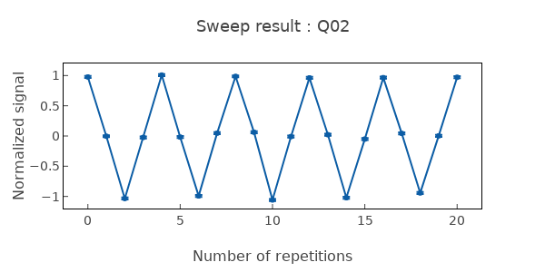

# CheckDRAGHPIPulse

Validates DRAG-corrected π/2 pulse quality for leakage suppression.

## What it measures

Gate fidelity of DRAG-corrected X90 pulse.

## Physical principle

Same DRAG principle as π pulse but for half rotation. Critical for quantum algorithms using superposition states.

```mermaid
gantt
    title CheckDRAGHPIPulse Pulse Sequence
    dateFormat x
    axisFormat " "

    section Drive (I)
    DRAG π/2 (1) :d1, 0, 20ms
    DRAG π/2 (2) :d2, after d1, 20ms
    DRAG π/2 (3) :d3, after d2, 20ms
    ···          :done, d4, after d3, 15ms
    DRAG π/2 (N) :d5, after d4, 20ms

    section Drive (Q)
    dY/dt (1)    :active, q1, 0, 20ms
    dY/dt (2)    :active, q2, after q1, 20ms
    dY/dt (3)    :active, q3, after q2, 20ms
    ···          :done, q4, after q3, 15ms
    dY/dt (N)    :active, q5, after q4, 20ms

    section Readout
    Measurement  :crit, r1, after d5, 50ms
```

## Expected result

Correct superposition state after single pulse; oscillation under repeated application.

- result_type: oscillation
- x_axis: Number of DRAG π/2 pulse repetitions
- y_axis: P(|1⟩)
- good_visual: oscillation with period 4 and very slow contrast decay, better than non-DRAG version

## Evaluation criteria

Gate fidelity should exceed the non-DRAG version; leakage should be minimal.

- check_questions:
  - "Is the gate fidelity >99.5%?"
  - "Is the leakage to |2⟩ <0.1%?"
  - "Is the DRAG version better than the non-DRAG CheckHPIPulse?"

## Input parameters

- qubit_frequency: Loaded from DB
- drag_hpi_amplitude: Loaded from DB
- drag_hpi_length: Loaded from DB
- drag_hpi_beta: Loaded from DB
- readout_amplitude: Loaded from DB
- readout_frequency: Loaded from DB
- readout_length: Readout pulse length (ns)

## Output parameters

None.

## Run parameters

- repetitions: Number of repetitions for the PI pulse (a.u.)
- interval: Time interval (ns)

## Common failure patterns

- [critical] DRAG beta mis-tuned
  - cause: beta parameter off, causing phase or leakage errors
  - visual: distorted oscillation pattern or fast contrast decay
  - next: rescan DRAG beta parameter
- [warning] Amplitude off
  - cause: does not produce exact π/2 rotation
  - visual: oscillation period deviates from 4
  - next: recalibrate amplitude with CreateDRAGHPIPulse
- [info] Decoherence during measurement
  - cause: T1/T2 corruption of validation signal
  - visual: exponential decay independent of gate quality
  - next: reduce measurement length, compare with coherence times

## Tips for improvement

- Compare with non-DRAG X90 to verify improvement.
- Run after DRAG π pulse is validated since they share parameters.
- Check phase accuracy with tomography if fidelity is borderline.

## Analysis guide

1. Compare gate fidelity with the non-DRAG CheckHPIPulse result.
2. Verify oscillation period is 4 (correct rotation angle).
3. Check for leakage signatures in the decay.
4. If fidelity is borderline, recommend tomographic verification.

## Prerequisites

- CreateDRAGHPIPulse
- CheckHPIPulse

## Related context

- history(last_n=5)
