# CheckHPIPulse

Validates π/2 pulse quality by repeated application and population measurement.

## What it measures

π/2 pulse fidelity – accumulated rotation error over multiple applications.

## Physical principle

Apply the calibrated π/2 pulse repeatedly; population should cycle through superposition states. Deviation indicates rotation or phase error.

```mermaid
gantt
    title CheckHPIPulse Pulse Sequence
    dateFormat x
    axisFormat " "

    section Drive
    π/2 (1)     :d1, 0, 20ms
    π/2 (2)     :d2, after d1, 20ms
    π/2 (3)     :d3, after d2, 20ms
    ···         :done, d4, after d3, 15ms
    π/2 (N)     :d5, after d4, 20ms

    section Readout
    Measurement :crit, r1, after d5, 50ms
```

## Expected result

Population oscillation with period 4 (four π/2 pulses = full rotation); contrast decay reveals error.

- result_type: oscillation
- x_axis: Number of π/2 pulse repetitions
- y_axis: P(|1⟩)
- good_visual: clear oscillation with period 4, high contrast maintained over 20+ repetitions

## Evaluation criteria

Correct cycling pattern over many repetitions with minimal contrast decay.

- check_questions:
  - "Does the population cycle with period 4 as expected?"
  - "Is the contrast maintained over 20 repetitions?"
  - "Is the per-gate error rate acceptable?"

## Input parameters

- qubit_frequency: Loaded from DB
- hpi_amplitude: Loaded from DB
- hpi_length: Loaded from DB
- readout_amplitude: Loaded from DB
- readout_frequency: Loaded from DB
- readout_length: Readout pulse length (ns)

## Output parameters

None.

## Run parameters

- repetitions: Number of repetitions for the HPI pulse (a.u.)
- interval: Time interval (ns)

## Common failure patterns

- [critical] Rotation angle error
  - cause: π/2 pulse amplitude off, population drifts from expected pattern
  - visual: oscillation period deviates from 4, systematic drift
  - next: re-run CreateHPIPulse with finer amplitude scan
- [warning] Phase error
  - cause: phase calibration off, visible in tomographic basis
  - visual: pattern distortion not visible in Z-only measurement
  - next: check phase calibration, use tomographic validation
- [info] Decoherence during sequence
  - cause: T1/T2 limit useful number of repetitions
  - visual: exponential contrast decay
  - next: reduce repetitions, compare with coherence times

## Tips for improvement

- If validation fails, re-run CreateHPIPulse or try DRAG correction.
- Compare error rate with CheckPIPulse for consistency.
- Phase errors may require separate X/Y pulse calibration.

## Analysis guide

1. Verify the oscillation period is 4 (four X90 = full rotation).
2. Check contrast decay rate to estimate per-gate error.
3. Compare with CheckPIPulse error rate for consistency.
4. If error is large, recommend recalibration.

## Prerequisites

- CreateHPIPulse
- CheckRabi

## Related context

- history(last_n=5)
