# CreateDRAGHPIPulse

Calibrates DRAG beta and amplitude for leakage-suppressed π/2 pulse.

## What it measures

Optimal DRAG derivative coefficient for X90 gate.

## Physical principle

Same as CreateDRAGPIPulse but for half-rotation; may share beta but needs independent amplitude calibration.

```mermaid
gantt
    title CreateDRAGHPIPulse Pulse Sequence
    dateFormat x
    axisFormat " "

    section Drive (I)
    Shaped π/2 pulse        :d1, 0, 80ms

    section Drive (Q)
    DRAG dY/dt (sweep β)    :active, q1, 0, 80ms

    section Readout
    Measurement             :crit, r1, after d1, 50ms
```

## Expected result

Leakage vs beta minimum; amplitude tuned for exact π/2 rotation.

- result_type: peak_curve
- x_axis: DRAG beta parameter
- y_axis: Leakage rate or population error
- good_visual: clear minimum in leakage vs beta with well-defined optimum, consistent with π pulse beta

## Evaluation criteria

Optimal beta should minimize leakage; rotation angle error should be minimal.

- check_questions:
  - "Is the leakage <0.1% at optimal beta?"
  - "Is the rotation angle error <0.5°?"
  - "Is the beta consistent with the DRAG π pulse beta?"

## Input parameters

- qubit_frequency: Loaded from DB
- control_amplitude: Loaded from DB
- readout_amplitude: Loaded from DB
- readout_frequency: Loaded from DB
- readout_length: Readout pulse length (ns)

## Output parameters

- drag_hpi_beta: DRAG HPI pulse beta (a.u.)
- drag_hpi_amplitude: DRAG HPI pulse amplitude (a.u.)
- drag_hpi_length: DRAG HPI pulse length (ns)

## Run parameters

- drag_hpi_duration: HPI pulse length (ns)
- shots: Number of shots (a.u.)
- interval: Time interval (ns)

## Common failure patterns

- [warning] Coupled beta/amplitude landscape
  - cause: need 2D optimization, beta and amplitude are interdependent
  - visual: optimizing one parameter moves the other's optimum
  - next: use 2D scan or iterative optimization
- [warning] Inherited beta from π pulse not optimal
  - cause: π/2 pulse may have different optimal DRAG parameters
  - visual: leakage higher than expected with shared beta
  - next: independent beta optimization for π/2
- [info] Non-Gaussian pulse shape
  - cause: DRAG assumes specific pulse shape for derivative calculation
  - visual: suboptimal leakage suppression
  - next: verify pulse shape, consider shape-specific DRAG

## Tips for improvement

- Often calibrate after CreateDRAGPIPulse and reuse beta.
- If amplitude differs significantly from π_pulse/2, suspect nonlinearity.
- Verify with AllXY or Clifford-based benchmarking.

## Analysis guide

1. Compare beta with the DRAG π pulse beta for consistency.
2. Verify the amplitude gives exact π/2 rotation.
3. Check leakage is below threshold.
4. Recommend CheckDRAGHPIPulse validation after calibration.

## Prerequisites

- CreateDRAGPIPulse
- CreateHPIPulse

## Related context

- history(last_n=5)
