# CreateDRAGPIPulse

Calibrates DRAG beta and amplitude for leakage-suppressed π pulse.

## What it measures

Optimal DRAG derivative coefficient (beta) for X180 gate.

## Physical principle

Scan DRAG beta parameter while monitoring leakage to |2⟩; find the minimum leakage point. Amplitude scan refines the rotation angle.

```mermaid
gantt
    title CreateDRAGPIPulse Pulse Sequence (n_rotations=4, n_iterations=2)
    dateFormat x
    axisFormat " "

    section Drive (I)
    π (1)   :d1, 0, 15ms
    π (2)   :d2, after d1, 15ms
    π (3)   :d3, after d2, 15ms
    π (4)   :d4, after d3, 15ms

    section Drive (Q)
    dY/dt (sweep β) :active, q1, 0, 15ms
    dY/dt           :active, q2, after q1, 15ms
    dY/dt           :active, q3, after q2, 15ms
    dY/dt           :active, q4, after q3, 15ms

    section Readout
    Measurement     :crit, r1, after d4, 40ms
```

## Expected result

Leakage vs beta shows a minimum; amplitude scan gives exact π rotation.

- result_type: peak_curve
- x_axis: DRAG beta parameter
- y_axis: Leakage rate or population error
- good_visual: clear minimum in leakage vs beta curve with well-defined optimum

## Evaluation criteria

The optimal beta should produce minimal leakage; the amplitude should give exact π rotation.

- check_questions:
  - "Is the leakage <0.1% at the optimal beta?"
  - "Is the leakage minimum well-defined (not flat)?"
  - "Does the amplitude give exact π rotation?"

## Input parameters

- qubit_frequency: Loaded from DB
- control_amplitude: Loaded from DB
- readout_amplitude: Loaded from DB
- readout_frequency: Loaded from DB
- readout_length: Readout pulse length (ns)

## Output parameters

- drag_pi_beta: DRAG PI pulse beta
- drag_pi_amplitude: DRAG PI pulse amplitude
- drag_pi_length: DRAG PI pulse length (ns)

## Run parameters

- drag_pi_duration: PI pulse length (ns)
- shots: Number of shots (a.u.)
- interval: Time interval (ns)

## Common failure patterns

- [info] Flat leakage landscape
  - cause: anharmonicity too large or pulse too slow for DRAG to matter
  - visual: leakage vs beta is nearly flat, no clear minimum
  - next: DRAG may not be necessary for this qubit, proceed without it
- [warning] Multiple local minima
  - cause: complex leakage landscape
  - visual: several dips in leakage vs beta curve
  - next: widen scan range, use coarse-then-fine optimization
- [warning] Pulse distortion from AWG
  - cause: DRAG waveform not faithfully reproduced by hardware
  - visual: leakage minimum not at expected beta value
  - next: check AWG bandwidth and fidelity

## Tips for improvement

- Start with beta ≈ anharmonicity^(-1) as initial guess.
- Ensure pulse bandwidth is within DAC/AWG limits.
- Run after anharmonicity measurement for accurate initial parameters.

## Analysis guide

1. Identify the leakage minimum in the beta scan.
2. Verify the minimum is well-defined (not flat plateau).
3. Check the refined amplitude gives exact π rotation.
4. Compare beta with the theoretical estimate (anharmonicity^(-1)).

## Prerequisites

- CreatePIPulse
- CheckQubitFrequency

## Related context

- history(last_n=5)
