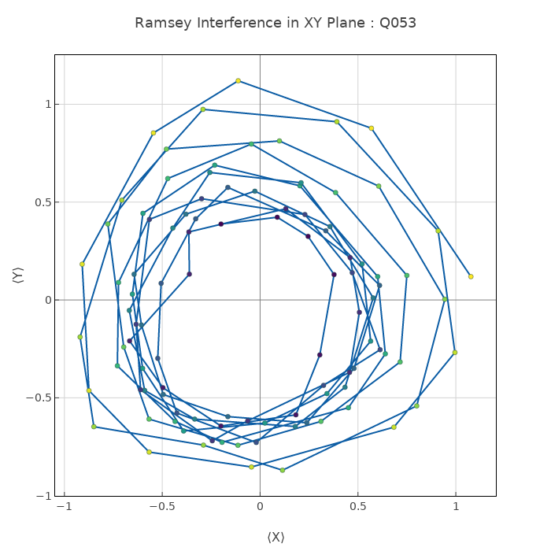

# CheckRamsey

Measures T2\* (free-induction) dephasing time and fine-tunes qubit frequency via Ramsey fringes.

## What it measures

T2\* dephasing time and residual detuning from the drive frequency.

## Physical principle

X/2 – free evolution τ – X/2 (or Y/2), then measure. Fringes oscillate at the detuning Δf; envelope decays as exp(-τ/T2\*).

```mermaid
gantt
    title CheckRamsey Pulse Sequence (X and Y axes)
    dateFormat x
    axisFormat " "

    section X-axis
    X/2 pulse       :d1, 0, 15ms
    free evolution τ :done, d2, after d1, 100ms
    X/2 pulse       :d3, after d2, 15ms
    Measurement     :crit, r1, after d3, 40ms

    section Y-axis
    X/2 pulse       :e1, 0, 15ms
    free evolution τ :done, e2, after e1, 100ms
    Y/2 pulse       :active, e3, after e2, 15ms
    Measurement     :crit, r2, after e3, 40ms
```

## Expected result

Damped cosine: oscillation frequency = detuning Δf, decay constant = T2\*. If Δf=0, monotonic decay.

- result_type: oscillation
- x_axis: Free evolution time τ (μs)
- y_axis: P(|1⟩)
- fit*model: A * cos(2π·Δf·τ + φ) \_ exp(-τ/T2\*) + B
- typical_range: 10–80 μs for fixed-frequency transmons
- good_visual: clear oscillation fringes with smooth exponential envelope

## Evaluation criteria

T2* should satisfy T2* ≤ T2_echo. Fringe frequency should match the intended detuning. Fit quality and fringe visibility should be high.

- check_questions:
  - "Are the Ramsey fringes clearly visible with good contrast?"
  - "Does the fringe frequency match the intended detuning?"
  - "Is T2* consistent with the T2_echo measurement (T2* ≤ T2_echo)?"

## Input parameters

- qubit_frequency: Loaded from DB
- hpi_amplitude: Loaded from DB
- hpi_length: Loaded from DB
- readout_amplitude: Loaded from DB
- readout_frequency: Loaded from DB
- readout_length: Readout pulse length (ns)

## Output parameters

- ramsey_frequency: Ramsey oscillation frequency (MHz)
- qubit_frequency: Qubit bare frequency (GHz)
- t2_star: T2\* time (μs)

## Run parameters

- detuning: Detuning for Ramsey oscillation (GHz)
- time_range: Time range for Rabi oscillation (ns)
- shots: Number of shots for Rabi oscillation (a.u.)
- interval: Time interval for Rabi oscillation (ns)

## Common failure patterns

- [critical] T2\* << T2_echo
  - cause: dominated by low-frequency noise (1/f flux noise, charge noise)
  - visual: rapid fringe decay, few oscillation periods visible
  - next: investigate low-frequency noise sources, check shielding
- [warning] No visible fringes
  - cause: detuning too small or T2\* extremely short
  - visual: flat or monotonically decaying signal
  - next: add artificial detuning (1–5 MHz) for clearer fringes
- [warning] Fringe frequency drift
  - cause: qubit frequency unstable (TLS, thermal)
  - visual: inconsistent fringe spacing, poor fit
  - next: repeat measurement, check for TLS coupling

## Tips for improvement

- Ramsey with artificial detuning (Δf ~ 1–5 MHz) gives clearer fringes for fitting.
- Second-axis (Y/2) Ramsey separates detuning direction (positive vs negative).
- If T2\* improves dramatically with echo, the dominant noise is low-frequency and potentially fixable.

## Analysis guide

1. Check fringe visibility and fit quality (R²).
2. Verify the extracted detuning matches the intended value.
3. Compare T2\* with T2_echo to quantify low-frequency noise contribution.
4. Review recent history for frequency drift (changing detuning).
5. If T2\* is very short, assess whether low-frequency noise mitigation is needed.

## Prerequisites

- CheckQubitFrequency
- CheckT1

## Related context

- history(last_n=5)
- neighbor_qubits(frequency)
