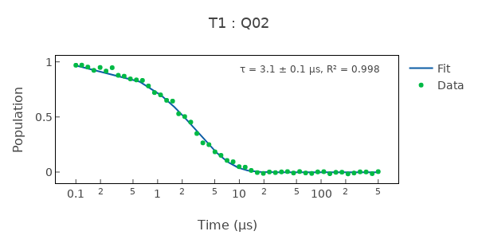

# CheckT1

Measures T1 energy-relaxation time via exponential decay of the excited state.

## What it measures

T1 relaxation time – how long the qubit retains energy in the |1⟩ state.

## Physical principle

Prepare |1⟩, wait variable delay τ, measure P(|1⟩). Fit exponential decay exp(-τ/T1).

```mermaid
gantt
    title CheckT1 Pulse Sequence
    dateFormat x
    axisFormat " "

    section Drive
    π pulse    :d1, 0, 20ms
    wait τ     :done, d2, after d1, 120ms

    section Readout
    Measurement :crit, r1, after d2, 50ms
```

## Expected result

Exponential decay from ~1 to ~0 as delay increases; single time constant T1.

- result_type: decay_curve
- x_axis: Delay τ (μs)
- y_axis: P(|1⟩)
- fit_model: A \* exp(-τ/T1) + B
- typical_range: 20–200 μs for fixed-frequency transmons
- good_visual: smooth monotonic decay with clear single-exponential shape, low residuals

## Evaluation criteria

Exponential fit should have high R²; T1 should be stable across repeated measurements and consistent with chip design expectations. Compare with T2_echo to check if decoherence is T1-limited (T2 ≈ 2\*T1).

- check_questions:
  - "Is the decay clearly single-exponential with R² > 0.95?"
  - "Is T1 consistent with recent measurements (within 20% variation)?"
  - "Is T1 long enough to support the target gate fidelity?"

## Input parameters

- qubit_frequency: Loaded from DB
- hpi_amplitude: Loaded from DB
- hpi_length: Loaded from DB
- readout_amplitude: Loaded from DB
- readout_frequency: Loaded from DB
- readout_length: Readout pulse length (ns)

## Output parameters

- t1: T1 time (μs)

## Run parameters

- time_range: Time range for T1 time (ns)
- shots: Number of shots for T1 time
- interval: Time interval for T1 time (ns)

## Common failure patterns

- [critical] Short T1 (<20 μs)
  - cause: TLS coupling, dielectric loss, or Purcell decay
  - visual: rapid decay, curve flattens well before maximum delay
  - next: check TLS defects near qubit frequency, inspect packaging and substrate
- [warning] Non-exponential decay
  - cause: multi-level leakage or readout-induced transitions
  - visual: shoulder or kink in decay curve, poor single-exponential fit
  - next: check for leakage to |2⟩, verify readout is QND
- [warning] Large scatter between qubits
  - cause: fabrication non-uniformity or localized defects
  - visual: T1 values vary widely across chip
  - next: compare with spatial map to identify defect regions

## Tips for improvement

- If T1 fluctuates between runs, suspect TLS defects near the qubit frequency.
- Compare with T2_echo: if T2 ≈ 2\*T1, decoherence is T1-limited.
- Check if readout power is too high (may cause residual excitation).

## Analysis guide

1. Check the exponential fit quality (R²) and residual pattern.
2. Compare the extracted T1 with recent history for drift or instability.
3. Compare T1 with T2_echo: if T2 ≈ 2\*T1, the qubit is T1-limited.
4. Check neighbor qubit T1 values for spatial correlation of defects.
5. If T1 is anomalously short, consider TLS, Purcell, or dielectric loss mechanisms.

## Prerequisites

- CheckQubitFrequency
- CheckReadoutFrequency

## Related context

- history(last_n=5)
- neighbor_qubits(frequency, t1)
