# CheckDispersiveShift

Measures dispersive shift (χ) between qubit and readout resonator.

## What it measures

Dispersive shift (χ) – the frequency shift of the resonator conditioned on the qubit state.

## Physical principle

Measure resonator spectrum with qubit in |0⟩ and |1⟩; in the dispersive regime the resonator shifts by 2χ, enabling QND readout.

```mermaid
gantt
    title CheckDispersiveShift Pulse Sequence
    dateFormat x
    axisFormat " "

    section Electrical delay
    Delay measurement       :active, p1, 0, 60ms

    section Meas 1 (|0⟩)
    idle (|0⟩ prep)         :done, a1, after p1, 20ms
    Readout (sweep freq)    :crit, a2, after a1, 60ms

    section Meas 2 (|1⟩)
    π pulse (|1⟩ prep)      :b1, after p1, 20ms
    Readout (sweep freq)    :crit, b2, after b1, 60ms
```

## Expected result

Two transmission peaks/dips separated by 2χ; one for each qubit state.

- result_type: peak_curve
- x_axis: Readout frequency (GHz)
- y_axis: Transmission amplitude
- good_visual: two clearly separated transmission dips, one per qubit state, with separation >> linewidth

## Evaluation criteria

The dispersive shift 2χ should exceed the resonator linewidth κ for state discrimination. Typical 2χ > 1 MHz for reliable readout.

- check_questions:
  - "Is 2χ clearly larger than the resonator linewidth κ?"
  - "Are both qubit-state-dependent peaks clearly resolved?"
  - "Is 2χ within the expected range for this qubit-resonator coupling?"

## Input parameters

None.

## Output parameters

- optimal_readout_frequency: Optimal Readout Frequency (GHz)
- dispersive_shift: Dispersive shift (MHz)

## Run parameters

- shots: Number of shots for Rabi oscillation (a.u.)
- interval: Time interval for Rabi oscillation (ns)

## Common failure patterns

- [critical] Insufficient dispersive shift (2χ < κ)
  - cause: weak qubit-resonator coupling or large detuning
  - visual: overlapping or barely separated peaks
  - next: readout fidelity will be fundamentally limited, check coupling design
- [warning] Purcell-limited T1
  - cause: large χ degrades T1 via Purcell decay
  - visual: T1 shorter than expected given other loss mechanisms
  - next: check Purcell filter design, balance χ vs T1 tradeoff
- [warning] Overlapping peaks
  - cause: χ < κ/2 makes states unresolvable
  - visual: single broad peak instead of two separated features
  - next: optimize readout frequency and power

## Tips for improvement

- Use the midpoint between the two peaks as optimal readout frequency.
- If 2χ is too small, readout fidelity will be fundamentally limited.
- Monitor χ over time; shifts indicate qubit frequency drift.

## Analysis guide

1. Identify the two qubit-state-dependent resonator peaks.
2. Measure the separation 2χ and compare with resonator linewidth κ.
3. Verify 2χ is sufficient for the required readout fidelity.
4. If χ has changed, check for qubit frequency drift.

## Related context

- history(last_n=5)
