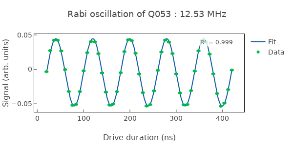
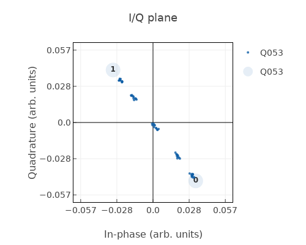

# CheckRabi

Measures Rabi oscillation to extract drive amplitude, frequency, and IQ-plane parameters.

## What it measures

Rabi oscillation parameters: amplitude, frequency (drive strength), phase, offset, and IQ-plane rotation parameters.

## Physical principle

Apply a resonant drive pulse of variable duration; the qubit oscillates between |0⟩ and |1⟩ at the Rabi frequency Ω_R. The IQ data is rotated via PCA to align the measurement axis, then fitted with a damped cosine model.

```mermaid
gantt
    title CheckRabi Pulse Sequence
    dateFormat x
    axisFormat " "

    section Drive
    Drive pulse (sweep t) :d1, 0, 100ms

    section Readout
    Measurement            :crit, r1, after d1, 50ms
```

## Expected result

Damped sinusoidal oscillation of the rotated IQ signal vs pulse duration. Frequency gives Ω_R, envelope gives the decay time τ.

- result_type: oscillation
- x_axis: Pulse duration (ns)
- y_axis: Rotated IQ signal (arb. units)
- fit_model: A _ cos(ω·t + φ) _ exp(-t/τ) + B (damped cosine, `is_damped=True` by default)
- good_visual: clear sinusoidal oscillation with high contrast and slow decay envelope

## Evaluation criteria

Rabi amplitude should be high; frequency should be consistent with calibrated drive amplitude; fit quality should be good.

- check_questions:
  - "Is the Rabi amplitude (contrast) sufficiently high?"
  - "Is the Rabi frequency consistent with the expected drive amplitude?"
  - "Is the fit R² > 0.95?"
  - "Is the decay slow compared to the oscillation period?"

## Input parameters

- qubit_frequency: Loaded from DB
- control_amplitude: Loaded from DB
- readout_amplitude: Loaded from DB
- readout_frequency: Loaded from DB
- readout_length: Readout pulse length (ns)

## Output parameters

- rabi_amplitude: Rabi oscillation amplitude (a.u.)
- rabi_frequency: Rabi oscillation frequency (MHz)
- rabi_phase: Rabi oscillation phase (a.u.)
- rabi_offset: Rabi oscillation offset (a.u.)
- rabi_angle: Rabi angle (in degree) (degree)
- rabi_noise: Rabi oscillation noise (a.u.)
- rabi_distance: Rabi distance (a.u.)
- rabi_reference_phase: Rabi reference phase (a.u.)
- control_amplitude: Control pulse amplitude (a.u.)
- maximum_rabi_frequency: Maximum Rabi frequency per unit control amplitude (MHz/a.u.)

## Run parameters

- time_range: Time range for Rabi oscillation (ns)
- shots: Number of shots for Rabi oscillation (a.u.)
- interval: Time interval for Rabi oscillation (ns)

## Common failure patterns

- [critical] Low contrast (<70%)
  - cause: readout miscalibration, thermal population, or leakage
  - visual: small oscillation amplitude, large DC offset
  - next: check readout fidelity and effective qubit temperature
- [warning] Rapid decay
  - cause: T1/T2 limiting or drive-induced heating
  - visual: oscillation amplitude drops quickly with pulse duration
  - next: check T1, reduce drive amplitude if heating is suspected
- [warning] Frequency mismatch
  - cause: drive amplitude changed or DAC nonlinearity
  - visual: oscillation frequency inconsistent with drive setting
  - next: recalibrate drive amplitude, check DAC linearity
- [warning] Beating pattern
  - cause: TLS strongly coupled near qubit frequency
  - visual: amplitude modulation with a second frequency component
  - next: check for TLS, try different qubit frequency operating point

## Tips for improvement

- Use Rabi frequency to calibrate π and π/2 pulse amplitudes.
- If contrast is low, check effective qubit temperature and readout fidelity first.
- Compare Rabi frequency across qubits for drive-line uniformity assessment.

## Analysis guide

1. Assess the oscillation contrast and fit quality (R²).
2. Verify Rabi frequency is consistent with the drive amplitude setting.
3. Check the decay envelope – rapid decay indicates decoherence or heating.
4. Look for beating patterns that would indicate TLS coupling.
5. Compare with recent history for drift in drive calibration.

## Prerequisites

- CheckQubitFrequency
- CheckReadoutFrequency

## Related context

- history(last_n=5)
