# ChevronPattern

Measures qubit response vs frequency and time to map the chevron pattern.

## What it measures

Chevron pattern – 2D map of qubit excitation vs drive detuning and pulse duration.

## Physical principle

Drive at various frequency detunings and durations; on-resonance gives Rabi oscillations, off-resonance gives faster but smaller oscillations, forming a V-shaped pattern.

```mermaid
gantt
    title ChevronPattern Pulse Sequence
    dateFormat x
    axisFormat " "

    section Drive
    Drive pulse (sweep Δf, t) :d1, 0, 100ms

    section Readout
    Measurement               :crit, r1, after d1, 50ms
```

## Expected result

2D color plot with chevron-shaped fringes; vertex at zero detuning (qubit frequency). Fringe spacing increases with detuning.

- result_type: 2d_map
- x_axis: Drive detuning (MHz)
- y_axis: Pulse duration (ns)
- z_axis: P(|1⟩)
- good_visual: symmetric V-shaped chevron fringes with clear vertex at zero detuning, high contrast

## Evaluation criteria

Clear fringe visibility with identifiable chevron vertex; vertex position should be consistent with qubit frequency.

- check_questions:
  - "Are the chevron fringes clearly visible with good contrast?"
  - "Is the chevron vertex identifiable to <1 MHz precision?"
  - "Is the pattern symmetric about zero detuning?"

## Input parameters

- qubit_frequency: Loaded from DB
- readout_amplitude: Loaded from DB
- readout_frequency: Loaded from DB
- readout_length: Readout pulse length (ns)

## Output parameters

- qubit_frequency: Qubit bare frequency (GHz)
- readout_amplitude: Optimal readout amplitude from SNR threshold (a.u.)

## Run parameters

- control_amplitude: Control pulse amplitude (a.u.)
- readout_amplitude_range: Amplitude range for readout sweep (a.u.)
- snr_threshold: SNR threshold for determining readout amplitude (a.u.)

## Common failure patterns

- [warning] Low contrast
  - cause: insufficient drive power or poor readout fidelity
  - visual: faint or washed-out fringes
  - next: increase drive amplitude or number of shots
- [warning] Smeared pattern
  - cause: frequency drift during measurement
  - visual: blurred fringes, especially at long durations
  - next: check frequency stability, reduce measurement time
- [info] Asymmetric chevron
  - cause: higher-order transitions or AC Stark shift
  - visual: fringes asymmetric about zero detuning
  - next: check for multi-level effects, reduce drive power

## Tips for improvement

- Use the chevron vertex to precisely identify qubit frequency before fine calibration.
- The fringe period at zero detuning gives the Rabi frequency.
- If fringes are faint, increase drive amplitude or number of shots.

## Analysis guide

1. Identify the chevron vertex position for frequency determination.
2. Check fringe contrast and symmetry.
3. Extract Rabi frequency from the fringe period at zero detuning.
4. If asymmetric, consider multi-level effects.

## Related context

- history(last_n=5)
