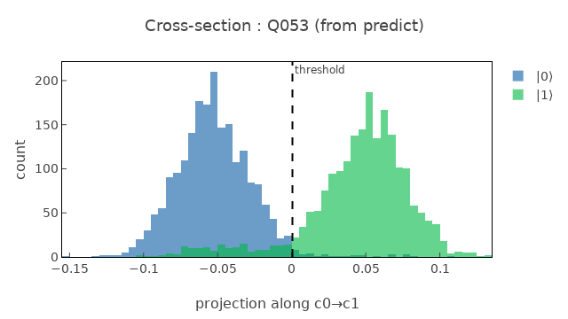

# ReadoutClassification

Calibrates and evaluates readout state discrimination (|0⟩ vs |1⟩ classification).

## What it measures

Readout assignment fidelity – probability of correctly identifying qubit state.

## Physical principle

Prepare |0⟩ and |1⟩ states, measure IQ data, train classifier, evaluate confusion matrix.

```mermaid
gantt
    title ReadoutClassification Pulse Sequence
    dateFormat x
    axisFormat " "

    section Meas 1 (|0⟩)
    idle (|0⟩ prep)    :done, a1, 0, 30ms
    Readout (IQ)       :crit, a2, after a1, 60ms

    section Meas 2 (|1⟩)
    π pulse (|1⟩ prep) :b1, 0, 30ms
    Readout (IQ)       :crit, b2, after b1, 60ms
```

## Expected result

Two IQ blob clusters; clear separation indicates good discrimination.

- result_type: scatter_plot
- x_axis: I quadrature (a.u.)
- y_axis: Q quadrature (a.u.)
- good_visual: two well-separated IQ clusters with minimal overlap, clear classification boundary

## Evaluation criteria

Average readout fidelity should be high with low asymmetry between |0⟩ and |1⟩ assignment errors.

- check_questions:
  - "Are the IQ blobs well-separated with minimal overlap?"
  - "Is the assignment fidelity symmetric for |0⟩ and |1⟩?"
  - "Is the average readout fidelity meeting the target?"

## Input parameters

- qubit_frequency: Loaded from DB
- drag_hpi_amplitude: Loaded from DB
- drag_hpi_length: Loaded from DB
- drag_hpi_beta: Loaded from DB
- readout_amplitude: Loaded from DB
- readout_frequency: Loaded from DB
- readout_length: Readout pulse length (ns)

## Output parameters

- average_readout_fidelity: Average readout fidelity (a.u.)
- readout_fidelity_0: Readout fidelity with preparation state 0 (a.u.)
- readout_fidelity_1: Readout fidelity with preparation state 1 (a.u.)

## Run parameters

- shots: Number of shots (a.u.)
- interval: Time interval (ns)

## Common failure patterns

- [critical] Overlapping IQ blobs
  - cause: insufficient dispersive shift or readout power
  - visual: IQ clusters overlap significantly, poor separation
  - next: check dispersive shift, optimize readout amplitude
- [warning] T1 decay during readout
  - cause: |1⟩ relaxes to |0⟩ before measurement completes
  - visual: asymmetric errors: P(0|1) >> P(1|0)
  - next: shorten readout pulse, check T1
- [warning] Readout-induced transitions
  - cause: measurement drives qubit transitions
  - visual: increased error rate at high readout power
  - next: reduce readout amplitude, check for non-QND effects
- [info] Classifier bias
  - cause: asymmetric errors for |0⟩ vs |1⟩
  - visual: confusion matrix has large off-diagonal asymmetry
  - next: retrain classifier, check IQ blob balance

## Tips for improvement

- If |1⟩→|0⟩ error >> |0⟩→|1⟩ error, suspect T1 during readout.
- Optimize readout amplitude and duration jointly.
- Consider neural network classifier for better discrimination.

## Analysis guide

1. Examine IQ scatter plot for blob separation and overlap.
2. Check the confusion matrix for error symmetry.
3. If P(0|1) >> P(1|0), T1 during readout is the limiting factor.
4. Compare fidelity with dispersive shift expectations.
5. Verify readout amplitude is at the optimal point.

## Related context

- history(last_n=5)
