# CheckCrossResonance

Measures cross-resonance (CR) interaction strength between coupled qubits.

## What it measures

ZX interaction rate and CR Hamiltonian terms for two-qubit gate calibration.

## Physical principle

Drive control qubit at target frequency; monitor target rotation rate. ZX coupling enables CNOT-type gates.

```mermaid
gantt
    title CheckCrossResonance Pulse Sequence
    dateFormat x
    axisFormat " "

    section Control Drive
    CR pulse (at target freq) :d1, 0, 120ms

    section Target Drive
    Cancel tone               :active, t1, 0, 120ms

    section Readout (Target)
    Measurement               :crit, r1, after d1, 50ms
```

## Expected result

Target qubit oscillation proportional to CR drive amplitude; Hamiltonian tomography shows dominant ZX term.

- result_type: oscillation
- x_axis: CR drive duration (ns)
- y_axis: Target qubit rotation angle
- good_visual: clear ZX oscillation with minimal parasitic IX/IY/IZ components

## Evaluation criteria

Clear ZX oscillation with parasitic terms (IX, IY, IZ) small relative to ZX. The ZX rate should be sufficient for practical gate durations.

- check_questions:
  - "Is the ZX oscillation clearly visible?"
  - "Are the IX/IY/IZ parasitic terms small relative to ZX?"
  - "Is the ZX rate sufficient for a practical gate duration (<500 ns)?"

## Input parameters

- control_qubit_frequency: (control qubit) (GHz)
- control_drag_hpi_amplitude: (control qubit) (a.u.)
- control_drag_hpi_length: (control qubit) (ns)
- control_drag_hpi_beta: (control qubit) (a.u.)
- control_readout_frequency: (control qubit) (GHz)
- control_readout_amplitude: (control qubit) (a.u.)
- control_readout_length: (control qubit) (ns)
- target_qubit_frequency: (target qubit) (GHz)
- target_readout_frequency: (target qubit) (GHz)
- target_readout_amplitude: (target qubit) (a.u.)
- target_readout_length: (target qubit) (ns)

## Output parameters

- cr_amplitude: Amplitude of the CR pulse. (a.u.)
- cr_phase: Phase of the CR pulse. (a.u.)
- cancel_amplitude: Amplitude of the cancel pulse. (a.u.)
- cancel_phase: Phase of the cancel pulse. (a.u.)
- cancel_beta: Beta of the cancel pulse. (a.u.)
- rotary_amplitude: Amplitude of the rotary pulse. (a.u.)
- zx_rotation_rate: ZX rotation rate. (a.u.)

## Run parameters

- shots: Number of shots (a.u.)
- interval: Time interval (ns)

## Common failure patterns

- [critical] Weak ZX rate
  - cause: large detuning between qubits or insufficient coupling
  - visual: very slow or no oscillation in target qubit
  - next: verify coupling strength, check qubit frequency separation
- [warning] Large IX term
  - cause: direct drive leakage to target qubit
  - visual: target qubit rotates even with control in |0⟩
  - next: implement echo CR sequence to cancel IX term
- [warning] Classical crosstalk
  - cause: signal leakage through control lines
  - visual: spurious oscillation independent of qubit state
  - next: check microwave isolation, add cancellation tone
- [warning] Frequency collision
  - cause: spectator qubit interference
  - visual: beating or inconsistent oscillation patterns
  - next: check spectator qubit frequencies

## Tips for improvement

- Ensure single-qubit gates are well-calibrated before CR characterization.
- Check for active cancellation (echo CR) if IX term is large.
- Monitor spectator qubits for correlated errors.

## Analysis guide

1. Identify the ZX oscillation rate from the target qubit data.
2. Quantify the IX/IY/IZ parasitic terms relative to ZX.
3. Assess whether ZX rate supports practical gate durations.
4. If parasitic terms are large, recommend echo CR or cancellation.
5. Check for spectator qubit effects.

## Prerequisites

- CheckQubitFrequency
- CheckPIPulse
- CheckHPIPulse

## Related context

- history(last_n=5)
- coupling(zx_rate, coupling_strength)
