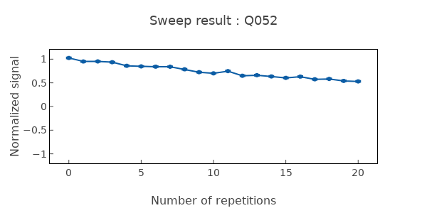
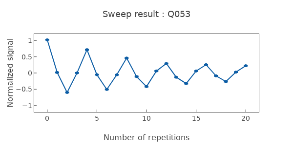

# CheckZX90

Validates ZX90 two-qubit gate fidelity via process or state fidelity measurement.

## What it measures

ZX90 gate fidelity – closeness to ideal CNOT-equivalent operation.

## Physical principle

Apply calibrated ZX90 gate and measure output state fidelity against ideal; may use interleaved RB or QPT.

## Expected result

Gate fidelity metric; conditional rotation of target by control state.

- result_type: scalar_metric
- good_visual: high fidelity value with consistent results across repeated measurements

## Evaluation criteria

ZX90 fidelity should meet targets; both control states should produce correct conditional rotation.

- check_questions:
  - "Is the ZX90 fidelity meeting the target?"
  - "Are the results consistent for both control qubit states (|0⟩ and |1⟩)?"
  - "Is the fidelity limited by coherence or by gate calibration?"

## Input parameters

- control_qubit_frequency: (control qubit) (GHz)
- control_drag_hpi_amplitude: (control qubit) (a.u.)
- control_drag_hpi_length: (control qubit) (ns)
- control_drag_hpi_beta: (control qubit) (a.u.)
- control_readout_frequency: (control qubit) (GHz)
- control_readout_amplitude: (control qubit) (a.u.)
- control_readout_length: (control qubit) (ns)
- target_qubit_frequency: (target qubit) (GHz)
- target_readout_frequency: (target qubit) (GHz)
- target_readout_amplitude: (target qubit) (a.u.)
- target_readout_length: (target qubit) (ns)
- cr_amplitude: (control qubit) (a.u.)
- cr_phase: (control qubit) (a.u.)
- cancel_amplitude: (target qubit) (a.u.)
- cancel_phase: (target qubit) (a.u.)
- cancel_beta: (target qubit) (a.u.)
- rotary_amplitude: (control qubit) (a.u.)
- zx_rotation_rate: (coupling qubit) (a.u.)

## Output parameters

None.

## Run parameters

- repetitions: Number of repetitions for the PI pulse (a.u.)
- shots: Number of shots (a.u.)
- interval: Time interval (ns)

## Common failure patterns

- [critical] Coherence-limited fidelity
  - cause: T1/T2 of either qubit too short for gate duration
  - visual: fidelity degrades with gate length, consistent with decoherence
  - next: improve coherence or shorten gate
- [warning] Residual ZZ coupling
  - cause: static coupling causes unwanted phase errors
  - visual: phase error correlated with idle time between gates
  - next: implement ZZ cancellation or echo sequences
- [warning] CR amplitude drift
  - cause: gate angle deviates from 90° due to parameter drift
  - visual: systematic rotation error in output state
  - next: re-run CreateZX90 with fresh CR calibration

## Tips for improvement

- Compare with interleaved RB for gate-specific error rate.
- Check both control states (|0⟩ and |1⟩) independently.
- If fidelity is poor, re-run CreateZX90 with fresh CR calibration.

## Analysis guide

1. Check the ZX90 fidelity against the target threshold.
2. Determine if the fidelity is coherence-limited or calibration-limited.
3. Compare with single-qubit gate fidelities to isolate two-qubit gate contribution.
4. If calibration-limited, recommend CreateZX90 recalibration.
5. If coherence-limited, assess T1/T2 of both qubits.

## Related context

- history(last_n=5)
- coupling(zx_rate, coupling_strength)
