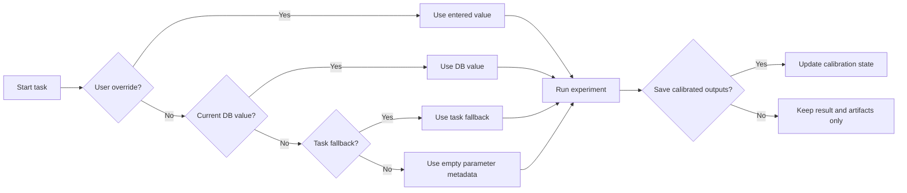
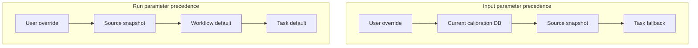

# Task Parameters

QDash separates calibration inputs, experiment settings, and calibrated outputs so that each execution records where its values came from and whether results change the current calibration state.

## Parameter types

| Type | Purpose | Examples |
| --- | --- | --- |
| Input parameters | Existing calibration values consumed by a task | `qubit_frequency`, `readout_amplitude` |
| Run parameters | Settings that control the experiment | `shots`, `interval`, `time_range` |
| Output parameters | New calibrated values produced by the task | `rabi_frequency`, `t1` |

An empty Input parameter field in the Tasks page means “use the value resolved by QDash.” It does not send an empty value to the task. Select a chip and target and use **Reload** to preview the current database value. Entering a value makes it an explicit override for that run.

## Which input value is used

For a normal workflow run, each task loads its declared Input parameters from the current calibration database during preprocessing. A default declared in the task code is used only when the database does not contain that parameter.

Tasks declare required database dependencies explicitly. If a required value is missing, execution fails with the missing parameter name instead of silently substituting zero or an empty value.

For a run started from the Tasks page, QDash uses this precedence:

1. A value entered by the user
2. The current calibration database value for the selected chip and target
3. A fallback value declared by the task

User overrides are applied again after preprocessing. This ensures that preprocessing cannot replace an explicit value entered in the Tasks page.

Leaving an override blank selects the normal database or fallback resolution. Clicking **Reload** copies current database values into the form; those populated fields become explicit overrides when the task is started. Reload does not modify the database.

## Re-execution behavior

QDash supports two different forms of re-execution.

### Re-executing an execution

Re-executing an execution starts the selected flow with the previous execution ID as its snapshot source. For each matching task name and target, QDash restores the recorded Input and Run parameters before preprocessing.

Input parameters are then refreshed by task preprocessing from the current calibration database. This means a re-execution is reproducible for Run parameters, while calibration inputs follow the current database unless the flow supplies an explicit Input override.

If a task and target did not exist in the source execution, QDash continues with the task’s normal defaults and current database inputs.

### Re-executing a task result

Re-executing an individual task result restores that task’s recorded Input and Run parameter snapshot. Any values entered in the re-execution dialog take priority. Input overrides are applied again after the current database has been loaded.

The effective precedence is:

1. Explicit user override
2. Current calibration database value loaded during preprocessing
3. Value recorded in the source task result
4. Fallback declared by the task

For Run parameters, preprocessing does not normally load database values, so the precedence is:

1. Explicit user override
2. Value recorded in the source task result
3. Workflow default
4. Task default

## Saving calibrated outputs

Executing a task always records its execution status, effective parameters, figures, raw data paths, and task result history. Saving calibrated outputs is a separate choice.

When **Save calibrated outputs to DB** is off, calculated outputs remain visible in the execution result but do not update the authoritative calibration database or backend parameter files. This is the safer mode for exploratory runs.

When it is on, successful output parameters update the calibration database and are synchronized to the backend where supported. Validation failures do not normally update backend parameters. A force-update option used by some re-execution paths can allow backend updates after failed validation and should be used deliberately.

## Target selection

Qubit tasks load values from the selected qubit. Coupling tasks may load from the control qubit, target qubit, or coupling record according to each parameter’s declared role. A coupling target uses the `control-target` form, such as `0-1`.
