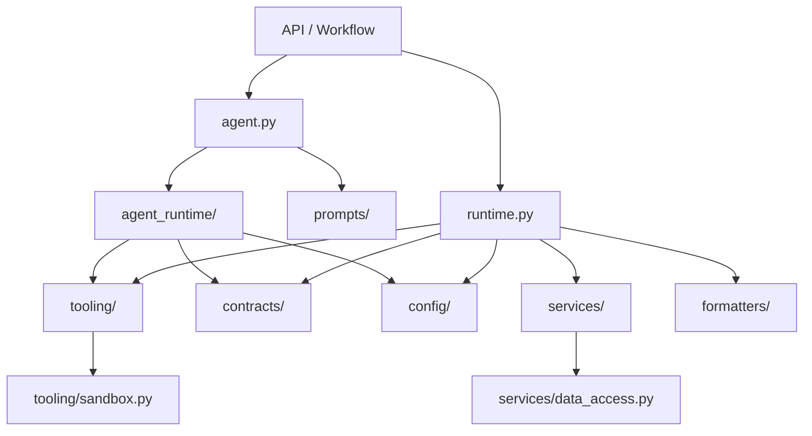

Copilot package for shared LLM-driven analysis, chat, and data-loading behavior.

This package is used by both the API layer and the workflow worker. It is organized around two public entrypoints:

- `agent.py`: runs LLM chat / analysis
- `runtime.py`: loads and shapes data for Copilot tools and analysis context

See [architecture.mmd](architecture.mmd) for a compact structure diagram.

## Read This Package In This Order

1. [agent.py](agent.py)
   Public entrypoint for `run_chat()`, `run_analysis()`, and markdown rendering helpers.
2. [runtime.py](runtime.py)
   Public entrypoint for Copilot data loading and tool-executor construction.
3. `prompts/`
   Prompt assets and prompt-input models.
4. `tooling/`
   Tool schemas, tool arg models, registry wiring, and Python sandbox execution.
5. `services/`
   Feature-oriented loaders and transformers used by `CopilotRuntime`.
6. `contracts/` and `config/`
   Shared request/response models and configuration models.
7. `agent_runtime/`
   Implementation details behind `agent.py`.

## Package Layout

- [agent.py](agent.py)
  Public LLM-facing facade. Delegates to `agent_runtime/` and `prompts/`.
- [runtime.py](runtime.py)
  Public data/runtime facade. Composes `services/`, `formatters/`, and `tooling/`.
- [config/](config/__init__.py)
  Copilot configuration models and YAML loader.
- [contracts/](contracts/__init__.py)
  Shared Pydantic request/response models and analysis-context contracts.
- [prompts/](prompts/__init__.py)
  Prompt text and small prompt-input models.
- [tooling/](tooling/__init__.py)
  Agent tool schemas, tool arg models, registry wiring, and the restricted Python sandbox.
- [services/](services/__init__.py)
  Domain-oriented loaders used by `CopilotRuntime`.
- [formatters/](formatters/__init__.py)
  LLM-facing compaction and presentation helpers.
- [agent_runtime/](agent_runtime/__init__.py)
  Internal client, execution, parsing, rendering, translation, and schema modules used by `agent.py`.

## High-Level Flow

### Chat / analysis flow

1. API or workflow code calls `run_chat()` or `run_analysis()` in [agent.py](agent.py).
2. `agent.py` builds prompt input using `prompts/`.
3. `agent_runtime/execution.py` runs the selected OpenAI-compatible API path.
4. Tool calls are resolved through executors created by [runtime.py](runtime.py).
5. Responses are parsed and rendered by `agent_runtime/parsing.py` and `agent_runtime/rendering.py`.

### Data / tool flow

1. API or workflow code creates [CopilotRuntime](runtime.py).
2. `CopilotRuntime` wires together `CopilotDataAccess`, feature loaders in `services/`, and the tool registry.
3. `tooling/registry.py` exposes runtime methods as LLM-callable tools.
4. `contracts/` models define the request/response boundary seen by the API layer.

## Directory Intent

- Keep `agent.py` and `runtime.py` thin.
- Put long prompt text in `prompts/`, not in execution code.
- Put feature behavior in `services/`, not in `runtime.py`.
- Put LLM-visible tool contracts in `tooling/`.
- Put request/response contracts in `contracts/`.
- Put provider/API-loop details in `agent_runtime/`, not in `agent.py`.

## When Adding New Code

- New prompt text:
  add to `prompts/`
- New tool schema or tool args:
  add to `tooling/`
- New runtime data loader:
  add to `services/` and expose via `CopilotRuntime`
- New API/workflow contract:
  add to `contracts/`
- New provider/parsing/rendering behavior for the agent:
  add to `agent_runtime/`

## Diagram

